## Chapter 1: Neural Network Fundamentals

This chapter establishes the foundation for understanding transformers by first explaining what neural networks are, how they work, and why they form the basis for modern language models. Throughout this chapter, we explain every concept using physical analogies that connect abstract mathematics to tangible reality, making the material more accessible and memorable.

### Why This Chapter First?

Most AI education jumps straight to transformers without explaining the fundamental system they're built on. This approach leaves students with a superficial understanding—they can describe what transformers do, but they don't understand how or why they work. 

This chapter takes a different approach. We build understanding from the ground up, starting with a single neuron and progressing through complete neural networks to transformers. Every concept connects to something you can visualize and understand. This foundation is essential because transformers are, at their core, sophisticated neural networks. To truly understand transformers, you must first understand the system they're built upon.

**Learning Principle:** Understand the system before you study its components.

---

## What Are Neural Networks?

Neural networks are computational systems inspired by how the brain processes information. To understand how they work, imagine a factory assembly line. Raw materials arrive at the input, pass through multiple assembly stations (called layers), and emerge as a finished product at the output. What makes this factory special is that it learns from examples. When you show it many examples—like "when I see 'cat', predict 'sat'"—the factory adjusts its machines (which we call weights) to get better at making predictions. After processing many examples, it learns the underlying patterns and can then make predictions on new inputs it has never seen before.

Neural networks matter because they can learn complex patterns from data without being explicitly programmed for each pattern. This ability to learn from examples makes them the foundation of modern AI, including the transformer models we'll study in later chapters. They excel at tasks where the rules are too complex to write down explicitly, but where we have many examples of the desired behavior.

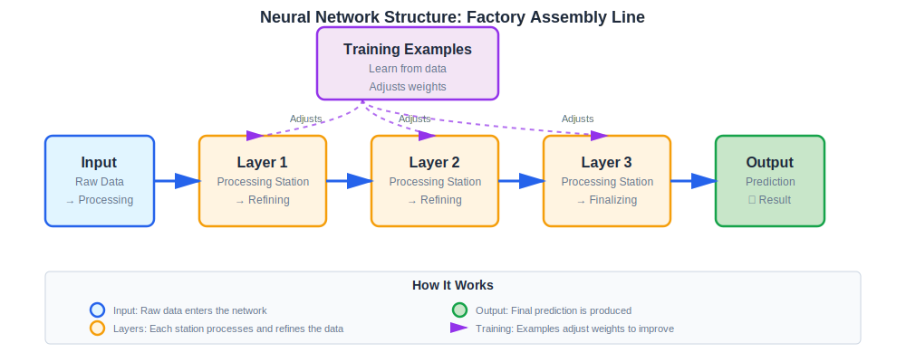

To see a neural network in action, [Example 1: Minimal Forward Pass](06-example1-forward-pass.md) demonstrates how a simple network makes predictions step by step.

---

## The Perceptron: The Basic Building Block

A perceptron is a single neuron—the simplest possible neural network. It functions as a decision-making unit that takes multiple inputs, weighs their importance, and produces a single output decision. While a single perceptron is quite limited in what it can learn, understanding how it works provides the foundation for understanding more complex networks.

### The Mathematical Story

Mathematically, a perceptron computes its output using the following formula:

$$y = f(\mathbf{w} \cdot \mathbf{x} + b)$$

where $\mathbf{x} \in \mathbb{R}^d$ is the input vector, $\mathbf{w} \in \mathbb{R}^d$ is the weight vector, $b \in \mathbb{R}$ is the bias scalar, $f: \mathbb{R} \to \mathbb{R}$ is the activation function, and $y \in \mathbb{R}$ is the output scalar.

In this equation, $\mathbf{x}$ represents the input, which is a vector of $d$ numbers. The variable $\mathbf{w}$ represents the weights, which determine how important each input is. The bias $b$ provides a baseline offset that shifts the entire computation. The function $f()$ is called the activation function, and it shapes the output in a specific way. Finally, $y$ is the output—the decision made by the perceptron.

You might notice that the core computation $\mathbf{w} \cdot \mathbf{x} + b$ looks very familiar—it's closely related to the equation of a straight line! In algebra, we write a line as $y = mx + c$, where $m$ is the slope and $c$ is the y-intercept. For a perceptron with a single input ($d=1$), $\mathbf{w} \cdot \mathbf{x} + b$ becomes $wx + b$, which is exactly $y = mx + c$ (where $w$ is the slope and $b$ is the intercept). For multiple inputs ($d > 1$), $\mathbf{w} \cdot \mathbf{x} = \sum_{i=1}^d w_i x_i$ is the dot product (weighted sum), which generalizes the line equation to multiple dimensions. The bias $b$ still shifts the entire computation up or down, just like the y-intercept shifts a line.

The key difference is that the perceptron then applies an activation function $f()$ to this linear combination. If $f()$ is the identity function (just returns its input unchanged), then the perceptron is computing a linear function—a straight line (or hyperplane in higher dimensions). But with other activation functions, we get non-linear transformations that enable the network to learn complex, curved patterns that a simple straight line cannot represent.

To see this transformation in action, consider what happens when we apply different activation functions to straight lines. The graphs below show four different linear functions (y = 2x + 1, y = -x + 2, y = 0.5x - 1, and y = -1.5x + 0.5) and how they are transformed by three common activation functions: ReLU, Sigmoid, and Tanh. (We'll define these functions precisely in a moment, but for now, notice their visual effects.) ReLU zeros out all negative values, creating sharp corners where lines cross zero. Sigmoid squashes everything into the 0-1 range, creating smooth S-shaped curves. Tanh does something similar but squashes to the -1 to 1 range, preserving the sign of the original values. These transformations are what allow neural networks to learn non-linear patterns—without them, the network would only be able to compute straight lines.

| | |
|:---:|:---:|
| 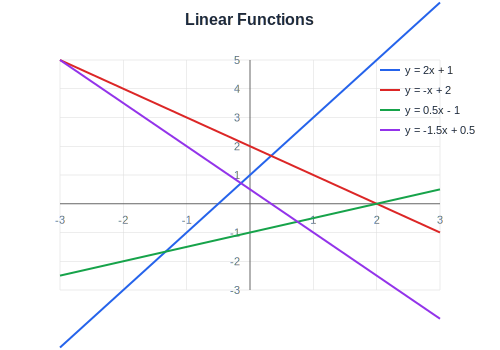 |  |
| 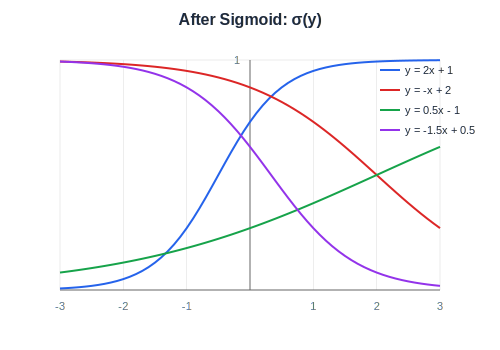 |  |

To understand this intuitively, think of a perceptron as a simple voting system. The inputs are like votes: [vote1, vote2, vote3]. The weights determine the strength of each vote: [0.8, 0.2, 0.5] means vote1 is most important. The bias adds a baseline value, like always adding +0.1 regardless of the votes. The activation function then shapes the result, perhaps by saying "if the total exceeds 0.5, output YES."

Let's work through a concrete example:

```
Input: [1.0, 0.5, 0.3]
Weights: [0.8, 0.2, 0.5]
Bias: 0.1

Weighted sum: 1.0×0.8 + 0.5×0.2 + 0.3×0.5 + 0.1 = 1.15
Activation (ReLU): max(0, 1.15) = 1.15
Output: 1.15 (decision made!)
```

In this example, we multiply each input by its corresponding weight, sum everything together, add the bias, and then apply the activation function to produce the final output.

### Understanding the Components

Let's examine each component of the perceptron in detail, as understanding these building blocks is essential for grasping how more complex networks operate.

**Weight ($\mathbf{w}$):** Weights determine the strength of connections in a network. A high weight creates a strong connection, meaning that input has a large influence on the output. A low weight creates a weak connection, giving that input only a small influence. When a weight is negative, it creates an inhibitory connection that opposes the input rather than supporting it. During training, the network learns which weights to assign to each input based on how well those weights help it make correct predictions.

Weights are typically initialized to small random values (e.g., sampled from a normal distribution with mean 0 and standard deviation 0.01) to break symmetry. If all weights start at zero, all neurons in a layer would compute identical outputs and learn identical features, which would waste capacity. Random initialization ensures each neuron starts with different weights, enabling the network to learn diverse features.

**Bias ($b$):** The bias acts as a baseline or offset that shifts the entire computation up or down. In algebra, this is like translating a graph: if you have $y = f(x)$ and you add a constant $c$ to get $y = f(x) + c$, the entire graph shifts up or down by $c$ units. The bias does the same thing—it shifts the entire function up or down. Think of it like setting a scale to zero before weighing something, or adjusting a thermostat's baseline temperature. The bias allows the perceptron to make decisions even when all inputs are zero, and it provides flexibility in how the decision boundary is positioned. Mathematically, without bias, a perceptron with all-zero inputs always outputs $f(0) = f(\mathbf{w} \cdot \mathbf{0}) = f(0)$, which severely limits expressivity. The bias term enables the network to learn decision boundaries that don't pass through the origin.

**Activation Function ($f()$):** The activation function acts as a filter that shapes the signal. Without an activation function, a network can only perform linear transformations, which severely limits what it can learn. With an activation function, the network gains the ability to learn complex, non-linear patterns. Different activation functions create different "shapes" of transformation, each suited to different types of problems.

Activation functions must be (at least piecewise) differentiable for gradient descent to work. They introduce non-linearity, which is mathematically necessary for learning complex patterns. It can be proven (via the universal approximation theorem) that neural networks with non-linear activation functions can approximate any continuous function, given sufficient capacity. Without activation functions, multiple layers would collapse into a single linear layer, losing the hierarchical learning capability that makes deep networks powerful.

The most common activation functions you'll encounter are:

- **ReLU** (Rectified Linear Unit): $f(x) = \max(0, x)$ - This function keeps positive values unchanged and zeros out any negative values. It's the most commonly used activation in modern neural networks because it's simple, efficient, and works well in practice. Note that ReLU is non-differentiable at $x=0$, but in practice this rarely causes issues since the probability of exactly hitting zero is negligible.

- **Sigmoid**: $f(x) = \frac{1}{1+e^{-x}}$ - This function squashes any input into the range $(0, 1)$, making it useful when you need outputs that represent probabilities. The sigmoid function is smooth and differentiable everywhere, but it saturates (gradient approaches zero) for very large positive or negative inputs, which can slow down learning.

- **Tanh**: $f(x) = \tanh(x)$ - Similar to sigmoid but squashes inputs into the range $(-1, 1)$, providing a symmetric output around zero. Like sigmoid, tanh is smooth and differentiable everywhere, but also saturates at the extremes.

**Perceptron Diagram:**

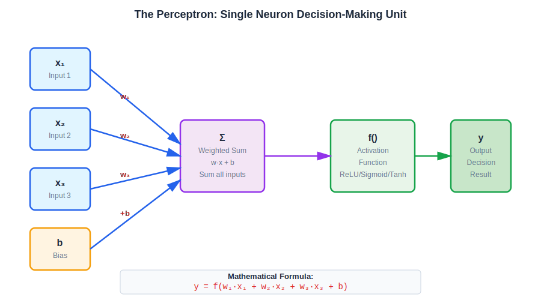

**Activation Function Behavior:**

| | | |
|:---:|:---:|:---:|
|  | 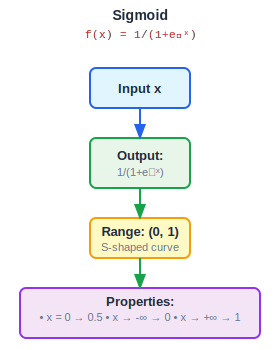 | 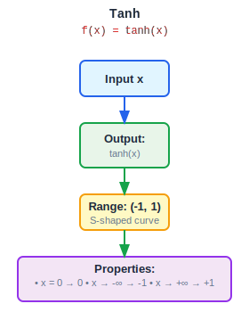 |

**Activation Function Graphs:**

| | | |
|:---:|:---:|:---:|
| 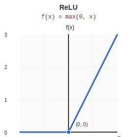 | 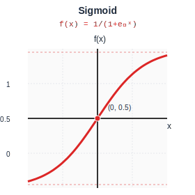 | 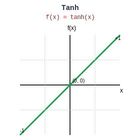 |

While a single perceptron is quite limited in what it can learn, stacking many perceptrons together creates powerful networks capable of learning complex patterns. This is why we build networks with multiple layers, as we'll see in the next section.

---

## Layers: Stacking Neurons

A layer is a collection of neurons (perceptrons) that process information together in parallel. Think of a layer as a factory assembly line station: input arrives, the layer processes it, and output goes to the next layer. Each layer performs a specific job, and having multiple layers means multiple processing steps, each building on what the previous layer learned.

To understand how multiple perceptrons form a layer, consider a layer with $n$ perceptrons, each processing the same input vector $\mathbf{x} \in \mathbb{R}^d$. Each perceptron has its own weight vector $\mathbf{w}_i \in \mathbb{R}^d$ and bias $b_i \in \mathbb{R}$. The layer computes $n$ outputs simultaneously: $y_i = f(\mathbf{w}_i \cdot \mathbf{x} + b_i)$ for $i = 1, \ldots, n$. We can stack these weight vectors into a matrix $\mathbf{W} \in \mathbb{R}^{n \times d}$ where each row is a perceptron's weight vector, and stack the biases into a vector $\mathbf{b} \in \mathbb{R}^n$. The entire layer computation becomes $\mathbf{y} = f(\mathbf{W}\mathbf{x} + \mathbf{b})$, where $f$ is applied element-wise. This matrix formulation shows that a layer is essentially multiple dot products computed simultaneously—exactly what matrix multiplication does.

Neural networks typically have three types of layers. The input layer receives raw data and passes it into the network. Hidden layers process the information, and you can have as many of these as needed for the complexity of your problem. Finally, the output layer produces the final prediction.

To visualize this, imagine a multi-stage factory. Stage 1 (the input layer) is where raw materials arrive. Stages 2 through 4 (hidden layers) each refine the product in some way, with each stage building on the work of the previous stage. Stage 5 (the output layer) is where the finished product exits.

Let's trace through an example to see how data flows through multiple layers:

```
Input Layer: Receives token "cat"
Hidden Layer 1: Converts to vector [0.3, 0.7, -0.2]
Hidden Layer 2: Processes to [0.4, 0.6, -0.1]
Output Layer: Produces [0.1, 0.8, 0.05, 0.05] (probabilities)
```

Notice how each layer transforms the data. The input layer receives the raw token, the first hidden layer converts it into a numerical representation, the second hidden layer refines that representation, and the output layer produces the final probabilities for each possible next token.

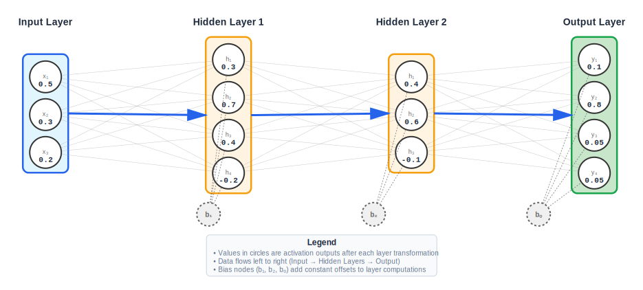

Layers enable complex transformations that a single perceptron cannot achieve. In algebra, this is like composing functions. If you have two functions $f(x)$ and $g(x)$, composing them gives you $f(g(x))$—you apply $g$ first, then apply $f$ to the result. Multiple layers work the same way: Layer 2 processes the output of Layer 1, Layer 3 processes the output of Layer 2, and so on. By stacking layers, networks can learn hierarchical patterns—simple patterns in early layers, and increasingly complex patterns in deeper layers. This hierarchical learning is what makes deep neural networks so powerful.

To see layers working together in detail, [Example 5: Feed-Forward Layers](10-example5-feedforward.md) demonstrates how information flows through multiple layers.

---

## Feedforward Networks: Multi-Layer Perceptrons

A **feed-forward network** (FFN) is a type of layer that applies two linear transformations with an activation function in between. This creates a two-stage processing pipeline: first expanding the dimensions to give the network more room to work, then compressing back to the original dimensions. The activation function in between adds crucial non-linearity that enables the network to learn complex patterns.

Mathematically, a feed-forward network is defined as:

$$\text{FFN}(\mathbf{x}) = \text{ReLU}(\mathbf{x}\mathbf{W}_1 + \mathbf{b}_1)\mathbf{W}_2 + \mathbf{b}_2$$

where $\mathbf{x} \in \mathbb{R}^d$ is the input vector, $\mathbf{W}_1 \in \mathbb{R}^{d \times d'}$ is the first weight matrix that expands dimensions, $\mathbf{b}_1 \in \mathbb{R}^{d'}$ is the first bias vector, $\mathbf{W}_2 \in \mathbb{R}^{d' \times d}$ is the second weight matrix that compresses dimensions back, $\mathbf{b}_2 \in \mathbb{R}^{d}$ is the second bias vector, and ReLU is applied element-wise. The expansion factor $d' > d$ (typically $d' = 4d$ in transformers) gives the network more capacity to learn complex feature combinations.

Here, $\mathbf{W}_1$ expands the input from dimension $d$ to dimension $d'$, $\mathbf{b}_1$ shifts the expanded representation, ReLU adds non-linearity, $\mathbf{W}_2$ compresses back to dimension $d$, and $\mathbf{b}_2$ provides the final offset. The expansion phase allows the network to learn complex feature combinations in the higher-dimensional space, while the compression ensures the output has the correct shape for the next layer.

To understand this intuitively, think of a feed-forward network as a two-stage transformation: expansion followed by compression. You start with a small package (a $d$-dimensional vector). In stage 1, you expand it into a large box (a $d'$-dimensional vector where $d' > d$), giving you more room to work with the information. The activation function then filters and processes the contents, introducing non-linearity. In stage 2, you compress it back down to a small package (back to $d$ dimensions), but now it's been transformed in a meaningful way. This expansion-compression pattern is fundamental to how transformers process information.

Let's trace through a concrete example:

```
Input: [0.3, 0.7] (dimension 2)
W₁: 2×4 matrix → Output: [0.5, 0.2, 0.8, 0.1] (expanded to 4)
ReLU: [0.5, 0.2, 0.8, 0.1] (no negatives)
W₂: 4×2 matrix → Output: [0.4, 0.6] (back to dimension 2)
```

Notice how the input starts as a 2-dimensional vector, expands to 4 dimensions in the middle (where the network can learn complex feature combinations), and then compresses back to 2 dimensions. The expansion gives the network capacity to learn, while the compression ensures the output has the right shape for the next layer.


Feed-forward networks are crucial because they add both non-linearity and capacity to transformers. The expansion phase allows the network to learn complex feature combinations that wouldn't be possible with just linear transformations. This is why FFNs are a core component of transformer architectures.

To see feed-forward networks in action, [Example 5: Feed-Forward Layers](10-example5-feedforward.md) demonstrates the complete FFN computation step by step.

---

## Loss Functions: Measuring Error

A **loss function** (also called **cross-entropy loss**) measures how wrong the model's prediction is compared to the target. In basic algebra, this is like measuring the distance between two points. If you have a target point and a predicted point, you can compute how far apart they are. The loss function does something similar: it measures how far the model's prediction is from the correct answer. Think of loss like a score in a game: lower loss means better predictions, while higher loss means worse predictions. Our goal during training is to minimize the loss, which maximizes the model's accuracy.

Mathematically, the cross-entropy loss is defined as:

$$L = -\log P_{\text{model}}(y_{\text{target}})$$

where $P_{\text{model}}(y_{\text{target}})$ is the probability assigned by the model to the correct token $y_{\text{target}}$. Notice that when the model assigns high probability to the correct answer, the loss is low (since the logarithm of a number close to 1 is close to 0). When the model assigns low probability to the correct answer, the loss is high (since the logarithm of a small number is a large negative number, and we negate it).

We use log probabilities rather than raw probabilities to avoid numerical underflow when probabilities are very small (e.g., $10^{-10}$). Direct probability multiplication would cause the result to underflow to zero in floating-point arithmetic, making gradient computation impossible. By working in log space, we maintain numerical stability while preserving the mathematical relationship between probabilities and loss.

To understand this intuitively, think of loss like a golf score: lower is better. A perfect prediction gives you a loss near 0, while a wrong prediction gives you a high loss. Just as in golf, you want to minimize your score.

Let's work through an example to see how this works in practice:

```
Target: "C" (one-hot: [0, 0, 1, 0])
Prediction probabilities: [0.1, 0.2, 0.6, 0.1]

Loss = -log(0.6) = 0.51  (model predicted C with 60% confidence - good!)
```

In this case, the model correctly identified "C" as the most likely answer, assigning it 60% probability. The loss of 0.51 reflects that this is a reasonable prediction, though not perfect. Now consider what happens when the model makes a wrong prediction:

```
If prediction was: [0.8, 0.1, 0.05, 0.05]
Loss = -log(0.05) = 3.0  (model predicted wrong - bad!)
```

Here, the model assigned only 5% probability to the correct answer "C", while assigning 80% to the wrong answer. The loss of 3.0 is much higher, correctly penalizing the model for its poor prediction.

| | |
|:---:|:---:|
|  |  |


Loss functions are essential because they tell us how well the model is learning. During training, we compute the loss after each prediction and use it to guide how we update the model's parameters. The entire training process is essentially a search for parameter values that minimize this loss function.

To see loss computation in action, [Example 2: Single Training Step](07-example2-single-step.md) shows how loss is computed and used to update the model.

---

## Gradient Descent: How Networks Learn

Gradient descent is an optimization algorithm that uses gradients to iteratively update parameters in order to minimize loss. To understand how it works, imagine walking downhill blindfolded. You can't see the bottom of the valley, but you can feel which way is downhill—that feeling is the gradient. You take a step in that direction (a weight update), and you repeat this process until you reach the bottom (minimum loss). The size of each step is controlled by the learning rate, which we'll discuss shortly.

### The Gradient

A gradient shows how much each parameter should change to reduce the loss. In basic calculus and algebra, the gradient is the derivative—it tells you the slope of a function at a given point. If you remember from algebra that the slope of a line $y = mx + b$ is $m$, the gradient generalizes this concept to multi-dimensional functions. The gradient tells you the slope in each direction.

The gradient $\nabla_{\mathbf{W}} L$ is a vector (or matrix) of partial derivatives: $\nabla_{\mathbf{W}} L = [\frac{\partial L}{\partial w_1}, \frac{\partial L}{\partial w_2}, \ldots]$. Each component tells us how much the loss changes when we change that specific parameter. Think of the gradient as a compass pointing uphill. Since loss is like altitude (and we want to go down), the gradient points in the direction of steepest increase. This means the negative gradient points in the direction we want to go—downhill, toward lower loss. The magnitude of the gradient tells us how steep the slope is: a large gradient means a steep slope, while a small gradient means a gentle slope.

Let's work through an example to make this concrete:

```
Parameter W (a weight in a matrix):
Current value: W = 0.5
Loss at W=0.5: 2.0
Gradient: ∂L/∂W = -0.3

Interpretation: 
- Negative gradient means increasing W will DECREASE loss
- Magnitude 0.3 means the slope is moderate
- Update: W_new = W_old - learning_rate × gradient
         = 0.5 - 0.1 × (-0.3) = 0.5 + 0.03 = 0.53
```

In this example, the negative gradient tells us that increasing the weight will decrease the loss. The magnitude of 0.3 indicates a moderate slope. We then update the weight by moving in the direction opposite to the gradient (since we want to minimize loss), scaled by the learning rate.

**Gradient Visualization:**


### The Learning Rate

The learning rate is a hyperparameter that controls how large each weight update is during training. Think of the learning rate as your step size when walking downhill. If you take large steps (high learning rate), you make fast progress but might overshoot the bottom of the valley. If you take small steps (low learning rate), your progress is slower but more precise. If your steps are too large, you might jump right over the valley and never find the minimum (this is called divergence). If your steps are too small, it takes forever to reach the bottom (slow convergence).

In transformers, the learning rate (denoted as $\eta$ or `lr`) is typically set between 0.0001 and 0.01. It's used in the gradient descent update rule: $W_{\text{new}} = W_{\text{old}} - \eta \times \text{gradient}$. Often, the learning rate is scheduled to start high (for fast initial learning) and decrease over time (for fine-tuning as training progresses).

To see how the learning rate affects updates, consider this example:

```
Gradient: -0.5 (should increase weight)
Learning rate: 0.1 (small steps)

Weight update: W_new = W_old - 0.1 × (-0.5)
              = W_old + 0.05  (small increase)
```

With a learning rate of 0.1, we make a modest update. But if we used a learning rate of 1.0:

```
If learning rate was 1.0:
Weight update: W_new = W_old - 1.0 × (-0.5)
              = W_old + 0.5  (large increase - might overshoot!)
```

This much larger update could cause us to overshoot the optimal weight value, potentially making the loss worse rather than better.

### Gradient Descent Algorithm

The gradient descent algorithm is mathematically defined as:

$$\mathbf{W}_{\text{new}} = \mathbf{W}_{\text{old}} - \eta \cdot \nabla_{\mathbf{W}} L$$

where $\mathbf{W} \in \mathbb{R}^{m \times n}$ is the weight matrix, $\eta \in \mathbb{R}^+$ is the learning rate, and $\nabla_{\mathbf{W}} L \in \mathbb{R}^{m \times n}$ is the gradient of the loss with respect to the weights.

Gradient descent converges to a local minimum under certain conditions: the loss function must be differentiable (or at least have subgradients), the learning rate must be sufficiently small (typically $\eta < \frac{2}{\lambda_{\max}}$ where $\lambda_{\max}$ is the largest eigenvalue of the Hessian), and the initialization must be reasonable. In practice, neural network loss landscapes are non-convex, so gradient descent finds local minima rather than global minima. However, for overparameterized networks (which includes most modern architectures), local minima are often good enough for practical purposes.

The gradient descent process follows these steps: First, we compute the loss by comparing the model's prediction to the target. Next, we compute the gradients, which tell us which direction to move each weight. Then we update the weights using the formula $W_{\text{new}} = W_{\text{old}} - \eta \times \frac{\partial L}{\partial W}$. This is like solving an equation iteratively. In algebra, if you're trying to find where a function equals zero, you might start with a guess, compute the slope at that point, and move in the direction that reduces the function value. Gradient descent does exactly this: it iteratively refines the weights until it finds values that minimize the loss. We repeat this process for many iterations, gradually moving the weights toward values that minimize the loss.


Let's trace through a complete iteration to see how this works:

```
Initial weight: W = 0.5
Loss: 2.0
Gradient: ∂L/∂W = -0.3 (negative = should increase W)
Learning rate: η = 0.1

Update: W_new = 0.5 - 0.1 × (-0.3)
       = 0.5 + 0.03
       = 0.53

New loss: 1.8 (lower - improved!)
```

After this update, the loss decreased from 2.0 to 1.8, confirming that we moved in the right direction. We would continue this process, computing new gradients and making new updates, until the loss stops decreasing significantly.

Gradient descent is the fundamental algorithm that enables neural networks to learn. Without it, we couldn't systematically update parameters to reduce loss. It's the engine that drives all neural network training, from simple perceptrons to complex transformer models.

To see gradient descent in action, [Example 2: Single Training Step](07-example2-single-step.md) demonstrates a complete gradient descent update with a single weight.

---

## Backpropagation: Computing Gradients

Backpropagation is the algorithm that computes gradients by propagating the loss backward through the network. To understand this, think of tracing back the cause of a mistake. You made an error (high loss), and now you need to work backwards to understand what caused it. You check each step, asking "Did this layer contribute to the error?" and calculate how much each parameter should change to fix it.

Backpropagation operates on a computational graph, which represents the forward pass as a directed acyclic graph (DAG). Each node represents an operation (addition, multiplication, activation function, etc.), and edges represent data flow. The computational graph enables automatic differentiation: by traversing the graph backward from the loss node, we can compute gradients for all parameters using the chain rule of calculus.

### The Forward Pass

The forward pass is the process of computing predictions by passing input data through the network from input to output. Think of the forward pass as following a recipe step-by-step. You start with ingredients (input tokens), process them through each step (each layer), and end with the final dish (the prediction). Data flows in one direction: Input → Layer 1 → Layer 2 → ... → Output.

In transformers, the forward pass follows a specific sequence of transformations. First, tokenization breaks the text into tokens. Then token encoding converts those tokens into integer IDs. Embedding lookup converts the integer IDs into vectors. Q/K/V projections transform those vectors into Query, Key, and Value vectors using weight matrices. Attention then combines these to produce a context vector. Output projection transforms the context vector into **logits** (raw, unnormalized scores for each vocabulary token) using the weight matrix $\mathbf{W}_O$. Finally, softmax converts the logits into probabilities.

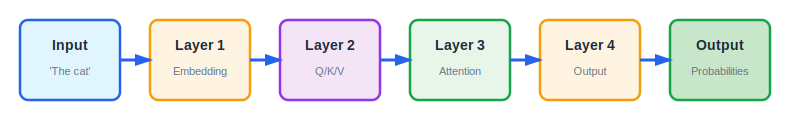

Let's trace through a complete forward pass example:

```
Forward Pass:
Input: "The cat"
  → Tokenize: ["The", "cat"]
  → Encode: [1, 2]
  → Embed: [[0.1, 0.2], [0.3, 0.7]]
  → Q/K/V: Query, Key, Value vectors
  → Attention: [0.4, 0.6] (context vector)
  → Logits: [1.0, 2.0, 0.5, 0.3]
  → Probabilities: [0.1, 0.8, 0.05, 0.05]
```

Notice how each step transforms the data, building up a richer representation until we finally have probabilities for each possible next token. The forward pass is how the model makes predictions, and it's the first step in both inference (making predictions) and training (where we'll then compute loss and gradients).

To see the forward pass in detail, [Example 1: Minimal Forward Pass](06-example1-forward-pass.md) shows the complete forward pass computation step by step.

### The Backward Pass

The backward pass (also called backpropagation) is the process of computing gradients by propagating the loss backward through the network from output to input. This is where the magic of learning happens—we figure out how each parameter contributed to the error and how much it should change.

In transformers, the backward pass follows this sequence. First, we compute the loss at the output by comparing the prediction to the target. Then we compute the gradient with respect to the output (the logits). Next, we propagate this gradient backward through each layer, using the chain rule of calculus. The gradient flows from the loss through the logits, then through the output projection to the context vector. From the context vector, it flows through the attention weights and attention scores to Q, K, and V. Finally, it flows through the Q/K/V maps back to the embeddings. At each step, we compute the gradient for each parameter (weight and bias). Once we have all the gradients, we use them to update the parameters using gradient descent.

The chain rule enables this backward propagation. For a two-layer network with output $y = f_2(f_1(\mathbf{x}; \mathbf{W}_1); \mathbf{W}_2)$, the gradient with respect to $\mathbf{W}_1$ is computed as:

$$\frac{\partial L}{\partial \mathbf{W}_1} = \frac{\partial L}{\partial y} \frac{\partial y}{\partial f_1} \frac{\partial f_1}{\partial \mathbf{W}_1}$$

Each term in this product is computed during the backward pass, with gradients flowing from the output back to the input. This is exactly what backpropagation does: it applies the chain rule at each layer, computing gradients layer by layer from output to input.

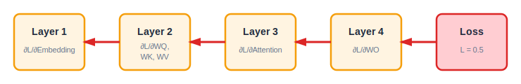

Let's trace through a backward pass example:

```
Backward Pass:
Loss: 0.5 (prediction was wrong)
  → Gradient w.r.t. logits: [-0.2, 0.8, -0.3, -0.3]
  → Gradient w.r.t. context: [0.1, 0.2]
  → Gradient w.r.t. attention weights: [0.05, 0.15]
  → Gradient w.r.t. Q, K, V: [computed via chain rule]
  → Gradient w.r.t. W_Q, W_K, W_V, W_O: [computed]
  → Update: W_new = W_old - learning_rate × gradient
```

Notice how the gradient flows backward, with each layer receiving information about how much it contributed to the error. The backward pass enables learning because without it, we couldn't compute how to update parameters to reduce loss. It's the mechanism that makes gradient descent possible in multi-layer networks.

To see the complete backward pass in action, [Example 3: Full Backpropagation](08-example3-full-backprop.md) shows the complete gradient flow through all components of a transformer.

---

## Training Loop: Putting It All Together

The training loop combines forward pass, loss computation, backward pass, and weight update into a complete learning cycle. This cycle repeats thousands or millions of times during training, gradually improving the model's ability to make correct predictions.

The complete cycle works as follows. First, the forward pass computes a prediction by passing input data through the network. Next, we compute the loss by comparing this prediction to the target. Then the backward pass computes gradients, telling us how much each parameter should change. Finally, we perform a weight update, changing the parameters using gradient descent. We then repeat this entire cycle with the next example.


To understand this intuitively, think of learning to play a musical instrument. You play a note (forward pass), hear if it's wrong (loss), figure out what to adjust (backward pass), and adjust your fingers (weight update). You repeat this process until you play correctly. Neural network training follows the same pattern, but instead of adjusting your fingers, the model adjusts its weights.

### Weight Update

Weight update is the process of changing matrix values (weights) based on gradients to improve predictions. Think of weight updates like tuning a radio. The current setting (weight) is like the current frequency. The static (loss) tells you how bad the signal is. The gradient tells you which direction to turn the dial, and the weight update is actually turning the dial. After many adjustments, you find the best frequency—the weight values that minimize loss.

Let's see how weight updates work in practice:

```
Before training:
Weight matrix W = [0.1, 0.2]
                 [0.3, 0.4]
Loss: 2.5 (high - bad predictions)

After computing gradients:
Gradient = [-0.5, -0.3]
          [-0.2, -0.1]

Weight update (learning_rate = 0.1):
W_new = W_old - 0.1 × Gradient
      = [0.1, 0.2] - 0.1 × [-0.5, -0.3]
        [0.3, 0.4]         [-0.2, -0.1]
      = [0.15, 0.23]
        [0.32, 0.41]

After training (many updates):
Loss: 0.1 (low - good predictions!)
```

Notice how the weights change based on the gradients, and how after many such updates, the loss decreases dramatically. This is how the model learns patterns from examples—by repeatedly making small adjustments to its weights based on the errors it makes.

To see a complete training cycle, [Example 2: Single Training Step](07-example2-single-step.md) shows one complete iteration of the training loop.

---

## Batch Training: Processing Multiple Examples

A batch is a group of sequences processed together during training. Think of batch training like grading multiple papers at once. Instead of grading one paper, you grade 32 papers together. This is more efficient because it enables parallel processing, and you average the results across all papers to get a more stable estimate of how well the model is performing.

In practice, the batch size is the number of sequences processed together (typically 32, 64, or 128). All sequences in the batch are processed in parallel, which makes efficient use of GPU resources. The gradients computed for each sequence are averaged across the batch, and the loss is also averaged. This averaging provides a more stable estimate of the true gradient than processing sequences one at a time.

Here's an example of how batching works:

```
Batch size: 4
Batch: [
  ["The", "cat", "sat"],
  ["The", "dog", "ran"],
  ["A", "bird", "flew"],
  ["A", "fish", "swam"]
]
Process all 4 sequences together, average gradients
```


Batching matters because it enables efficient GPU utilization and provides stable gradient estimates. Larger batches give more stable gradients (since you're averaging over more examples) but require more memory. Smaller batches use less memory but may have noisier gradients.

To see batch training in action, [Example 4: Multiple Patterns](09-example4-multiple-patterns.md) demonstrates how multiple sequences are processed together.

### Epochs: Complete Passes Through Data

An epoch is one complete pass through the entire training dataset. Think of an epoch like reading an entire textbook once. You start at page 1 and read through to the end—that's one epoch. Multiple epochs means reading the book multiple times to learn better. Each time through, you notice different details and reinforce what you've learned.

In training, if you have a dataset with 10,000 sequences and a batch size of 32, you'll have 10,000 ÷ 32 = 313 batches per epoch. One epoch means processing all 313 batches. Training typically involves repeating this for multiple epochs (e.g., 10 epochs), giving the model multiple chances to see all the training data and improve.

Let's work through a concrete example:

```
Dataset: 1000 sequences
Batch size: 32
Epoch 1: Process batches 1-32 (all 1000 sequences)
Epoch 2: Process batches 1-32 again (same sequences, different order)
Epoch 3: Process batches 1-32 again
... (until model converges)
```

Models typically need multiple epochs to learn effectively. Each epoch gives the model another opportunity to see all training data and improve its predictions. Early epochs show rapid improvement as the model learns basic patterns, while later epochs show slower, more refined improvements.


---

## From Neural Networks to Transformers

Transformers are a special type of neural network that uses attention to process sequences. Now that we understand the fundamentals of neural networks—perceptrons, layers, loss functions, gradient descent, and backpropagation—we can see how all these concepts come together in transformer architectures.

### The Transformer Architecture

A transformer is built from three main components. First, input processing handles the conversion of raw text into a form the network can work with. This involves tokenization (breaking text into tokens), token encoding (converting tokens to integer IDs), and embedding lookup (converting integer IDs to vectors).

Second, transformer blocks (of which there can be multiple) perform the core processing. Each block contains an attention layer that finds relevant information, a feed-forward network that adds non-linearity, layer normalization that stabilizes training, and residual connections that enable training of very deep networks.

Third, the output component converts the processed information into predictions. This includes an output projection that converts to vocabulary predictions, and a softmax function that converts those predictions into probabilities.


### Key Transformer Concepts

Now that we understand the basic architecture, let's define the key concepts that make transformers work. These terms will appear throughout the rest of this book, so it's important to understand them clearly. We'll organize them by theme, starting with how text enters the system and progressing through how it's processed.

#### Input Processing: From Text to Vectors

**Tokenization and Encoding**

The journey begins with **tokenization**, the process of breaking text into discrete units called tokens. Think of tokenization like cutting a sentence into individual words. For example, the input "The cat sat on the mat." becomes ["The", "cat", "sat", "on", "the", "mat", "."] after tokenization, with each piece now being a separate token. A **token** is the smallest unit of input that a transformer processes—think of it like a word on a Scrabble tile, where each tile represents one piece of information that the model can work with.

The **vocabulary** is the complete set of all possible tokens that a transformer can recognize. Think of vocabulary like a dictionary or Scrabble tile bag. It contains all possible words or tokens the model knows, has a limited size (e.g., 50,000 tokens for GPT models), and each token has a unique ID or index. Once we have tokens, **token encoding** converts them (strings) into integer IDs. Think of token encoding like assigning a student ID number to each student. The student name (token) maps to a student ID (integer), so "cat" might map to 2. This mapping uses the vocabulary we just defined.

**Embeddings**

**Embedding lookup** is the process of converting integer token IDs into vector representations using an embedding matrix. Think of embedding lookup like using a student ID to retrieve their file from a filing cabinet. The student ID (integer) gives you access to the student file (a vector of information), so ID 2 might retrieve the vector [0.3, 0.7, -0.2]. An **embedding** converts a discrete token into a continuous vector (a list of numbers). Think of an embedding like a translator that converts a word (a discrete symbol) into a point on a map (continuous coordinates). The word "cat" is just a symbol, but its embedding [0.3, 0.7, -0.2] represents a location in meaning-space where similar words are close together.

#### Mathematical Foundations

**Vectors, Matrices, and Dimensions**

A **vector** is an ordered list of numbers, representing a point in space. Think of a vector like GPS coordinates. The vector [0.3, 0.7] represents a point at (0.3, 0.7) on a 2D map, while [0.3, 0.7, -0.2] represents a point in 3D space. In basic algebra, you might add vectors component-wise: [1, 2] + [3, 4] = [4, 6]. This is just like adding coordinates—you add the x-components together and the y-components together.

A **matrix** is a rectangular grid of numbers, used to transform vectors. In algebra, matrix multiplication is like solving a system of linear equations. When you multiply a matrix by a vector, you're essentially computing multiple weighted sums simultaneously. For example, if you have equations $y_1 = 2x_1 + 3x_2$ and $y_2 = 4x_1 + 5x_2$, you can write this as a matrix multiplication where the matrix contains the coefficients.

Matrix multiplication $\mathbf{A}\mathbf{B}$ computes the dot product of each row of $\mathbf{A}$ with each column of $\mathbf{B}$. This is equivalent to computing multiple weighted sums simultaneously—exactly what happens when a layer processes an input vector. Think of a matrix like a machine that transforms objects. You feed in a vector (point A), the matrix applies transformation rules (rotate, scale, shift), and you get out a new vector (point B). **Dimension** refers to the size or length of a vector or matrix axis. Think of dimension like the number of measurements needed to describe something. In 2D, you need (x, y) coordinates on a map. In 3D, you need (x, y, z) coordinates in space. Higher dimensions require more measurements or features to fully describe the data.

**Model Parameters**

A **parameter** is a value in the model that gets learned (updated) during training. Think of parameters like adjustable knobs on a machine. Each knob controls some aspect of the machine's behavior, and during training, we adjust the knobs to make the machine work better. Weights and biases are both types of parameters. A **weight** is a parameter (number) in a matrix that determines how inputs are transformed. Think of weights like the strength of connections in a network. A high weight creates a strong connection, meaning the input has a big influence, while a low weight creates a weak connection with small influence. A **bias** is a parameter (number) that's added to a computation to shift the result. Think of bias like a baseline or offset, similar to setting a scale to zero before weighing something. It shifts the entire computation up or down.

A **hyperparameter** is a configuration setting that controls how the model is trained or structured, but is NOT learned during training. Think of hyperparameters like settings on a machine before you start it. The learning rate controls how fast the machine adjusts, the batch size determines how many items are processed at once, and the number of layers specifies how many processing stages the machine has.

#### Sequence Processing

**Sequences and Chunking**

A **sequence** is an ordered list of tokens that the transformer processes together. Think of a sequence like a sentence or paragraph. The order matters—"cat sat" is different from "sat cat"—and sequences have a fixed maximum length (e.g., 512 tokens for many models). When documents are too long, **chunking** splits them into smaller, manageable pieces called chunks. Think of chunking like dividing a long book into chapters. A long document gets split into multiple smaller chunks, with each chunk fitting within the model's sequence length limit.

#### Attention Mechanism

**Query, Key, and Value**

**Query (Q), Key (K), and Value (V)** are three different representations of the same token, each serving a specific purpose in attention. Think of attention like a library search system. The Query (Q) asks "What am I looking for?"—like typing a search query. The Key (K) says "What do I have to offer?"—like keywords on a book's spine. The Value (V) contains "What is my actual content?"—like the actual book content. **Q/K/V Maps** are three separate matrices that transform the same embedding into Query, Key, and Value vectors. Think of Q/K/V maps like three different lenses looking at the same object. You have the same token embedding (the object), but the $\mathbf{W}_Q$ lens gives you the Query view (what I'm looking for), the $\mathbf{W}_K$ lens gives you the Key view (what I'm advertising), and the $\mathbf{W}_V$ lens gives you the Value view (what I actually contain).

**Attention Dot Product**

The **attention dot product** is a mathematical operation that measures how similar two vectors are. In algebra, the dot product is computed by multiplying corresponding components and summing: for vectors $[a, b]$ and $[c, d]$, the dot product is $ac + bd$. This is essentially a weighted sum—you're multiplying each component of one vector by the corresponding component of the other, then adding everything together.

The dot product $\mathbf{Q} \cdot \mathbf{K}$ measures cosine similarity when vectors are normalized. For unnormalized vectors, it measures both magnitude and alignment. Think of the dot product like measuring alignment. A high dot product means the vectors point in the same direction, indicating they're similar and relevant to each other. A low dot product means the vectors point in different directions, indicating they're different and not relevant.

#### Output Generation

**Context Vectors and Output Projection**

A **context vector** is a weighted combination of all token values, where the weights come from attention. In basic algebra, this is like computing a weighted average. If you have values [a, b, c] with weights [0.5, 0.3, 0.2], the weighted average is $0.5a + 0.3b + 0.2c$. The context vector does exactly this: it multiplies each token value by its attention weight and sums them together. Think of a context vector like a blended smoothie. Each fruit (token value) contributes to the smoothie, and the amount of each fruit equals the attention weight. The final smoothie (the context vector) contains all the blended information. **Output Projection ($\mathbf{W}_O$)** is a matrix that transforms the context vector into vocabulary-space (predictions for each token). Think of $\mathbf{W}_O$ like a translator that converts context meaning (in semantic space) into the likelihood of each word (in vocabulary space). It's like converting "animal, four legs, meows" into "cat: 80%, dog: 15%, mat: 5%".

**Logits and Softmax**

**Logits** are the raw, unnormalized scores output by the model before applying softmax. Think of logits like raw test scores before grading on a curve. You might have raw scores [85, 90, 75, 80], and after applying the curve (softmax), you get probabilities [0.2, 0.5, 0.1, 0.2]. Logits can be any real numbers (positive, negative, large, small), while probabilities must be between 0 and 1 and sum to 1. **Softmax** is a function that converts numbers into probabilities (they sum to 1.0). In basic arithmetic, this is like converting numbers to percentages that add up to 100%. If you have test scores [85, 90, 75] out of 100, you might convert them to percentages, but softmax does something more sophisticated: it ensures the largest number gets the biggest share while all numbers sum to exactly 1.0. Think of softmax like dividing a pie. If you have scores [5, 2, 1], softmax converts them to probabilities [0.7, 0.2, 0.1]. The largest score gets the biggest slice, and all slices sum to 1.0 (the whole pie).

#### Training Techniques

**Layer Normalization**

**Layer normalization** is a technique that normalizes the inputs to a layer by adjusting the mean and variance. In basic algebra and statistics, this is exactly like computing z-scores: you subtract the mean and divide by the standard deviation. The formula is $z = \frac{x - \mu}{\sigma}$, where $\mu$ is the mean and $\sigma$ is the standard deviation. This transforms any set of numbers so they have a mean of 0 and a standard deviation of 1. Think of layer normalization like standardizing test scores. Raw scores might vary widely (0-100), but after normalization (subtract mean, divide by standard deviation), the scores are centered around 0 with a consistent scale.

**Residual Connections**

A **residual connection** adds the input of a layer directly to its output. In algebra, this is like adding two functions together: if you have $f(x)$ and you compute $f(x) + x$, you're adding the original input to the transformed output. This is exactly what a residual connection does: Output = Layer(Input) + Input. Think of a residual connection like a shortcut or bypass. The main path goes Input → Layer → Output, but there's also a shortcut that goes Input → (directly to output). The final output is Layer(Input) + Input. Residual connections enable training of very deep networks by allowing gradients to flow directly through the shortcut, which helps prevent the vanishing gradient problem that can occur in very deep networks.

To see these concepts in action, [Example 5: Feed-Forward Layers](10-example5-feedforward.md) shows residual connections in action, and [Example 6: Complete Transformer](11-example6-complete.md) shows the full architecture with all components working together.

---

## The Complete Learning Cycle

Now that we've covered all the individual components, let's see how they work together in a complete transformer. The learning cycle consists of a forward pass (where the model makes predictions) and a backward pass (where the model learns from its mistakes).

During the forward pass, the model makes predictions. First, tokenization breaks the text "The cat sat" into tokens: ["The", "cat", "sat"]. Token encoding then converts these tokens to integer IDs: [1, 2, 3]. Embedding lookup converts the integer IDs into vectors: [[0.1, 0.2], [0.3, 0.7], [0.5, 0.1]]. The Q/K/V maps transform each embedding into three views (Query, Key, and Value). Attention computes Q·K (dot product) to find which tokens are relevant to each other. Softmax converts the attention scores to probabilities. The context vector is computed as a weighted sum of all Values, where the weights come from attention. Output projection (WO) transforms the context vector into vocabulary scores (logits). Finally, softmax converts the logits into prediction probabilities.

During the backward pass, the model learns from its mistakes. The loss function compares the prediction to the target. The backward pass then computes gradients, which flow backward through the network using the chain rule. Finally, weight updates change the parameters (weights and biases) to reduce the loss, using the gradient descent algorithm we learned earlier.

To see these concepts in action, we've prepared several examples that build from simple to complex. [Example 1: Minimal Forward Pass](06-example1-forward-pass.md) demonstrates the forward pass only, showing how predictions are made. [Example 2: Single Training Step](07-example2-single-step.md) shows one complete training cycle, combining forward pass, loss computation, and weight updates. [Example 3: Full Backpropagation](08-example3-full-backprop.md) traces the complete gradient flow through all components. [Example 4: Multiple Patterns](09-example4-multiple-patterns.md) demonstrates batch training with multiple sequences. [Example 5: Feed-Forward Layers](10-example5-feedforward.md) adds feed-forward networks and residual connections to the architecture. Finally, [Example 6: Complete Transformer](11-example6-complete.md) shows the full architecture with all components working together.

---

## Key Principles

As we conclude this chapter, let's summarize the key principles that underlie everything we've learned. First, everything in a transformer is a vector or matrix. Tokens become vectors, and all operations are performed using matrices. This mathematical foundation enables the parallel processing that makes transformers efficient.

Second, attention finds relevance. The Q·K dot product measures how relevant each token is to every other token, allowing the model to focus on the most important information when making predictions.

Third, softmax creates probabilities. It converts any scores into probabilities that sum to 1, which is essential for making predictions about which token comes next.

Fourth, the context vector combines information. It's a weighted sum of all token values, where the weights come from attention. This allows the model to blend information from multiple tokens based on their relevance.

Fifth, learning equals gradient descent. Gradients show how to update weights to reduce loss, and this is the mechanism that enables all neural network learning, from simple perceptrons to complex transformers.

---

## What's Next?

Now that you understand neural network fundamentals, you're ready to dive deeper into the specific components that make transformers work. In Chapter 2: The Matrix Core, we'll take a deep dive into matrix operations, which are the mathematical foundation of everything transformers do. Chapter 3: Embeddings will show you exactly how tokens become vectors and why this representation is so powerful. Chapter 4: Attention Intuition will help you develop a deep understanding of how attention finds relevant information. Finally, Chapter 5: Why Transformers? will explain the specific problems that transformers solve and why they've become so dominant in modern AI.

For quick reference as you continue reading, see [Appendix B: Terminology Reference](appendix-b-terminology-reference.md) for all definitions with their physical analogies.

Remember: Every concept in this chapter has a physical analogy. If you ever forget what something means, think about its physical analogy—that's what it's actually modeling. These analogies aren't just helpful mnemonics; they reflect the real-world processes that neural networks are designed to capture.

---

**Navigation:**
- [← Index](00-index.md) | [Next: The Matrix Core →](02-matrix-core.md)

