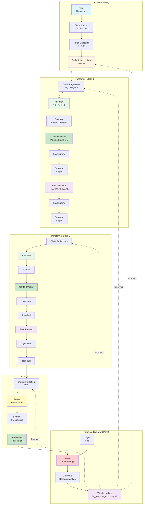

## Chapter 1: Neural Network Fundamentals

**This chapter establishes the foundation: what neural networks are, how they work, and why they're the basis for transformers. Every concept is explained with physical analogies to connect abstract math to tangible reality.**

### Why This Chapter First?

**The Problem:** Most AI education jumps straight to transformers without explaining the fundamental system they're built on.

**The Solution:** This chapter builds understanding from the ground up - from a single neuron to complete neural networks to transformers. Every concept connects to something you can visualize and understand.

**Learning Principle:** **UNDERSTAND THE SYSTEM BEFORE YOU STUDY ITS COMPONENTS.**

---

## What Are Neural Networks?

**Neural networks** are computational systems inspired by how the brain processes information. Think of them like a **factory assembly line**:

- **Input** arrives (raw materials)
- **Layers** process it (assembly stations)
- **Output** is produced (finished product)
- The factory **learns** from examples to improve (training)

**Physical Analogy:** Imagine a factory that makes predictions:
- You give it examples: "When I see 'cat', predict 'sat'"
- The factory adjusts its machines (weights) to get better
- After many examples, it learns the pattern
- Now it can make predictions on new inputs

**Why they matter:** Neural networks can learn complex patterns from data. They're the foundation of modern AI, including transformers.

**See it in action:** [Example 1: Minimal Forward Pass](06-example1-forward-pass.md) shows how a simple network makes predictions.

---

## The Perceptron: The Basic Building Block

A **perceptron** is a single neuron - the simplest neural network. It's like a **decision-making unit** that takes inputs, weighs them, and makes a decision.

### The Mathematical Story

A perceptron computes:

$$y = f(w \cdot x + b)$$

Where:
- **$x$** = input (a vector of numbers)
- **$w$** = **weights** (how important each input is)
- **$b$** = **bias** (a baseline offset)
- **$f()$** = **activation function** (shapes the output)
- **$y$** = output (the decision)

**Physical Analogy:** Think of a perceptron like a **simple voting system**:
- Inputs are votes: [vote1, vote2, vote3]
- Weights are vote strengths: [0.8, 0.2, 0.5] (vote1 is most important)
- Bias is a baseline: +0.1 (always add this)
- Activation shapes the result: "If total > 0.5, say YES"

**Example:**
```
Input: [1.0, 0.5, 0.3]
Weights: [0.8, 0.2, 0.5]
Bias: 0.1

Weighted sum: 1.0×0.8 + 0.5×0.2 + 0.3×0.5 + 0.1 = 1.15
Activation (ReLU): max(0, 1.15) = 1.15
Output: 1.15 (decision made!)
```

### Understanding the Components

**Weight ($w$):** Think of weights like **the strength of connections** in a network:
- High weight = strong connection (input has big influence)
- Low weight = weak connection (input has small influence)
- Negative weight = inhibitory connection (opposes the input)

**Bias ($b$):** Think of bias like a **baseline or offset**:
- Like setting a scale to zero before weighing
- Or adjusting a thermostat's baseline temperature
- Shifts the entire computation up or down

**Activation Function ($f()$):** Think of activation like a **filter that shapes the signal**:
- Without activation: network is just linear transformations (limited)
- With activation: network can learn complex, non-linear patterns
- Different activations = different "shapes" of transformation

**Common Activation Functions:**
- **ReLU**: $f(x) = \max(0, x)$ - Keeps positive, zeros negative
- **Sigmoid**: $f(x) = \frac{1}{1+e^{-x}}$ - Squashes to 0-1 range
- **Tanh**: $f(x) = \tanh(x)$ - Squashes to -1 to 1 range

**Why it matters:** A single perceptron is limited, but stacking many perceptrons creates powerful networks.

---

## Layers: Stacking Neurons

A **layer** is a group of neurons (perceptrons) that process information together. Think of a layer like a **factory assembly line station**:

- Input arrives → Layer processes it → Output goes to next layer
- Each layer does a specific job
- Multiple layers = multiple processing steps

**Types of Layers:**

1. **Input Layer**: Receives raw data
2. **Hidden Layers**: Process information (can have many)
3. **Output Layer**: Produces final prediction

**Physical Analogy:** Like a **multi-stage factory**:
- Stage 1 (Input): Raw materials arrive
- Stage 2-4 (Hidden): Each stage refines the product
- Stage 5 (Output): Finished product exits

**Example:**
```
Input Layer: Receives token "cat"
Hidden Layer 1: Converts to vector [0.3, 0.7, -0.2]
Hidden Layer 2: Processes to [0.4, 0.6, -0.1]
Output Layer: Produces [0.1, 0.8, 0.05, 0.05] (probabilities)
```

**Why it matters:** Layers enable complex transformations. Stacking layers allows learning hierarchical patterns.

**See it in action:** [Example 5: Feed-Forward Layers](10-example5-feedforward.md) shows how layers work together.

---

## Feedforward Networks: Multi-Layer Perceptrons

A **feed-forward network** (FFN) is a layer that applies two linear transformations with an activation function in between. Think of FFN like a **two-stage processing pipeline**:

- Stage 1: Expand (increase dimensions)
- Stage 2: Compress (reduce back to original dimensions)
- Activation in between adds non-linearity

**Mathematical Structure:**
$$\text{FFN}(x) = \text{ReLU}(xW_1 + b_1)W_2 + b_2$$

Where:
- $W_1$: First **weight** matrix (expands dimensions)
- $b_1$: First **bias**
- ReLU: **Activation function**
- $W_2$: Second **weight** matrix (compresses dimensions)
- $b_2$: Second **bias**

**Physical Analogy:** Like a **two-stage compressor**:
- Input: Small package (2D vector)
- Stage 1: Expand to large box (4D vector) - more room to work
- Activation: Filter/process contents
- Stage 2: Compress back to small package (2D vector) - but now transformed

**Example:**
```
Input: [0.3, 0.7] (dimension 2)
W₁: 2×4 matrix → Output: [0.5, 0.2, 0.8, 0.1] (expanded to 4)
ReLU: [0.5, 0.2, 0.8, 0.1] (no negatives)
W₂: 4×2 matrix → Output: [0.4, 0.6] (back to dimension 2)
```

**Why it matters:** FFNs add non-linearity and capacity to transformers. They enable learning complex feature combinations.

**See it in action:** [Example 5: Feed-Forward Layers](10-example5-feedforward.md) demonstrates FFN computation.

---

## Loss Functions: Measuring Error

A **loss function** (also called **softmax loss** or **cross-entropy loss**) measures how wrong the model's prediction is compared to the target. Think of loss like a **score in a game**:

- Lower loss = better prediction = you're winning
- Higher loss = worse prediction = you're losing
- Goal: minimize loss (maximize accuracy)

**Mathematical Definition:**
$$L = -\log P(y_{\text{target}})$$

Where $P(y_{\text{target}})$ is the model's predicted probability for the correct token.

**Physical Analogy:** Like a **golf score**:
- Lower is better
- Perfect prediction = loss near 0
- Wrong prediction = high loss
- You want to minimize your score

**Example:**
```
Target: "C" (one-hot: [0, 0, 1, 0])
Prediction probabilities: [0.1, 0.2, 0.6, 0.1]

Loss = -log(0.6) = 0.51  (model predicted C with 60% confidence - good!)

If prediction was: [0.8, 0.1, 0.05, 0.05]
Loss = -log(0.05) = 3.0  (model predicted wrong - bad!)
```

**Why it matters:** Loss tells us how well the model is learning. We minimize it during training.

**See it in action:** [Example 2: Single Training Step](07-example2-single-step.md) shows how loss is computed and used.

---

## Gradient Descent: How Networks Learn

**Gradient descent** is an optimization algorithm that uses **gradients** to iteratively update **parameters** to minimize **loss**. Think of gradient descent like **walking downhill blindfolded**:

- You can't see the bottom, but you can feel which way is downhill (**gradient**)
- Take a step in that direction (**weight update**)
- Repeat until you reach the bottom (minimum loss)
- Step size = **learning rate**

### The Gradient

A **gradient** shows how much each **parameter** should change to reduce the **loss**. Think of gradient like a **compass pointing uphill**:

- Loss is like altitude (want to go down)
- Gradient points in the direction of steepest increase
- Negative gradient = direction to go DOWN (reduce loss)
- Magnitude = how steep the slope is

**Example:**
```
Parameter W (a weight in a matrix):
Current value: W = 0.5
Loss at W=0.5: 2.0
Gradient: ∂L/∂W = -0.3

Interpretation: 
- Negative gradient means increasing W will DECREASE loss
- Magnitude 0.3 means the slope is moderate
- Update: W_new = W_old - learning_rate × gradient
         = 0.5 - 0.1 × (-0.3) = 0.5 + 0.03 = 0.53
```

### The Learning Rate

The **learning rate** is a **hyperparameter** that controls how large each **weight update** is during training. Think of learning rate like **step size when walking downhill**:

- Large steps (high learning rate): Fast progress, but might overshoot the bottom
- Small steps (low learning rate): Slow progress, but more precise
- Too large: You jump over the valley (divergence)
- Too small: You take forever to reach the bottom (slow convergence)

**In Transformers:**
- Learning rate ($\eta$ or `lr`) is typically between 0.0001 and 0.01
- Used in gradient descent: $W_{\text{new}} = W_{\text{old}} - \eta \times \text{gradient}$
- Often scheduled (starts high, decreases over time)

**Example:**
```
Gradient: -0.5 (should increase weight)
Learning rate: 0.1 (small steps)

Weight update: W_new = W_old - 0.1 × (-0.5)
              = W_old + 0.05  (small increase)

If learning rate was 1.0:
Weight update: W_new = W_old - 1.0 × (-0.5)
              = W_old + 0.5  (large increase - might overshoot!)
```

### Gradient Descent Algorithm

**Mathematical Definition:**
$$W_{\text{new}} = W_{\text{old}} - \eta \cdot \nabla_W L$$

Where:
- $W$: **Weight** matrix
- $\eta$: **Learning rate**
- $\nabla_W L$: **Gradient** of loss w.r.t. weights

**The Process:**
1. Compute **loss**
2. Compute **gradients** (which direction to move)
3. Update **weights**: $W_{\text{new}} = W_{\text{old}} - \eta \times \frac{\partial L}{\partial W}$
4. Repeat for many iterations

**Example:**
```
Initial weight: W = 0.5
Loss: 2.0
Gradient: ∂L/∂W = -0.3 (negative = should increase W)
Learning rate: η = 0.1

Update: W_new = 0.5 - 0.1 × (-0.3)
       = 0.5 + 0.03
       = 0.53

New loss: 1.8 (lower - improved!)
```

**Why it matters:** Gradient descent is the fundamental algorithm that enables neural networks to learn. Without it, we couldn't update **parameters** to reduce **loss**.

**See it in action:** [Example 2: Single Training Step](07-example2-single-step.md) demonstrates gradient descent with a single weight update.

---

## Backpropagation: Computing Gradients

**Backpropagation** is the algorithm that computes **gradients** by propagating the **loss** backward through the network. Think of backward pass like **tracing back the cause of a mistake**:

- You made an error (high **loss**)
- Work backwards: "What caused this error?"
- Check each step: "Did this **layer** contribute to the error?"
- Calculate how much each **parameter** should change

### The Forward Pass

The **forward pass** is the process of computing predictions by passing input data through the network from input to output. Think of forward pass like **following a recipe step-by-step**:

- Start with ingredients (input tokens)
- Process through each step (each **layer**)
- End with final dish (prediction)
- Data flows in one direction: Input → Layer 1 → Layer 2 → ... → Output

**In Transformers:**
1. **Tokenization**: Text → Tokens
2. **Token Encoding**: Tokens → Integer IDs
3. **Embedding Lookup**: Integer IDs → Vectors
4. **Q/K/V Projections**: Vectors → Q, K, V (using **weight** matrices)
5. **Attention**: Q, K, V → Context Vector
6. **Output Projection**: Context → **Logits** (using **weight** matrix WO)
7. **Softmax**: **Logits** → Probabilities

**Example:**
```
Forward Pass:
Input: "The cat"
  → Tokenize: ["The", "cat"]
  → Encode: [1, 2]
  → Embed: [[0.1, 0.2], [0.3, 0.7]]
  → Q/K/V: Query, Key, Value vectors
  → Attention: [0.4, 0.6] (context vector)
  → Logits: [1.0, 2.0, 0.5, 0.3]
  → Probabilities: [0.1, 0.8, 0.05, 0.05]
```

**Why it matters:** Forward pass is how the model makes predictions. It's the first step in both inference and training.

**See it in action:** [Example 1: Minimal Forward Pass](06-example1-forward-pass.md) shows the complete forward pass computation.

### The Backward Pass

The **backward pass** (also called **backpropagation**) is the process of computing **gradients** by propagating the **loss** backward through the network from output to input.

**In Transformers:**
1. Compute **loss** at output
2. Compute **gradient** w.r.t. output (**logits**)
3. Propagate **gradient** backward through each **layer**:
   - Loss → **Logits** → Output Projection → Context Vector
   - Context Vector → Attention Weights → Attention Scores → Q, K, V
   - Q, K, V → Q/K/V Maps → Embeddings
4. Compute **gradient** for each **parameter** (**weight**, **bias**)
5. Use **gradients** to update **parameters**

**Example:**
```
Backward Pass:
Loss: 0.5 (prediction was wrong)
  → Gradient w.r.t. logits: [-0.2, 0.8, -0.3, -0.3]
  → Gradient w.r.t. context: [0.1, 0.2]
  → Gradient w.r.t. attention weights: [0.05, 0.15]
  → Gradient w.r.t. Q, K, V: [computed via chain rule]
  → Gradient w.r.t. W_Q, W_K, W_V, W_O: [computed]
  → Update: W_new = W_old - learning_rate × gradient
```

**Why it matters:** Backward pass enables learning. Without it, we couldn't compute how to update **parameters** to reduce **loss**.

**See it in action:** [Example 3: Full Backpropagation](08-example3-full-backprop.md) shows complete gradient flow through all components.

---

## Training Loop: Putting It All Together

The **training loop** combines **forward pass**, **loss** computation, **backward pass**, and **weight update** into a complete learning cycle.

**The Complete Cycle:**
1. **Forward Pass**: Compute prediction
2. **Loss**: Measure error
3. **Backward Pass**: Compute **gradients**
4. **Weight Update**: Change **parameters** using **gradient descent**

**Physical Analogy:** Like **learning to play a musical instrument**:
- Play a note (forward pass)
- Hear if it's wrong (loss)
- Figure out what to adjust (backward pass)
- Adjust your fingers (weight update)
- Repeat until you play correctly

### Weight Update

**Weight update** is the process of changing matrix values (**weights**) based on **gradients** to improve predictions. Think of weight updates like **tuning a radio**:

- Current setting (**weight**) = current frequency
- Static (**loss**) = how bad the signal is
- **Gradient** = which direction to turn the dial
- **Weight update** = actually turning the dial
- After many adjustments, you find the best frequency

**Example:**
```
Before training:
Weight matrix W = [0.1, 0.2]
                 [0.3, 0.4]
Loss: 2.5 (high - bad predictions)

After computing gradients:
Gradient = [-0.5, -0.3]
          [-0.2, -0.1]

Weight update (learning_rate = 0.1):
W_new = W_old - 0.1 × Gradient
      = [0.1, 0.2] - 0.1 × [-0.5, -0.3]
        [0.3, 0.4]         [-0.2, -0.1]
      = [0.15, 0.23]
        [0.32, 0.41]

After training (many updates):
Loss: 0.1 (low - good predictions!)
```

**Why it matters:** This is how the model learns patterns from examples.

**See it in action:** [Example 2: Single Training Step](07-example2-single-step.md) shows one complete training cycle.

---

## Batch Training: Processing Multiple Examples

A **batch** is a group of sequences processed together during training. Think of a batch like **grading multiple papers at once**:

- Instead of grading one paper, grade 32 papers together
- More efficient (parallel processing)
- Average the results across all papers

**In Training:**
- **Batch size** = number of sequences processed together (e.g., 32, 64, 128)
- All sequences in **batch** processed in parallel
- **Gradients** averaged across **batch**
- **Loss** averaged across **batch**

**Example:**
```
Batch size: 4
Batch: [
  ["The", "cat", "sat"],
  ["The", "dog", "ran"],
  ["A", "bird", "flew"],
  ["A", "fish", "swam"]
]
Process all 4 sequences together, average gradients
```

**Why it matters:** Batching enables efficient GPU utilization and stable **gradient** estimates. Larger **batches** = more stable but require more memory.

**See it in action:** [Example 4: Multiple Patterns](09-example4-multiple-patterns.md) demonstrates batch training.

### Epochs: Complete Passes Through Data

An **epoch** is one complete pass through the entire training dataset. Think of an epoch like **reading an entire textbook once**:

- Start at page 1, read through to the end
- That's one **epoch**
- Multiple **epochs** = reading the book multiple times to learn better

**In Training:**
- Dataset: 10,000 sequences
- **Batch size**: 32
- Batches per **epoch**: 10,000 ÷ 32 = 313 batches
- One **epoch** = process all 313 batches
- Training: Repeat for multiple **epochs** (e.g., 10 **epochs**)

**Example:**
```
Dataset: 1000 sequences
Batch size: 32
Epoch 1: Process batches 1-32 (all 1000 sequences)
Epoch 2: Process batches 1-32 again (same sequences, different order)
Epoch 3: Process batches 1-32 again
... (until model converges)
```

**Why it matters:** Models typically need multiple **epochs** to learn. Each **epoch** gives the model another chance to see all training data and improve.

---

## From Neural Networks to Transformers

Transformers are a special type of neural network that uses **attention** to process sequences. Let's see how all the concepts we've learned apply to transformers.

### The Transformer Architecture

A transformer is built from these components:

1. **Input Processing:**
   - **Tokenization**: Breaking text into **tokens**
   - **Token Encoding**: Converting **tokens** to integer IDs
   - **Embedding Lookup**: Converting integer IDs to **vectors**

2. **Transformer Blocks** (can have multiple):
   - **Attention Layer**: Finds relevant information
   - **Feed-Forward Network (FFN)**: Adds non-linearity
   - **Layer Normalization**: Stabilizes training
   - **Residual Connections**: Enables deep networks

3. **Output:**
   - **Output Projection**: Converts to vocabulary predictions
   - **Softmax**: Converts to probabilities

### Complete Transformer Architecture



### Key Transformer Concepts

**Tokenization:** The process of breaking text into discrete units called **tokens**. Think of tokenization like **cutting a sentence into individual words**:
- Input: "The cat sat on the mat."
- After tokenization: ["The", "cat", "sat", "on", "the", "mat", "."]
- Each piece is now a separate **token**

**Token:** The smallest unit of input that a transformer processes. Think of a **token** like a **word on a Scrabble tile**. Each tile represents one piece of information.

**Vocabulary:** The complete set of all possible **tokens** that a transformer can recognize. Think of **vocabulary** like a **dictionary** or **Scrabble tile bag**:
- Contains all possible words/**tokens** the model knows
- Limited size (e.g., 50,000 **tokens** for GPT models)
- Each **token** has a unique ID/index

**Token Encoding:** The process of converting **tokens** (strings) into integer IDs. Think of **token encoding** like **assigning a student ID number to each student**:
- Student name (**token**) → Student ID (integer)
- "cat" → 2
- Uses **vocabulary** mapping

**Embedding Lookup:** The process of converting integer token IDs into **vector** representations using an embedding matrix. Think of **embedding lookup** like **using a student ID to retrieve their file from a filing cabinet**:
- Student ID (integer) → Student file (**vector** of information)
- ID 2 → **Vector** [0.3, 0.7, -0.2]

**Embedding:** Converts a discrete **token** into a continuous **vector** (list of numbers). Think of an **embedding** like a **translator** that converts:
- A word (discrete symbol) → A point on a map (continuous coordinates)
- "cat" (just a symbol) → `[0.3, 0.7, -0.2]` (a location in meaning-space)

**Vector:** An ordered list of numbers, representing a point in space. Think of a **vector** like **GPS coordinates**:
- `[0.3, 0.7]` = point at (0.3, 0.7) on a 2D map
- `[0.3, 0.7, -0.2]` = point in 3D space

**Matrix:** A rectangular grid of numbers, used to transform **vectors**. Think of a **matrix** like a **machine that transforms objects**:
- Input: a **vector** (point A)
- **Matrix**: transformation rules (rotate, scale, shift)
- Output: a new **vector** (point B)

**Dimension:** The size or length of a **vector** or **matrix** axis. Think of **dimension** like **the number of measurements** needed to describe something:
- 2D: (x, y) coordinates on a map
- 3D: (x, y, z) coordinates in space
- Higher dimensions: More measurements/features

**Parameter:** A value in the model that gets learned (updated) during training. Think of **parameters** like **adjustable knobs on a machine**:
- Each knob controls some aspect of the machine's behavior
- During training, we adjust knobs to make the machine work better
- **Weights** and **biases** are **parameters**

**Weight:** A **parameter** (number) in a **matrix** that determines how inputs are transformed. Think of **weights** like **the strength of connections** in a network:
- High **weight** = strong connection (input has big influence)
- Low **weight** = weak connection (input has small influence)

**Bias:** A **parameter** (number) that's added to a computation to shift the result. Think of **bias** like a **baseline or offset**:
- Like setting a scale to zero before weighing
- Shifts the entire computation up or down

**Hyperparameter:** A configuration setting that controls how the model is trained or structured, but is NOT learned during training. Think of **hyperparameters** like **settings on a machine before you start it**:
- **Learning rate**: How fast the machine adjusts
- **Batch size**: How many items processed at once
- **Number of layers**: How many processing stages

**Sequence:** An ordered list of **tokens** that the transformer processes together. Think of a **sequence** like a **sentence** or **paragraph**:
- Ordered: position matters ("cat sat" ≠ "sat cat")
- Fixed length: sequences have maximum length (e.g., 512 **tokens**)

**Chunking:** The process of splitting long documents or **sequences** into smaller, manageable pieces (chunks). Think of **chunking** like **dividing a long book into chapters**:
- Long document → Multiple smaller chunks
- Each chunk fits within model's **sequence** length limit

**Query (Q), Key (K), Value (V):** Three different representations of the same **token**, each serving a specific purpose. Think of attention like a **library search system**:

- **Query (Q)**: "What am I looking for?" - Like typing a search query
- **Key (K)**: "What do I have to offer?" - Like keywords on a book's spine
- **Value (V)**: "What is my actual content?" - Like the actual book content

**Q/K/V Maps:** Three separate **matrices** that transform the same **embedding** into Query, Key, and Value **vectors**. Think of Q/K/V maps like **three different lenses** looking at the same object:
- Same **token embedding** (the object)
- WQ lens → Query view (what I'm looking for)
- WK lens → Key view (what I'm advertising)
- WV lens → Value view (what I actually contain)

**Attention Dot Product:** A mathematical operation that measures how similar two **vectors** are. Think of dot product like **measuring alignment**:
- High dot product = **vectors** point in same direction = similar = relevant
- Low dot product = **vectors** point different directions = different = not relevant

**Softmax:** A function that converts numbers into probabilities (they sum to 1.0). Think of **softmax** like **dividing a pie**:
- You have scores: [5, 2, 1]
- **Softmax** converts to probabilities: [0.7, 0.2, 0.1]
- The largest score gets the biggest slice
- All slices sum to 1.0 (the whole pie)

**Context Vector:** A weighted combination of all **token** values, where weights come from attention. Think of **context vector** like a **blended smoothie**:
- Each fruit (**token** value) contributes
- Amount of each fruit = attention weight
- Final smoothie = **context vector** (blended information)

**Output Projection (WO):** A **matrix** that transforms the **context vector** into vocabulary-space (predictions for each **token**). Think of WO like a **translator** that converts:
- Context meaning (in semantic space) → Likelihood of each word (in vocabulary space)
- Like converting "animal, four legs, meows" → "cat: 80%, dog: 15%, mat: 5%"

**Logits:** The raw, unnormalized scores output by the model before applying **softmax**. Think of **logits** like **raw test scores before grading on a curve**:
- Raw scores: [85, 90, 75, 80] (**logits**)
- After curve (**softmax**): [0.2, 0.5, 0.1, 0.2] (probabilities)
- **Logits** can be any real numbers (positive, negative, large, small)
- Probabilities must be 0-1 and sum to 1

**Layer Normalization:** A technique that normalizes the inputs to a **layer** by adjusting the mean and variance. Think of **layer normalization** like **standardizing test scores**:
- Raw scores vary widely (0-100)
- Normalize: subtract mean, divide by standard deviation
- Result: scores centered around 0 with consistent scale

**Residual Connection:** Adds the input of a **layer** directly to its output. Think of **residual connection** like a **shortcut or bypass**:
- Main path: Input → **Layer** → Output
- Shortcut: Input → (directly to output)
- Final: Output = **Layer**(Input) + Input

**Why it matters:** **Residual connections** enable training of very deep networks by allowing **gradients** to flow directly through the shortcut.

**See it in action:** [Example 5: Feed-Forward Layers](10-example5-feedforward.md) shows **residual connections** in action, and [Example 6: Complete Transformer](11-example6-complete.md) shows the full architecture.

---

## The Complete Learning Cycle

Here's how all these components work together in a transformer:

**Forward Pass (Prediction):**
1. **Tokenization** breaks text "The cat sat" into **tokens**: ["The", "cat", "sat"]
2. **Token Encoding** converts **tokens** to integer IDs: [1, 2, 3]
3. **Embedding Lookup** converts integer IDs to **vectors**: [[0.1, 0.2], [0.3, 0.7], [0.5, 0.1]]
4. **Q/K/V Maps** transform **embedding** into three views (Query, Key, Value)
5. **Attention** computes Q·K (dot product) to find relevant **tokens**
6. **Softmax** converts attention scores to probabilities
7. **Context Vector** = weighted sum of all Values
8. **Output Projection (WO)** transforms **context vector** to vocabulary scores (**logits**)
9. **Softmax** converts **logits** to prediction probabilities

**Backward Pass (Learning):**
10. **Loss** compares prediction to target
11. **Backward Pass**: **Gradient** computation flows backward through network
12. **Weight Update** changes **parameters** (**weights**, **biases**) to reduce **loss**

**See it in action:**
- [Example 1: Minimal Forward Pass](06-example1-forward-pass.md) - Forward pass only
- [Example 2: Single Training Step](07-example2-single-step.md) - One training cycle
- [Example 3: Full Backpropagation](08-example3-full-backprop.md) - Complete gradient flow
- [Example 4: Multiple Patterns](09-example4-multiple-patterns.md) - Batch training
- [Example 5: Feed-Forward Layers](10-example5-feedforward.md) - Adding FFN and residuals
- [Example 6: Complete Transformer](11-example6-complete.md) - Full architecture

---

## Key Principles

1. **Everything is a vector or matrix:** **Tokens** become **vectors**, operations are **matrices**
2. **Attention finds relevance:** Q·K measures how relevant each **token** is
3. **Softmax creates probabilities:** Converts any scores to probabilities (sums to 1)
4. **Context combines information:** Weighted sum of all values based on attention
5. **Learning = gradient descent:** **Gradients** show how to update **weights** to reduce **loss**

---

## What's Next?

Now that you understand neural network fundamentals:

- **Chapter 2: The Matrix Core** - Deep dive into **matrix** operations
- **Chapter 3: Embeddings** - How **tokens** become **vectors**
- **Chapter 4: Attention Intuition** - How attention finds relevant information
- **Chapter 5: Why Transformers?** - The problem transformers solve

**For quick reference:** See [Appendix B: Terminology Reference](appendix-b-terminology-reference.md) for all definitions with physical analogies.

**Remember:** Every concept in this chapter has a physical analogy. If you ever forget what something means, think about its physical analogy - that's what it's actually modeling!

---

**Navigation:**
- [← Index](00-index.md) | [Next: The Matrix Core →](02-matrix-core.md)

