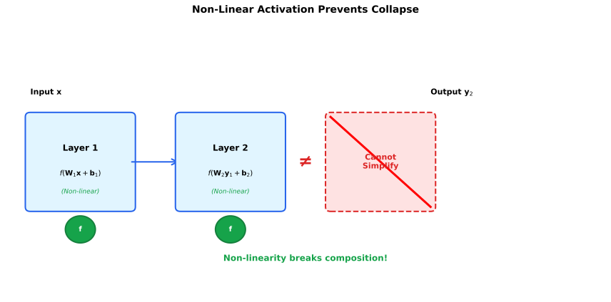
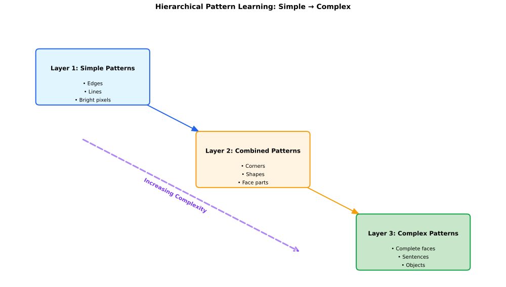
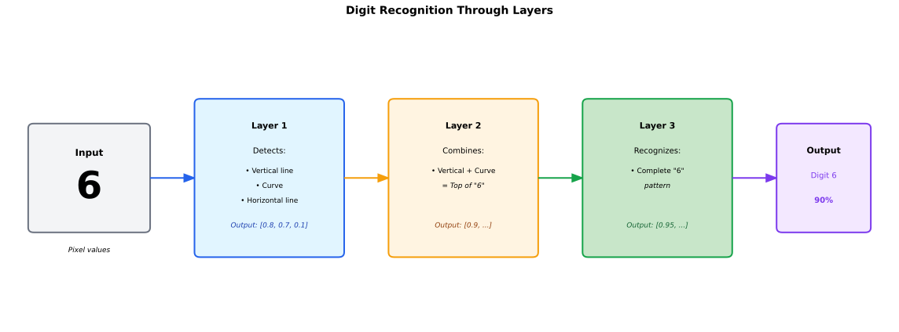
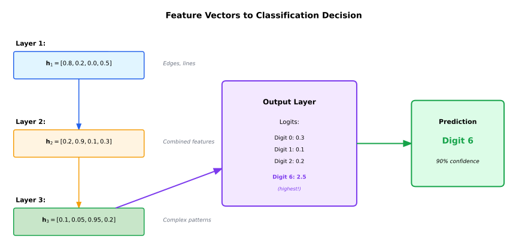

## Chapter 1: Neural Networks and the Perceptron

This chapter establishes the foundation for understanding neural networks by starting with the simplest possible unit: a single neuron, called a perceptron. We explain every concept using physical analogies that connect abstract mathematics to tangible reality, making the material more accessible and memorable. Understanding how a single perceptron works provides the essential foundation for understanding more complex networks, including the transformers we'll study in later chapters.

**Navigation:**
- [← Introduction](00-introduction.md) | [Table of Contents](00-index.md) | [Next: Multilayer Networks and Architecture →](02-multilayer-networks-architecture.md)

### Why This Chapter First?

Most AI education jumps straight to transformers without explaining the fundamental system they're built on. This approach leaves students with a superficial understanding—they can describe what transformers do, but they don't understand how or why they work. 

This chapter takes a different approach. We build understanding from the ground up, starting with a single neuron and progressing through its components and capabilities. Every concept connects to something you can visualize and understand. This foundation is essential because transformers are, at their core, sophisticated neural networks. To truly understand transformers, you must first understand the system they're built upon.

**Learning Principle:** Understand the system before you study its components.

---

## What Are Neural Networks?

Neural networks are computational systems inspired by how the brain processes information. To understand how they work, imagine a factory assembly line. Raw materials arrive at the input, pass through multiple assembly stations (called layers), and emerge as a finished product at the output. What makes this factory special is that it learns from examples. When you show it many examples—like "when I see 'cat', predict 'sat'"—the factory adjusts its machines (which we call weights) to get better at making predictions. After processing many examples, it learns the underlying patterns and can then make predictions on new inputs it has never seen before.

Neural networks matter because they can learn complex patterns from data without being explicitly programmed for each pattern. This ability to learn from examples makes them the foundation of modern AI, including the transformer models we'll study in later chapters. They excel at tasks where the rules are too complex to write down explicitly, but where we have many examples of the desired behavior.

To see a neural network in action, [Example 1: Minimal Forward Pass](09-example1-forward-pass.md) demonstrates how a transformer makes predictions step by step through the forward pass.

---

## The Perceptron: The Basic Building Block

A perceptron is a single neuron—the simplest possible neural network. It functions as a decision-making unit that takes multiple inputs, weighs their importance, and produces a single output decision. While a single perceptron is quite limited in what it can learn, understanding how it works provides the foundation for understanding more complex networks.

### The Mathematical Story

A perceptron computes its output using the following formula:

$$y = f(\mathbf{w} \cdot \mathbf{x} + b)$$

Let's break down each component of this equation:

**1. The input ($\mathbf{x}$):** The input is a **vector** (an ordered list of numbers) containing $d$ numbers. We write this mathematically as $\mathbf{x} \in \mathbb{R}^d$, where:
- $\mathbb{R}$ (pronounced "R") means "the set of all **real numbers**" (any number you can think of: positive, negative, whole numbers, decimals, fractions)
- $\mathbb{R}^d$ means "all vectors with $d$ components, each being a real number" (a $d$-dimensional vector where each component is a real number)
- The notation $\in$ means "belongs to" or "is a member of"

For example, if $d=3$, then $\mathbf{x}$ is a 3-dimensional vector like $\begin{bmatrix} 0.5 \\ 0.3 \\ 0.2 \end{bmatrix}$, where each number is a real number.

**2. The weights ($\mathbf{w}$):** The weights determine how important each input component is. This is also a $d$-dimensional vector ($\mathbf{w} \in \mathbb{R}^d$), meaning it has the same number of components as the input. Each weight corresponds to one input component—the first weight applies to the first input, the second weight to the second input, and so on.

**3. The bias ($b$):** The bias is a single **real number** ($b \in \mathbb{R}$) that provides a baseline offset, shifting the entire computation up or down. Think of it like adjusting a scale to zero before weighing something—it shifts the starting point of the calculation.

**4. The dot product ($\mathbf{w} \cdot \mathbf{x}$):** The dot product multiplies each weight by its corresponding input component and sums them all together, producing a single number (a **scalar**). This is the weighted sum of all inputs.

**5. Adding the bias ($\mathbf{w} \cdot \mathbf{x} + b$):** We add the bias to the dot product result, giving us the **pre-activation value** (the value before applying the activation function).

**6. The activation function ($f()$):** The activation function (written as $f: \mathbb{R} \to \mathbb{R}$, which means "a function that takes one real number as input and produces another real number as output") shapes the final output. It transforms the pre-activation value into the final decision.

**7. The output ($y$):** The final output is a single real number ($y \in \mathbb{R}$) representing the decision made by the perceptron.

**Notation Note:** When we write a vector like $\begin{bmatrix} 1 \\ 0 \end{bmatrix}$, this represents a single vector with two components (the first component is 1, the second is 0). This is different from a system of equations—it is one mathematical object (a vector), not multiple equations. The vertical arrangement is simply the standard mathematical notation for column vectors.

### Example: Computing Perceptron Output

We now illustrate the perceptron computation using a numerical example with a 2-dimensional input vector. For pedagogical clarity, we choose simple input values that make the arithmetic easy to follow: $\mathbf{x} = \begin{bmatrix} 1 \\ 0 \end{bmatrix}$, which is a unit basis vector where only the first component is non-zero. This choice simplifies the calculation while demonstrating the core computation.

**Given:**
- Input vector: $\mathbf{x} = \begin{bmatrix} 1 \\ 0 \end{bmatrix}$ (chosen for simplicity: only the first component is active, making it easy to trace how each component contributes)
- Weight vector: $\mathbf{w} = \begin{bmatrix} 0.1 \\ 0.2 \end{bmatrix}$ (arbitrary example values chosen to demonstrate the computation)
- Bias: $b = 0.05$ (arbitrary example value)
- Activation function: $f(x) = \text{ReLU}(x) = \max(0, x)$

**Equation to solve:**
$$y = f\left(\begin{bmatrix} 0.1 \\ 0.2 \end{bmatrix} \cdot \begin{bmatrix} 1 \\ 0 \end{bmatrix} + 0.05\right) = \text{ReLU}\left(\begin{bmatrix} 0.1 \\ 0.2 \end{bmatrix} \cdot \begin{bmatrix} 1 \\ 0 \end{bmatrix} + 0.05\right)$$

**Computation:**

1. **Compute the dot product** $\mathbf{w} \cdot \mathbf{x}$:
   $$\mathbf{w} \cdot \mathbf{x} = w_1 \cdot x_1 + w_2 \cdot x_2 = 0.1 \times 1 + 0.2 \times 0 = 0.1 + 0 = 0.1$$

   **Important Note on Dot Products:** The dot product of two vectors always produces a **scalar** (a single number), not a vector. This is because we multiply corresponding components and then **sum** them together. The formula $\mathbf{w} \cdot \mathbf{x} = \sum_{i=1}^d w_i x_i$ shows this: we multiply each $w_i$ by $x_i$, then add all the products together, resulting in a single number. This weighted sum is exactly what we need for a perceptron, which produces a single output value.

2. **Add the bias term**:
   $$\mathbf{w} \cdot \mathbf{x} + b = 0.1 + 0.05 = 0.15$$

3. **Apply the activation function**:
   $$y = f(0.15) = \text{ReLU}(0.15) = \max(0, 0.15) = 0.15$$

**Result:** The perceptron produces output $y = 0.15$ (a scalar, single number).

**Interpretation:** We chose the input vector $\begin{bmatrix} 1 \\ 0 \end{bmatrix}$ because it simplifies the calculation—only the first component is non-zero, making it easy to see how that component contributes to the output. The first component (value 1) is multiplied by weight 0.1, contributing 0.1 to the weighted sum. The second component (value 0) is multiplied by weight 0.2, contributing 0 to the weighted sum (demonstrating that zero inputs produce zero contribution regardless of the weight value). The bias term adds 0.05 to the result. After applying the ReLU activation function, which preserves non-negative values, the final output is 0.15.

### Example: Alternative Input

To demonstrate how different inputs produce different outputs, we now consider the same perceptron with input $\mathbf{x} = \begin{bmatrix} 0 \\ 1 \end{bmatrix}$, which is the complementary unit basis vector (only the second component is non-zero). This choice allows us to compare how the same perceptron responds to different input patterns while keeping the arithmetic simple.

**Equation to solve:**
$$y = f\left(\begin{bmatrix} 0.1 \\ 0.2 \end{bmatrix} \cdot \begin{bmatrix} 0 \\ 1 \end{bmatrix} + 0.05\right) = \text{ReLU}\left(\begin{bmatrix} 0.1 \\ 0.2 \end{bmatrix} \cdot \begin{bmatrix} 0 \\ 1 \end{bmatrix} + 0.05\right)$$

**Computation:**

1. Dot product: $\mathbf{w} \cdot \mathbf{x} = 0.1 \times 0 + 0.2 \times 1 = 0.2$
2. Add bias: $0.2 + 0.05 = 0.25$
3. Apply ReLU: $y = \max(0, 0.25) = 0.25$

This example demonstrates that the same perceptron produces different outputs for different input vectors. By using the unit basis vectors $\begin{bmatrix} 1 \\ 0 \end{bmatrix}$ and $\begin{bmatrix} 0 \\ 1 \end{bmatrix}$, we can clearly see how each input component contributes independently to the output. This ability to respond differently to different input patterns is fundamental to how neural networks learn to recognize and classify patterns—a capability we will explore in detail in [Example 7: Character Recognition](15-example7-character-recognition.md), where we'll see how networks use this mechanism to distinguish between different characters.

You might notice that the core computation $\mathbf{w} \cdot \mathbf{x} + b$ looks very familiar—it's closely related to the equation of a straight line! In algebra, we write a line as $y = mx + c$, where $m$ is the slope and $c$ is the y-intercept. For a perceptron with a single input ($d=1$), $\mathbf{w} \cdot \mathbf{x} + b$ becomes $wx + b$, which is exactly $y = mx + c$ (where $w$ is the slope and $b$ is the intercept). For multiple inputs ($d > 1$), $\mathbf{w} \cdot \mathbf{x} = \sum_{i=1}^d w_i x_i$ is the dot product (weighted sum), which generalizes the line equation to multiple dimensions. The bias $b$ still shifts the entire computation up or down, just like the y-intercept shifts a line.

**Understanding Dot Products vs. Matrix Multiplication:**

It's important to understand the difference between a **dot product** and **matrix multiplication**, as this distinction is crucial for understanding how neural networks work. Both operations compute weighted sums, but they produce different types of results.

**1. Dot Product ($\mathbf{w} \cdot \mathbf{x}$):**

A dot product takes two **vectors** of the same dimension and produces a **scalar** (a single number). Think of it like computing a weighted average: you multiply each component of one vector by the corresponding component of the other vector, then add all the products together.

The formula is: $\mathbf{w} \cdot \mathbf{x} = \sum_{i=1}^d w_i x_i = w_1 x_1 + w_2 x_2 + \cdots + w_d x_d$

- **Input**: Two vectors of the same size (both have $d$ components)
- **Output**: A single number (a **scalar**)
- **What it does**: Computes one weighted sum

**Why we use dot products in perceptrons:** A single perceptron produces one output value (a scalar), so we need a dot product. The dot product $\mathbf{w} \cdot \mathbf{x}$ takes the $d$-dimensional input vector $\mathbf{x}$ and the $d$-dimensional weight vector $\mathbf{w}$, multiplies corresponding components, sums them up, and produces a single number. This single number is then passed through the activation function to produce the final output.

**2. Matrix Multiplication ($\mathbf{W}\mathbf{x}$):**

Matrix multiplication takes a **matrix** and a **vector** and produces a **vector**. Think of it like computing multiple weighted sums simultaneously—one for each row of the matrix.

- **Input**: A matrix $\mathbf{W}$ of size $n \times d$ (meaning it has $n$ rows and $d$ columns) and a vector $\mathbf{x}$ with $d$ components
- **Output**: A vector with $n$ components
- **What it does**: Computes $n$ dot products in parallel

Each element of the result is computed as a dot product: the $i$-th element of $\mathbf{W}\mathbf{x}$ is the dot product of the $i$-th row of $\mathbf{W}$ with $\mathbf{x}$.

**Why we use matrix multiplication in layers:** When we have multiple perceptrons (a layer), we use matrix multiplication. If we have $n$ perceptrons, each with its own weight vector $\mathbf{w}_i$, we can stack these weight vectors into a matrix $\mathbf{W}$ where each row is a weight vector. Then $\mathbf{W}\mathbf{x}$ computes all $n$ dot products simultaneously, producing an $n$-dimensional output vector (one value per perceptron). This is exactly what happens in a layer: multiple dot products computed in parallel via matrix multiplication.

**Concrete Example:**

- **Single perceptron**: $\mathbf{w} = \begin{bmatrix} 0.1 \\ 0.2 \end{bmatrix}$, $\mathbf{x} = \begin{bmatrix} 1 \\ 0 \end{bmatrix}$
  - Dot product: $\mathbf{w} \cdot \mathbf{x} = 0.1 \times 1 + 0.2 \times 0 = 0.1$ (scalar)
  
- **Layer with 2 perceptrons**: $\mathbf{W} = \begin{bmatrix} 0.1 & 0.2 \\ 0.3 & 0.4 \end{bmatrix}$, $\mathbf{x} = \begin{bmatrix} 1 \\ 0 \end{bmatrix}$
  - Matrix multiplication: $\mathbf{W}\mathbf{x} = \begin{bmatrix} 0.1 \times 1 + 0.2 \times 0 \\ 0.3 \times 1 + 0.4 \times 0 \end{bmatrix} = \begin{bmatrix} 0.1 \\ 0.3 \end{bmatrix}$ (vector)
  - Notice: Each row of $\mathbf{W}$ is dotted with $\mathbf{x}$, producing one element of the result vector

To understand what this generalization means geometrically, we need to see how the equation $\mathbf{w} \cdot \mathbf{x} + b = 0$ creates decision boundaries in different dimensions. The key insight is that this same equation creates different geometric objects depending on the number of input dimensions, but they all serve the same purpose: dividing space into two regions.

**From Lines to Hyperplanes: A Step-by-Step Progression**

**1. 1D input ($d=1$):** When we have a single input, the equation becomes $w_1 x_1 + b = 0$. This defines a **point** on a number line (specifically, the point $x_1 = -b/w_1$). This point divides the number line into two regions: all points to one side satisfy $w_1 x_1 + b > 0$ (positive), while all points to the other side satisfy $w_1 x_1 + b < 0$ (negative). Think of it like a temperature scale where zero degrees divides hot from cold.

**2. 2D input ($d=2$):** When we have two inputs, the equation becomes $w_1 x_1 + w_2 x_2 + b = 0$. This defines a **straight line** in the $(x_1, x_2)$ plane. This line divides the plane into two regions (half-planes): all points on one side satisfy $w_1 x_1 + w_2 x_2 + b > 0$, while all points on the other side satisfy $w_1 x_1 + w_2 x_2 + b < 0$. This is exactly like the line equation $y = mx + c$ you learned in algebra, but written in a more general form.

**3. 3D input ($d=3$):** When we have three inputs, the equation becomes $w_1 x_1 + w_2 x_2 + w_3 x_3 + b = 0$. This defines a **plane** in 3D space. This plane divides 3D space into two regions (half-spaces): all points on one side satisfy $w_1 x_1 + w_2 x_2 + w_3 x_3 + b > 0$, while all points on the other side satisfy $w_1 x_1 + w_2 x_2 + w_3 x_3 + b < 0$. Think of it like a wall that divides a room into two halves.

**4. nD input ($d=n$):** When we have $n$ inputs (where $n$ can be any number), the equation $\mathbf{w} \cdot \mathbf{x} + b = 0$ defines a **hyperplane** in $n$-dimensional space. A hyperplane is the generalization of a point (1D), line (2D), and plane (3D) to higher dimensions. Just like a line divides 2D space and a plane divides 3D space, a hyperplane divides $n$-dimensional space into two regions.

**The Power of the Vector Form**

The equation $\mathbf{w} \cdot \mathbf{x} + b = 0$ is powerful because it's the same mathematical structure (a **hyperplane**) regardless of dimension. Whether you're working in 2D, 3D, or 1000D, the equation works the same way: it creates a flat surface that divides space into two regions. All points on one side satisfy $\mathbf{w} \cdot \mathbf{x} + b > 0$, while all points on the other side satisfy $\mathbf{w} \cdot \mathbf{x} + b < 0$. This is why we use the vector form—it's dimension-independent, meaning the same formula works for any number of inputs.

| | | |
|:---:|:---:|:---:|
|  |  |  |

The key difference is that the perceptron then applies an activation function $f()$ to this linear combination. If $f()$ is the identity function (just returns its input unchanged), then the perceptron is computing a linear function—a straight line (or hyperplane in higher dimensions). But with other activation functions, we get non-linear transformations that enable the network to learn complex, curved patterns that a simple straight line cannot represent.

To see this transformation in action, consider what happens when we apply different activation functions to straight lines. The graphs below show four different linear functions (y = 2x + 1, y = -x + 2, y = 0.5x - 1, and y = -1.5x + 0.5) and how they are transformed by three common activation functions: ReLU, Sigmoid, and Tanh. (We'll define these functions precisely in a moment, but for now, notice their visual effects.) ReLU zeros out all negative values, creating sharp corners where lines cross zero. Sigmoid squashes everything into the 0-1 range, creating smooth S-shaped curves. Tanh does something similar but squashes to the -1 to 1 range, preserving the sign of the original values. These transformations are what allow neural networks to learn non-linear patterns—without them, the network would only be able to compute straight lines.

| | |
|:---:|:---:|
|  |  |
|  |  |

To understand this intuitively, think of a perceptron as a simple voting system. The inputs are like votes: [vote1, vote2, vote3]. The weights determine the strength of each vote: [0.8, 0.2, 0.5] means vote1 is most important. The bias adds a baseline value, like always adding +0.1 regardless of the votes. The activation function then shapes the result, perhaps by saying "if the total exceeds 0.5, output YES."

We illustrate this with a numerical example using arbitrary values chosen to demonstrate the computation:

**Equation to solve:**
$$y = f\left(\begin{bmatrix} 0.8 \\ 0.2 \\ 0.5 \end{bmatrix} \cdot \begin{bmatrix} 1.0 \\ 0.5 \\ 0.3 \end{bmatrix} + 0.1\right) = \text{ReLU}\left(\begin{bmatrix} 0.8 \\ 0.2 \\ 0.5 \end{bmatrix} \cdot \begin{bmatrix} 1.0 \\ 0.5 \\ 0.3 \end{bmatrix} + 0.1\right)$$

**Given:**
- Input vector: $\mathbf{x} = \begin{bmatrix} 1.0 \\ 0.5 \\ 0.3 \end{bmatrix}$ (example 3-dimensional input vector)
- Weight vector: $\mathbf{w} = \begin{bmatrix} 0.8 \\ 0.2 \\ 0.5 \end{bmatrix}$ (example weight values)
- Bias: $b = 0.1$ (example bias value)
- Activation function: $f(x) = \text{ReLU}(x) = \max(0, x)$

**Computation:**

1. **Compute the weighted sum** $\mathbf{w} \cdot \mathbf{x} + b$:
   $$\mathbf{w} \cdot \mathbf{x} + b = w_1 x_1 + w_2 x_2 + w_3 x_3 + b = 0.8 \times 1.0 + 0.2 \times 0.5 + 0.5 \times 0.3 + 0.1 = 0.8 + 0.1 + 0.15 + 0.1 = 1.15$$

2. **Apply the activation function**:
   $$y = f(1.15) = \text{ReLU}(1.15) = \max(0, 1.15) = 1.15$$

**Result:** The perceptron produces output $y = 1.15$.

This example demonstrates that each input is multiplied by its corresponding weight, the products are summed together, the bias is added, and then the activation function is applied to produce the final output. The specific values are chosen arbitrarily for illustration; in practice, these would be learned during training.

### Understanding the Components

We now examine each component of the perceptron in detail, as understanding these building blocks is essential for grasping how more complex networks operate.

**Weight ($\mathbf{w}$):** Weights determine the strength of connections in a network. A high weight creates a strong connection, meaning that input has a large influence on the output. A low weight creates a weak connection, giving that input only a small influence. When a weight is negative, it creates an inhibitory connection that opposes the input rather than supporting it. During training, the network learns which weights to assign to each input based on how well those weights help it make correct predictions.

**Numerical Example:** Consider a weight vector $\mathbf{w} = \begin{bmatrix} 0.1 \\ 0.2 \end{bmatrix}$:
- The first input component is scaled by weight 0.1 (moderate influence)
- The second input component is scaled by weight 0.2 (stronger influence, contributing twice as much per unit input)
- For comparison, a weight vector $\mathbf{w} = \begin{bmatrix} 0.5 \\ -0.3 \end{bmatrix}$ would give the first component strong positive influence (0.5), while the second component would have inhibitory influence (-0.3), reducing the output when that input is positive

**Computation Example:** Using the same simple input vector $\mathbf{x} = \begin{bmatrix} 1 \\ 0 \end{bmatrix}$ and weights $\mathbf{w} = \begin{bmatrix} 0.1 \\ 0.2 \end{bmatrix}$:
- First component contribution: $w_1 \times x_1 = 0.1 \times 1 = 0.1$
- Second component contribution: $w_2 \times x_2 = 0.2 \times 0 = 0$
- Total weighted input: $0.1 + 0 = 0.1$

This demonstrates that weights only affect the output when their corresponding input components are non-zero. The weight value 0.2 has no effect in this case because the corresponding input component is zero. We chose $\begin{bmatrix} 1 \\ 0 \end{bmatrix}$ specifically to make this property clear—by having one component be zero, we can isolate the effect of the other component.

Weights are typically initialized to small random values (e.g., sampled from a normal distribution with mean 0 and standard deviation 0.01) to break symmetry. If all weights start at zero, all neurons in a layer would compute identical outputs and learn identical features, which would waste capacity. Random initialization ensures each neuron starts with different weights, enabling the network to learn diverse features.

**Bias ($b$):** The bias serves two critical purposes in a perceptron:

**1. Baseline offset:** The bias acts as a baseline or offset that shifts the entire computation up or down. In algebra, this is like **translating a graph**: if you have $y = f(x)$ and you add a constant $c$ to get $y = f(x) + c$, the entire graph shifts up or down by $c$ units. The bias does the same thing—it shifts the entire function up or down. Think of it like setting a scale to zero before weighing something, or adjusting a thermostat's baseline temperature.

**2. Decision boundary flexibility:** The bias allows the perceptron to make decisions even when all inputs are zero, and it provides flexibility in how the **decision boundary** (the line or hyperplane that separates different classes) is positioned. 

**Why bias is essential:** Without bias, a perceptron with all-zero inputs always outputs $f(0) = f(\mathbf{w} \cdot \mathbf{0}) = f(0)$, which severely limits **expressivity** (the network's ability to represent different functions). More importantly, without bias, the decision boundary must always pass through the **origin** (the point where all coordinates are zero). The bias term enables the network to learn decision boundaries that don't pass through the origin, giving it much more flexibility in how it separates different classes of data.

**Numerical Example:** Consider bias $b = 0.05$:
- Given weighted sum 0.1, the value before activation becomes $0.1 + 0.05 = 0.15$
- Given weighted sum 0.0, the value before activation becomes $0.0 + 0.05 = 0.05$ (positive output even with zero weighted input)
- With bias $b = -0.1$, the same weighted sum of 0.1 becomes $0.1 + (-0.1) = 0.0$

**Comparison Example:** To illustrate how bias affects the output, consider two perceptrons with identical weights $\mathbf{w} = \begin{bmatrix} 0.1 \\ 0.2 \end{bmatrix}$ and the same simple input $\mathbf{x} = \begin{bmatrix} 1 \\ 0 \end{bmatrix}$ (chosen to keep the calculation straightforward):
- Perceptron A with $b = 0.05$: output = ReLU(0.1 + 0.05) = ReLU(0.15) = 0.15
- Perceptron B with $b = -0.1$: output = ReLU(0.1 + (-0.1)) = ReLU(0.0) = 0.0

The bias parameter shifts the decision threshold, controlling the perceptron's sensitivity to input variations.

**Activation Function ($f()$):** The activation function acts as a filter that shapes the signal. Without an activation function, a network can only perform linear transformations, which severely limits what it can learn. With an activation function, the network gains the ability to learn complex, non-linear patterns. Different activation functions create different "shapes" of transformation, each suited to different types of problems.

**Numerical Example:** Consider the pre-activation value 0.15 (weighted sum + bias):
- **ReLU**: $f(0.15) = \max(0, 0.15) = 0.15$ (preserves non-negative values)
- **ReLU with negative input**: For input $-0.1$, ReLU produces $\max(0, -0.1) = 0$ (rectifies negative values to zero)
- **Sigmoid**: $f(0.15) = \frac{1}{1+e^{-0.15}} \approx 0.537$ (maps to the interval $(0, 1)$)
- **Tanh**: $f(0.15) = \tanh(0.15) \approx 0.149$ (maps to the interval $(-1, 1)$, preserving the sign of the input)

**Comparison Example:** To compare different activation functions, we use the same input $\mathbf{x} = \begin{bmatrix} 1 \\ 0 \end{bmatrix}$ (chosen for simplicity), weights $\mathbf{w} = \begin{bmatrix} 0.1 \\ 0.2 \end{bmatrix}$, and bias $b = 0.05$:
- Pre-activation value: $0.1 + 0.05 = 0.15$
- **With ReLU activation**: output = $\max(0, 0.15) = 0.15$
- **With Sigmoid activation**: output = $\frac{1}{1+e^{-0.15}} \approx 0.537$
- **With identity (no activation)**: output = $0.15$ (linear transformation only)

This comparison demonstrates that different activation functions produce distinct outputs from the same pre-activation value, enabling networks to learn different types of non-linear patterns.

**Why activation functions matter:** Activation functions serve two critical purposes. First, they must be **smooth enough** (technically, at least **piecewise differentiable**) so that **gradient descent** can calculate how to adjust the weights during training. Think of "smooth enough" as meaning the function has no sharp, discontinuous jumps that would break the gradient calculation—it can have corners (like ReLU at zero), but must be smooth in sections.

Second, and more importantly, activation functions introduce **non-linearity**—the ability to create curves and complex shapes instead of just straight lines. To understand why this matters, imagine trying to draw a circle using only straight lines: you'd need infinitely many tiny straight segments. Similarly, without non-linearity, networks can only learn **straight-line relationships** between inputs and outputs, which severely limits what patterns they can represent. Real-world data rarely follows straight-line patterns—think of how image recognition, language understanding, or any complex task requires curved, non-linear decision boundaries.

The power of non-linearity is captured by the **universal approximation theorem** (proven by Cybenko in 1989 and Hornik et al. in 1991), which establishes that a neural network with a single hidden layer and non-linear activation can approximate any **continuous function** to **arbitrary accuracy**, given enough neurons. In practical terms, this means that with non-linear activation functions, networks can learn to represent almost any pattern you can imagine, as long as they have enough neurons (what mathematicians call **sufficient capacity**).

Without activation functions, multiple layers would be useless—they would all collapse into a single **linear layer**, losing the ability to learn **hierarchical patterns** (simple patterns in early layers building into complex patterns in later layers) that make deep networks powerful.

### How Activation Functions Enable Complex Pattern Learning

To understand why activation functions are essential for learning complex patterns, we need to see what happens when we stack multiple layers—both with and without activation functions.

**Why Linear Layers Collapse:**

Consider a network with two layers, both using the identity function (no activation). The first layer computes $\mathbf{y}_1 = \mathbf{W}_1 \mathbf{x} + \mathbf{b}_1$, and the second layer computes $\mathbf{y}_2 = \mathbf{W}_2 \mathbf{y}_1 + \mathbf{b}_2$. If we substitute the first equation into the second:

$$\mathbf{y}_2 = \mathbf{W}_2 (\mathbf{W}_1 \mathbf{x} + \mathbf{b}_1) + \mathbf{b}_2 = \mathbf{W}_2 \mathbf{W}_1 \mathbf{x} + \mathbf{W}_2 \mathbf{b}_1 + \mathbf{b}_2$$

This simplifies to $\mathbf{y}_2 = \mathbf{W}_{\text{combined}} \mathbf{x} + \mathbf{b}_{\text{combined}}$, where $\mathbf{W}_{\text{combined}} = \mathbf{W}_2 \mathbf{W}_1$ and $\mathbf{b}_{\text{combined}} = \mathbf{W}_2 \mathbf{b}_1 + \mathbf{b}_2$. This is just a single linear transformation! No matter how many linear layers you stack, the result is always equivalent to a single linear layer. This is why linear layers "collapse"—they can't create any complexity beyond what a single layer can do.

**How Non-Linear Activation Functions Prevent Collapse:**

Now consider the same two-layer network, but with a non-linear activation function $f()$ applied after each layer. The first layer computes $\mathbf{y}_1 = f(\mathbf{W}_1 \mathbf{x} + \mathbf{b}_1)$, and the second layer computes $\mathbf{y}_2 = f(\mathbf{W}_2 \mathbf{y}_1 + \mathbf{b}_2)$. When we substitute:

$$\mathbf{y}_2 = f(\mathbf{W}_2 f(\mathbf{W}_1 \mathbf{x} + \mathbf{b}_1) + \mathbf{b}_2)$$

Because $f()$ is non-linear, we cannot simplify this to a single linear transformation. The non-linearity "breaks" the composition, preventing collapse. Each layer now contributes something unique that cannot be replicated by a single layer.

**How Non-Linear Composition Creates Complex Patterns:**

The power of non-linear activation functions comes from composition—applying one non-linear function to the output of another. Each layer transforms the input in a non-linear way, and when you stack multiple such transformations, the complexity compounds.

Think of it like this: A single non-linear function can create simple curves (like ReLU creating sharp corners, or sigmoid creating S-curves). But when you compose multiple non-linear functions, each layer can:
1. **Detect simple patterns** in early layers (e.g., "is this pixel bright?" or "does this edge exist?")
2. **Combine simple patterns** in middle layers (e.g., "is this a corner?" or "does this look like part of a face?")
3. **Recognize complex patterns** in later layers (e.g., "is this a complete face?" or "does this sentence make sense?")

**Concrete Example: Hierarchical Pattern Learning**

Imagine training a network to recognize handwritten digits. Without activation functions, the network could only learn linear decision boundaries—it could separate "digit 0" from "digit 1" with a straight line, but couldn't learn the complex curved shapes that distinguish digits.

With ReLU activation functions, here's what happens:

- **Layer 1** learns to detect simple features: "Is there a vertical line here?" "Is there a horizontal line there?" Each neuron might activate when it sees a specific edge orientation. The ReLU function allows neurons to "turn on" (output positive values) when they detect their feature, and "turn off" (output zero) otherwise.

- **Layer 2** receives these simple feature detections and learns to combine them: "If I see a vertical line on the left AND a curve on the right, that might be part of a '6'." The ReLU function again allows neurons to activate only when multiple conditions are met.

- **Layer 3** receives these combined features and learns even more complex patterns: "If I see the pattern from Layer 2 that looks like the top of a '6', AND the pattern that looks like the bottom of a '6', then this is likely a '6'."

Each layer builds on the previous layer's output, and the non-linear activation function is what makes this hierarchical composition possible. Without it, Layer 2 would just be a linear combination of Layer 1's outputs, which could be replicated by a single layer. With non-linear activation, Layer 2 creates genuinely new patterns that Layer 1 couldn't represent.

**Mathematical Intuition:**

In algebra, composing linear functions always gives you a linear function: if $f(x) = ax + b$ and $g(x) = cx + d$, then $g(f(x)) = c(ax + b) + d = (ca)x + (cb + d)$, which is still linear. But composing non-linear functions creates new functions with different shapes. For example, if $f(x) = \max(0, x)$ (ReLU) and $g(x) = \max(0, x)$, then $g(f(x)) = \max(0, \max(0, x)) = \max(0, x)$—but when you have different weight matrices between the activations, the composition creates genuinely new non-linear patterns.

This is why deep networks with activation functions can learn complex patterns: each layer applies a non-linear transformation, and stacking many such transformations creates a function that can approximate arbitrarily complex relationships between inputs and outputs.

**How Patterns Translate to Classification Decisions:**

Understanding that networks learn hierarchical patterns is only half the story. The crucial question is: how do these patterns actually help the network make correct classifications? The answer lies in how the final output layer uses these learned patterns.

**Who Builds the Features? How Are They Assigned to Layers?**

This is a critical point: **no one manually chooses or designs the features**. The network learns them automatically during training. Here's how it works:

1. **Architecture is designed, features are learned**: You (the engineer) design the network architecture—how many layers, how many neurons per layer, which activation functions to use. But what each neuron actually learns to detect is determined automatically by the training process.

2. **Hierarchical structure emerges naturally**: Early layers naturally learn simple patterns (edges, lines) because they only see raw input. Later layers naturally learn complex patterns (shapes, objects) because they see the outputs of earlier layers. This hierarchy emerges from the network structure itself—you don't tell Layer 1 to learn edges and Layer 3 to learn objects. The network figures this out through training.

3. **Training guides feature learning**: During training, **backpropagation** and the **loss function** automatically guide which features are learned. If a feature helps reduce the loss (makes better predictions), its weights increase. If a feature hurts predictions, its weights decrease. Over many training examples, the network discovers which patterns are useful for the task.

4. **Different layers learn different abstractions**: Because Layer 1 only sees raw pixels, it can only learn pixel-level patterns (edges, brightness). Layer 2 sees Layer 1's outputs, so it can learn combinations of edges (corners, curves). Layer 3 sees Layer 2's outputs, so it can learn combinations of those combinations (complete shapes). This abstraction hierarchy is a natural consequence of the layered structure.

Consider our handwritten digit recognition example. The network doesn't just learn patterns for the sake of learning them—it learns patterns that are **useful for distinguishing between different digits**. Here's how the patterns contribute to the final classification:

1. **Pattern Detection Creates Feature Vectors**: Each layer's output is a vector of numbers, where each number represents how strongly a particular pattern is detected. For example, after Layer 1, you might have a vector like $[0.8, 0.2, 0.0, 0.5]$, where:
   - $0.8$ means "strong vertical line detected"
   - $0.2$ means "weak horizontal line detected"
   - $0.0$ means "no diagonal line detected"
   - $0.5$ means "moderate curve detected"

2. **Later Layers Combine Features**: Layer 2 receives these feature vectors and learns to combine them. A neuron in Layer 2 might learn: "If I see a strong vertical line (0.8) AND a moderate curve (0.5), this combination suggests the top part of a '6'." This neuron outputs a high value (say, 0.9) when it sees this combination, and a low value (say, 0.1) otherwise.

3. **Output Layer Makes the Decision**: The final output layer receives the combined features from the last hidden layer. It has one neuron per class (e.g., one for "digit 0", one for "digit 1", etc.). Each output neuron learns which combinations of features indicate its class. For example:
   - The "digit 1" neuron might have high weights for "vertical line" features and low weights for "curve" features
   - The "digit 6" neuron might have high weights for "vertical line + curve" combinations
   - The "digit 0" neuron might have high weights for "closed loop" features

4. **The Final Computation**: When the network sees an input image, it computes:
   - Layer 1 detects simple patterns → outputs feature vector $\mathbf{h}_1$
   - Layer 2 combines patterns → outputs feature vector $\mathbf{h}_2$
   - Layer 3 recognizes complex patterns → outputs feature vector $\mathbf{h}_3$
   - Output layer computes: $\text{logit}_i = \mathbf{w}_i \cdot \mathbf{h}_3 + b_i$ for each class $i$ (where a logit is the raw, unnormalized score before converting to probabilities; we'll define this formally in [Chapter 3: Learning Algorithms](03-learning-algorithms.md))
   - The class with the highest logit becomes the prediction

**Concrete Example: Recognizing the Digit "6"**

Let's trace through what happens when the network sees an image of the digit "6":

- **Input**: Pixel values representing a "6" shape
- **Layer 1 Output**: $[0.8, 0.1, 0.0, 0.7]$ 
  - High value (0.8) for "vertical line on left" detector
  - Low value (0.1) for "horizontal line" detector
  - Zero (0.0) for "diagonal line" detector
  - High value (0.7) for "curve" detector

- **Layer 2 Output**: $[0.2, 0.9, 0.1, 0.3]$
  - Low value (0.2) for "straight line combination" detector
  - **High value (0.9) for "vertical line + curve" combination** (this is the key pattern for "6")
  - Low values for other combinations

- **Layer 3 Output**: $[0.1, 0.05, 0.95, 0.2]$
  - Very low values for "digit 0", "digit 1", "digit 2" patterns
  - **Very high value (0.95) for "digit 6" pattern** (recognizes the complete "6" shape)

- **Output Layer**: Computes logits (raw, unnormalized scores) for each class
  - Logit for "digit 0": $\mathbf{w}_0 \cdot [0.1, 0.05, 0.95, 0.2] + b_0 = 0.3$
  - Logit for "digit 1": $\mathbf{w}_1 \cdot [0.1, 0.05, 0.95, 0.2] + b_1 = 0.1$
  - Logit for "digit 2": $\mathbf{w}_2 \cdot [0.1, 0.05, 0.95, 0.2] + b_2 = 0.2$
  - **Logit for "digit 6": $\mathbf{w}_6 \cdot [0.1, 0.05, 0.95, 0.2] + b_6 = 2.5$** (highest!)

- **Softmax** (a function that converts scores to probabilities; we'll define this formally in [Chapter 3: Learning Algorithms](03-learning-algorithms.md)): Converts logits to probabilities
  - $P(\text{digit 0}) = 0.05$
  - $P(\text{digit 1}) = 0.02$
  - $P(\text{digit 2}) = 0.03$
  - **$P(\text{digit 6}) = 0.90$** (prediction!)

**Why This Works: Training Guides Pattern Learning**

The key insight is that the network doesn't learn arbitrary patterns—it learns patterns that are **useful for reducing the loss function**. During training:

1. The network makes a prediction (e.g., "digit 6" with 90% confidence)
2. The loss function compares this to the true label (e.g., "digit 6")
3. Backpropagation computes gradients that tell each layer: "Your patterns helped (or hurt) the prediction"
4. Weight updates adjust the patterns to be more useful

For example, if the network incorrectly predicts "digit 1" when it sees a "6", the gradients will:
- **Increase** weights in neurons that detect "vertical line + curve" (the pattern that distinguishes "6" from "1")
- **Decrease** weights in neurons that detect "just vertical line" (the pattern that led to the wrong prediction)

Over many training examples, the network learns that certain pattern combinations are highly predictive of specific classes. The hierarchical structure means:
- Early layers learn patterns that are **reusable** across many classes (edges, curves, lines)
- Later layers learn patterns that are **specific** to particular classes (the exact combination that means "6" vs "0")

This is why the patterns have value: they're not just abstract features—they're features that have been optimized through training to maximize classification accuracy. Each pattern contributes to the final decision through the weighted combination in the output layer, and the training process ensures these weights are set to make the most useful patterns have the most influence.

**Neural Networks vs. Hashing: A Critical Distinction**

You might wonder: is this process like hashing, where ideally each data item gets a unique identifier? The answer is **no**—and understanding why reveals something fundamental about how neural networks work.

**1. Traditional Hashing: Unique Identifiers**

**Hashing** creates unique identifiers:
- Same input → same hash (deterministic)
- Different inputs → different hashes (ideally unique)
- Goal: Create a one-to-one mapping for lookup/identification
- Example: Hash function might map "cat.jpg" → `0x3A7F2B1C` (unique identifier)

The fundamental principle of hashing is: **"Make each input unique"**—even similar inputs should get different hashes.

**2. Bloom Filters: Accidental Sharing**

You might be thinking: "What about bloom filters? They also create shared representations where multiple items map to the same bits." This is a good observation, but there's a crucial difference:

- **Bloom filters**: Shared representation is a **side effect** of hash collisions. Multiple items accidentally map to the same bits in a bit array, but the goal is still to distinguish items (though with false positives). The sharing happens because of limited space and hash collisions, not because items are semantically similar.

- **Neural networks**: Shared representation is **intentional and learned**. Similar items (like different handwritten "6"s) are **designed** to produce similar representations because that's what enables classification.

Bloom filters are probabilistic data structures for membership testing ("is this item in the set?"), while neural networks learn task-specific similarity for classification ("what class does this belong to?"). The key difference is that neural networks learn **semantic similarity** (what makes two "6"s similar), while bloom filters create **accidental collisions** (two different items happen to hash to the same bits).

**3. Neural Networks: Intentional Shared Representations**

**Neural networks learn shared representations:**
- Similar inputs → similar representations (not unique!)
- Goal: Learn features that help with classification/prediction
- Different inputs that belong to the same class should produce similar patterns
- Example: All images of "digit 6" should activate similar neurons, regardless of handwriting style

The fundamental principle of neural networks is: **"Make similar inputs produce similar representations"**—this is the opposite of hashing.

**Why We Want Shared Patterns, Not Unique Hashes:**

If neural networks worked like hashing (creating unique identifiers for each input), they would be useless for classification. Here's why:

1. **Generalization requires similarity**: To recognize a new "6" that the network has never seen before, it must share features with the "6"s it trained on. If each training example got a unique hash, the network couldn't recognize new examples.

2. **Pattern reuse is the goal**: The whole point is that many different "6"s share the same pattern (vertical line + curve). This shared pattern is what makes classification possible.

3. **The output layer needs shared features**: The output layer learns to say "if I see pattern X (vertical line + curve), predict class '6'". This only works if many different "6" images produce pattern X. If each image produced a unique pattern, the output layer couldn't learn useful mappings.

**Concrete Example:**

Imagine you have 1000 training images of the digit "6", each handwritten differently:
- Image 1: Slightly slanted "6"
- Image 2: Bold "6"
- Image 3: Thin "6"
- ... (997 more variations)

**With hashing (unique identifiers):**
- Image 1 → hash `0x3A7F2B1C`
- Image 2 → hash `0x9D4E8A2F`
- Image 3 → hash `0x1B6C3D9E`
- ... (all different, no relationship)

When you show a new "6" image, it gets a completely new hash. The network can't recognize it because it has no connection to the training examples.

**With neural network pattern learning (shared features):**
- Image 1 → pattern `[0.8, 0.1, 0.0, 0.7]` (vertical line + curve detected)
- Image 2 → pattern `[0.9, 0.0, 0.0, 0.8]` (stronger vertical line + curve)
- Image 3 → pattern `[0.7, 0.2, 0.0, 0.6]` (weaker but same pattern)
- ... (all similar, sharing the "vertical line + curve" pattern)

When you show a new "6" image, it produces a similar pattern (e.g., `[0.85, 0.1, 0.0, 0.75]`). The output layer recognizes this pattern and correctly predicts "digit 6" because it learned that this pattern combination indicates class "6".

**The Key Insight:**

Neural networks are doing the **opposite** of hashing:
- **Hashing**: "Make each input unique"
- **Neural networks**: "Make similar inputs produce similar representations"

This is called **representation learning** or **feature learning**. The network learns to map inputs to a space where:
- Similar inputs (same class) are close together
- Different inputs (different classes) are far apart

This is more like **clustering** than hashing—grouping similar things together rather than giving each thing a unique identifier.

**Why Shared Patterns Matter:**

If neural networks worked like hashing (creating unique identifiers for each input), they would be useless for classification:
1. **No generalization**: They couldn't recognize new examples they haven't seen before
2. **No learning**: They would need to store every training example (defeating the purpose of learning)
3. **No classification**: They couldn't classify anything they haven't memorized

The shared patterns are what make neural networks powerful: they learn to recognize the **essence** of what makes something a "6" (the pattern), not just memorize each individual "6" (a unique hash).

**Similarity-Preserving Hashing: A Closer Analogy**

You might be thinking: "What about a hash function that generates identical hashes for similar things?" This is actually much closer to what neural networks do! This concept is called **locality-sensitive hashing (LSH)** or **similarity-preserving hashing**.

**Locality-Sensitive Hashing (LSH):**
- Similar inputs → similar (or identical) hashes
- Different inputs → different hashes
- Goal: Preserve similarity relationships in the hash space
- Example: Two similar images might hash to `0x3A7F2B1C` and `0x3A7F2B1D` (very similar hashes)

**How Neural Networks Compare:**

Neural networks are doing something similar to LSH, but with crucial differences:

1. **Neural networks learn what "similar" means**: Unlike traditional LSH (which uses a fixed similarity metric like Euclidean distance), neural networks learn from data what features make inputs similar for the specific task. For digit recognition, "similar" means "same digit class", not just "pixel-wise similar". A bold "6" and a thin "6" are very different pixel-wise, but the network learns they're similar because they share the pattern (vertical line + curve).

2. **Continuous representations, not discrete hashes**: Neural networks produce continuous vectors (e.g., `[0.8, 0.1, 0.0, 0.7]`), not discrete hash codes. This allows for:
   - Fine-grained similarity (not just "same" or "different")
   - Gradient-based learning (can't take gradients of discrete hashes)
   - Smooth interpolation between patterns

3. **Task-specific similarity**: The network learns similarity that's optimized for the task. For digit recognition, two "6"s with different handwriting styles are similar. For a different task (like detecting forgeries), those same two images might need to be treated as different.

**Concrete Comparison:**

**Traditional LSH (fixed similarity metric):**
- Uses a predefined distance function (e.g., Hamming distance, cosine similarity)
- Two images are "similar" if they're close in pixel space
- Hash function: `hash(image) = f(pixels)`, where `f` is fixed
- Problem: Pixel-wise similarity doesn't match semantic similarity (a bold "6" and thin "6" are far apart in pixel space but semantically identical)

**Neural Network (learned similarity):**
- Learns what makes inputs similar for the task
- Two images are "similar" if they activate similar patterns
- Representation function: `representation(image) = learned_patterns(image)`, where `learned_patterns` is optimized through training
- Solution: Learns that bold "6" and thin "6" are similar because they share the "vertical line + curve" pattern

**The Key Difference:**

Both LSH and neural networks create similarity-preserving mappings, but:
- **LSH**: Uses a fixed similarity metric → "These inputs are similar because they're close in this predefined space"
- **Neural networks**: Learn the similarity metric → "These inputs are similar because they share patterns that help with the task"

**Why This Matters:**

Neural networks can learn task-specific similarity. For example:
- **Digit recognition**: A bold "6" and thin "6" are similar (same digit)
- **Handwriting analysis**: A bold "6" and thin "6" might be different (different writing styles)
- **Forgery detection**: Two identical-looking "6"s might be different (one is a forgery)

The same network architecture can learn different notions of similarity depending on the training data and loss function. This flexibility is what makes neural networks powerful—they don't just preserve similarity, they learn what similarity means for the task at hand.

**The Bottom Line:**

Neural networks are indeed similar to similarity-preserving hash functions, but they go further: they don't just preserve a predefined notion of similarity; they **learn what "similar" means** from the data, optimized for the specific task. This learned similarity is what enables them to generalize to new examples and perform well on classification tasks. Unlike traditional hash functions (which use fixed rules) or even locality-sensitive hashing (which uses fixed similarity metrics), neural networks adapt their notion of similarity based on what helps them solve the task at hand.

The most common activation functions you'll encounter are:

- **ReLU** (Rectified Linear Unit): $f(x) = \max(0, x)$ - This function keeps positive values unchanged and zeros out any negative values. It's the most commonly used activation in modern neural networks because it's simple, efficient, and works well in practice. Note that ReLU is non-differentiable at $x=0$, but in practice this rarely causes issues since the probability of exactly hitting zero is negligible.

- **Sigmoid**: $f(x) = \frac{1}{1+e^{-x}}$ - This function squashes any input into the range $(0, 1)$, making it useful when you need outputs that represent probabilities. The sigmoid function is smooth and differentiable everywhere, but it saturates (gradient approaches zero) for very large positive or negative inputs, which can slow down learning. While sigmoid can represent probabilities, modern networks typically use softmax for multi-class classification (see [Example 7: Character Recognition](15-example7-character-recognition.md)).

- **Tanh**: $f(x) = \tanh(x) = \frac{e^x - e^{-x}}{e^x + e^{-x}}$ - Similar to sigmoid but squashes inputs into the range $(-1, 1)$, providing a symmetric output around zero. Like sigmoid, tanh is smooth and differentiable everywhere, but also saturates at the extremes. The hyperbolic tangent function can also be written as $\tanh(x) = \frac{\sinh(x)}{\cosh(x)}$, where $\sinh(x) = \frac{e^x - e^{-x}}{2}$ and $\cosh(x) = \frac{e^x + e^{-x}}{2}$ are the hyperbolic sine and cosine functions, respectively.

**Perceptron Diagram:**

**Activation Function Behavior:**

| | | |
|:---:|:---:|:---:|
|  |  |  |

**Activation Function Graphs:**

| | | |
|:---:|:---:|:---:|
|  |  |  |

To see ReLU activation in action within a feed-forward network, [Example 5: Feed-Forward Layers](13-example5-feedforward.md) demonstrates how ReLU is applied in the expansion phase of a feed-forward network.

---

## Chapter Summary

In this chapter, we've established the foundation of neural networks by examining the perceptron—the simplest possible neural network. We've seen how a single neuron computes its output through a weighted combination of inputs, a bias term, and an activation function. The key insights are:

1. **The perceptron formula** $y = f(\mathbf{w} \cdot \mathbf{x} + b)$ captures the essence of neural computation: weighted inputs, bias offset, and non-linear transformation.

2. **Activation functions are essential** for enabling non-linear pattern learning. Without them, networks can only learn linear relationships, which severely limits their capabilities.

3. **Neural networks learn shared representations**, not unique identifiers. This is fundamentally different from hashing and enables generalization to new examples.

4. **The universal approximation theorem** tells us that with non-linear activation functions, networks can learn to represent almost any pattern, given sufficient capacity.

While a single perceptron is limited, understanding it provides the foundation for understanding more complex networks. In the next chapter, we'll see how stacking multiple perceptrons into layers creates powerful networks capable of learning hierarchical patterns.

---

**Navigation:**
- [← Introduction](00-introduction.md) | [← Index](00-index.md) | [Next: Multilayer Networks and Architecture →](02-multilayer-networks-architecture.md)

