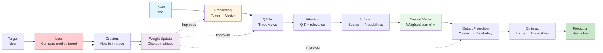

## Chapter 1: Core Terminology and Foundations

**Before we dive into transformers, we need to understand the building blocks. This chapter explains every term you'll encounter, with physical analogies to make them concrete.**

### Why This Chapter First?

**The Problem:** Technical terms are often used before they're explained, leaving readers confused.

**The Solution:** This chapter establishes ALL terminology with physical explanations BEFORE we use them.

**Learning Principle:** **DESCRIBE and TEACH concepts BEFORE you apply them.**

---

## The Building Blocks: From Words to Predictions

### Token

**What it is:** A token is the smallest unit of input that a transformer processes.

**Physical Analogy:** Think of a token like a **word on a Scrabble tile**. Each tile represents one piece of information:
- "cat" = one token
- "the" = one token  
- "!" = one token (punctuation is also a token)

**In Transformers:**
- Tokens can be words, subwords, or characters
- Vocabulary = all possible tokens (like all Scrabble tiles in the bag)
- Example vocabulary: {A, B, C, D, "cat", "dog", "the", ...}

**Why it matters:** Transformers process sequences of tokens, not raw text.

---

### Embedding

**What it is:** An embedding converts a discrete token into a continuous vector (list of numbers).

**Physical Analogy:** Think of an embedding like a **translator** that converts:
- A word (discrete symbol) → A point on a map (continuous coordinates)
- "cat" (just a symbol) → `[0.3, 0.7, -0.2]` (a location in meaning-space)

**Why we need it:**
- Tokens are **discrete** (just symbols, no math)
- Neural networks need **continuous** numbers (can do math)
- Embeddings bridge this gap

**Physical Example:**
```
Token "cat" → Embedding → Vector [0.3, 0.7, -0.2]
Token "dog" → Embedding → Vector [0.4, 0.6, -0.1]  (close to "cat"!)
Token "mat" → Embedding → Vector [-0.1, 0.2, 0.8]  (far from "cat")
```

**Key insight:** Similar meanings → similar vectors (like cities close on a map)

---

### Vector

**What it is:** A vector is an ordered list of numbers, representing a point in space.

**Physical Analogy:** Think of a vector like **GPS coordinates**:
- `[0.3, 0.7]` = point at (0.3, 0.7) on a 2D map
- `[0.3, 0.7, -0.2]` = point in 3D space

**In Transformers:**
- Each token becomes a vector (via embedding)
- Vectors live in "semantic space" (meaning-space)
- Similar vectors = similar meanings

**Why it matters:** All computations in transformers work with vectors, not words.

---

### Matrix

**What it is:** A matrix is a rectangular grid of numbers, used to transform vectors.

**Physical Analogy:** Think of a matrix like a **machine that transforms objects**:
- Input: a vector (point A)
- Matrix: transformation rules (rotate, scale, shift)
- Output: a new vector (point B)

**Example:**
```
Input vector: [1, 0]  (pointing right →)
Matrix: [0, -1]       (rotation machine)
        [1,  0]
Output: [0, 1]        (now pointing up ↑)
```

**In Transformers:**
- Matrices transform embeddings
- Each matrix learns specific transformations
- Learning = finding the right transformation matrices

**Why it matters:** Every layer in a transformer is a matrix multiplication.

---

### Query (Q), Key (K), Value (V)

**What they are:** Three different representations of the same token, each serving a specific purpose.

**Physical Analogy:** Think of attention like a **library search system**:

**Query (Q): "What am I looking for?"**
- Like typing a search query into Google
- "sat" asks: "What is the subject?"
- Physical: A **question** you ask

**Key (K): "What do I have to offer?"**
- Like keywords on a book's spine
- "cat" offers: "I am a noun, I am the subject"
- Physical: An **advertisement** of what you contain

**Value (V): "What is my actual content?"**
- Like the actual book content once you find it
- Once "cat" is identified as relevant, retrieve its meaning
- Physical: The **actual information** you retrieve

**Why three?**
- Q and K determine **relevance** (what to attend to)
- V provides **content** (what to retrieve)
- Separation allows learning different aspects independently

### Q/K/V Maps (Projection Matrices)

**What they are:** Three separate matrices that transform the same embedding into Query, Key, and Value vectors.

**Physical Analogy:** Think of Q/K/V maps like **three different lenses** looking at the same object:
- Same token embedding (the object)
- WQ lens → Query view (what I'm looking for)
- WK lens → Key view (what I'm advertising)
- WV lens → Value view (what I actually contain)

**Mathematical Process:**
```
Token "cat" → Embedding: [0.3, 0.7, -0.2]

WQ Matrix → Query: [0.5, 0.2]  (learned: "what I need")
WK Matrix → Key:   [0.4, 0.3]  (learned: "what I offer")
WV Matrix → Value: [0.6, 0.1]  (learned: "my content")
```

**Why separate maps?**
- Each matrix learns a **different aspect** of the token
- Query learns: "What questions should I ask?"
- Key learns: "What should I advertise about myself?"
- Value learns: "What information should I provide?"
- This separation enables powerful attention mechanisms

**Physical Example:**
Imagine you're at a conference:
- **Query (Q)**: Your name tag says "Looking for: ML expert" (what you need)
- **Key (K)**: Someone else's name tag says "I am: ML expert" (what they offer)
- **Value (V)**: Their actual expertise and knowledge (what you get when you connect)

The Q/K/V maps are like **three different name tag templates** that everyone uses, but each person fills them out differently based on who they are.

---

### Attention Dot Product

**What it is:** A mathematical operation that measures how similar two vectors are.

**Physical Analogy:** Think of dot product like **measuring alignment**:
- High dot product = vectors point in same direction = similar = relevant
- Low dot product = vectors point different directions = different = not relevant
- Zero dot product = perpendicular = unrelated

**Example:**
```
Query "sat": [0.8, 0.2]  (looking for subject)
Key "cat":  [0.7, 0.3]  (offers: I'm a subject)
Dot product = 0.8×0.7 + 0.2×0.3 = 0.62  (HIGH - relevant!)

Key "the":  [0.1, 0.9]  (offers: I'm an article)
Dot product = 0.8×0.1 + 0.2×0.9 = 0.26  (LOW - not relevant)
```

**In Transformers:**
- Q · K measures relevance between positions
- Higher score = more attention
- This is how the model finds relevant information

---

### Softmax

**What it is:** A function that converts numbers into probabilities (they sum to 1.0).

**Physical Analogy:** Think of softmax like **dividing a pie**:
- You have scores: [5, 2, 1]
- Softmax converts to probabilities: [0.7, 0.2, 0.1]
- The largest score gets the biggest slice
- All slices sum to 1.0 (the whole pie)

**Example:**
```
Attention scores: [3.0, 1.0, 0.5]  (how relevant each token is)
After softmax:    [0.7, 0.2, 0.1]  (probabilities - attention weights)
Sum: 1.0 ✓
```

**Why it matters:**
- Attention weights must be probabilities
- Softmax ensures they sum to 1.0
- Higher scores → higher probabilities → more attention

---

### Context Vector

**What it is:** A weighted combination of all token values, where weights come from attention.

**Physical Analogy:** Think of context vector like a **blended smoothie**:
- Each fruit (token value) contributes
- Amount of each fruit = attention weight
- Final smoothie = context vector (blended information)

**Example:**
```
Token "cat":  Value = [0.3, 0.7], Attention = 0.6  → Contribution: 0.6 × [0.3, 0.7]
Token "the":  Value = [0.1, 0.2], Attention = 0.1  → Contribution: 0.1 × [0.1, 0.2]
Token "on":   Value = [0.2, 0.3], Attention = 0.2  → Contribution: 0.2 × [0.2, 0.3]
Token "mat":  Value = [0.4, 0.5], Attention = 0.1  → Contribution: 0.1 × [0.4, 0.5]

Context Vector = Sum of all contributions
               = 0.6×[0.3,0.7] + 0.1×[0.1,0.2] + 0.2×[0.2,0.3] + 0.1×[0.4,0.5]
               = [0.18+0.01+0.04+0.04, 0.42+0.02+0.06+0.05]
               = [0.27, 0.55]
```

**Why it matters:** The context vector contains all relevant information from the sequence, weighted by importance.

---

### Output Projection (WO)

**What it is:** A matrix that transforms the context vector into vocabulary-space (predictions for each token).

**Physical Analogy:** Think of WO like a **translator** that converts:
- Context meaning (in semantic space) → Likelihood of each word (in vocabulary space)
- Like converting "animal, four legs, meows" → "cat: 80%, dog: 15%, mat: 5%"

**Example:**
```
Context Vector: [0.27, 0.55]  (meaning: "something that sits")
WO Matrix: [2.0, 1.0]         (learned transformation)
          [0.5, 2.0]
          [1.0, 0.5]
          [0.1, 0.2]

Output Logits: [0.27×2.0+0.55×1.0, 0.27×0.5+0.55×2.0, 0.27×1.0+0.55×0.5, 0.27×0.1+0.55×0.2]
              = [1.09, 1.235, 0.545, 0.137]
              = Scores for tokens: [A, B, C, D]
```

**Why it matters:** This is how the model predicts which token comes next.

---

### Softmax Loss (Cross-Entropy Loss)

**What it is:** A measure of how wrong the model's prediction is compared to the target.

**Physical Analogy:** Think of loss like a **score in a game**:
- Lower loss = better prediction = you're winning
- Higher loss = worse prediction = you're losing
- Goal: minimize loss (maximize accuracy)

**Example:**
```
Target: "C" (one-hot: [0, 0, 1, 0])
Prediction probabilities: [0.1, 0.2, 0.6, 0.1]

Loss = -log(0.6) = 0.51  (model predicted C with 60% confidence - good!)

If prediction was: [0.8, 0.1, 0.05, 0.05]
Loss = -log(0.05) = 3.0  (model predicted wrong - bad!)
```

**Why it matters:** Loss tells us how well the model is learning. We minimize it during training.

---

### Gradient

**What it is:** A gradient shows how much each parameter should change to reduce the loss.

**Physical Analogy:** Think of gradient like a **compass pointing uphill**:
- Loss is like altitude (want to go down)
- Gradient points in the direction of steepest increase
- Negative gradient = direction to go DOWN (reduce loss)
- Magnitude = how steep the slope is

**Example:**
```
Parameter W (a weight in a matrix):
Current value: W = 0.5
Loss at W=0.5: 2.0
Gradient: ∂L/∂W = -0.3

Interpretation: 
- Negative gradient means increasing W will DECREASE loss
- Magnitude 0.3 means the slope is moderate
- Update: W_new = W_old - learning_rate × gradient
         = 0.5 - 0.1 × (-0.3) = 0.5 + 0.03 = 0.53
```

**Why it matters:** Gradients tell us exactly how to update parameters to improve predictions.

---

### Weight Update

**What it is:** The process of changing matrix values (weights) based on gradients to improve predictions.

**Physical Analogy:** Think of weight updates like **tuning a radio**:
- Current setting (weight) = current frequency
- Static (loss) = how bad the signal is
- Gradient = which direction to turn the dial
- Weight update = actually turning the dial
- After many adjustments, you find the best frequency

**Example:**
```
Before training:
Weight matrix W = [0.1, 0.2]
                 [0.3, 0.4]
Loss: 2.5 (high - bad predictions)

After computing gradients:
Gradient = [-0.5, -0.3]
          [-0.2, -0.1]

Weight update (learning_rate = 0.1):
W_new = W_old - 0.1 × Gradient
      = [0.1, 0.2] - 0.1 × [-0.5, -0.3]
        [0.3, 0.4]         [-0.2, -0.1]
      = [0.15, 0.23]
        [0.32, 0.41]

After training (many updates):
Loss: 0.1 (low - good predictions!)
```

**Why it matters:** This is how the model learns patterns from examples.

---

## Complete Flow: From Token to Prediction

**Here's how all these components work together:**



**Step-by-step:**
1. **Token** "cat" enters
2. **Embedding** converts to vector `[0.3, 0.7, -0.2]`
3. **Q/K/V Maps** transform embedding into three views:
   - WQ → Query (what I need)
   - WK → Key (what I offer)
   - WV → Value (my content)
4. **Attention** computes Q·K (dot product) to find relevant tokens
5. **Softmax** converts attention scores to probabilities
6. **Context Vector** = weighted sum of all Values
7. **Output Projection (WO)** transforms context to vocabulary scores
8. **Softmax** converts scores to prediction probabilities
9. **Loss** compares prediction to target
10. **Gradient** shows how to improve
11. **Weight Update** changes matrices to reduce loss

---

## Physical Analogies Summary

| Component | Physical Analogy | Why It Exists |
|-----------|-----------------|---------------|
| **Token** | Scrabble tile | Smallest unit of information |
| **Embedding** | GPS coordinates | Convert symbols → numbers (math-ready) |
| **Vector** | Point on a map | Represents meaning in semantic space |
| **Matrix** | Transformation machine | Transforms vectors (rotates, scales, shifts) |
| **Query (Q)** | Search question | "What information do I need?" |
| **Key (K)** | Book spine keywords | "What information do I offer?" |
| **Value (V)** | Book content | "What is my actual information?" |
| **Q/K/V Maps** | Three different lenses | Transform same embedding into Q, K, V views |
| **Attention Dot Product** | Alignment measure | Measures how relevant two tokens are |
| **Softmax** | Pie division | Converts scores → probabilities (sums to 1) |
| **Context Vector** | Blended smoothie | Weighted combination of all relevant information |
| **Output Projection (WO)** | Translator | Converts meaning → vocabulary predictions |
| **Softmax Loss** | Game score | Measures prediction error (lower = better) |
| **Gradient** | Compass (uphill) | Shows direction to reduce loss |
| **Weight Update** | Radio tuning | Changes matrices to improve predictions |

---

## Key Principles

1. **Everything is a vector or matrix:** Tokens become vectors, operations are matrices
2. **Attention finds relevance:** Q·K measures how relevant each token is
3. **Softmax creates probabilities:** Converts any scores to probabilities (sums to 1)
4. **Context combines information:** Weighted sum of all values based on attention
5. **Learning = gradient descent:** Gradients show how to update weights to reduce loss

---

## What's Next?

Now that you understand all the terminology:
- **Chapter 2: The Matrix Core** - Deep dive into matrix operations
- **Chapter 3: Embeddings** - How tokens become vectors
- **Chapter 4: Attention Intuition** - How attention finds relevant information
- **Chapter 5: Why Transformers?** - The problem transformers solve

**Remember:** Every term you'll encounter has been explained here with physical analogies. Refer back to this chapter whenever you see an unfamiliar term!

---

**Navigation:**
- [← Index](00-index.md) | [Next: The Matrix Core →](02-matrix-core.md)

