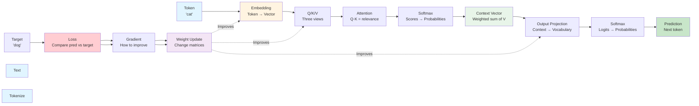

## Chapter 1: Core Terminology and Foundations

**Before we dive into transformers, we need to understand the building blocks. This chapter explains every term you'll encounter, with physical analogies to make them concrete.**

### Why This Chapter First?

**The Problem:** Technical terms are often used before they're explained, leaving readers confused.

**The Solution:** This chapter establishes ALL terminology with physical explanations BEFORE we use them.

**Learning Principle:** **DESCRIBE and TEACH concepts BEFORE you apply them.**

---

## The Building Blocks: From Words to Predictions

### Tokenization

**What it is:** Tokenization is the process of breaking text into discrete units called tokens.

**Physical Analogy:** Think of tokenization like **cutting a sentence into individual words**:
- Input: "The cat sat on the mat."
- After tokenization: ["The", "cat", "sat", "on", "the", "mat", "."]
- Each piece is now a separate token

**Different Tokenization Strategies:**
- **Word-level**: Split by spaces → ["The", "cat", "sat"]
- **Subword-level**: Split into smaller pieces → ["The", "cat", "sa", "t"] (handles unknown words)
- **Character-level**: Split into individual characters → ["T", "h", "e", " ", "c", "a", "t"]

**Why it matters:** Transformers can't process raw text - they need discrete tokens to work with. Tokenization converts continuous text into a sequence of discrete symbols.

**Example:**
```
Input text: "Hello world!"
Tokenized: ["Hello", "world", "!"]
Result: 3 tokens ready for processing
```

---

### Token

**What it is:** A token is the smallest unit of input that a transformer processes. It's the result of tokenization.

**Physical Analogy:** Think of a token like a **word on a Scrabble tile**. Each tile represents one piece of information:
- "cat" = one token
- "the" = one token  
- "!" = one token (punctuation is also a token)

**In Transformers:**
- Tokens can be words, subwords, or characters (depending on tokenization strategy)
- Vocabulary = all possible tokens (like all Scrabble tiles in the bag)
- Example vocabulary: {A, B, C, D, "cat", "dog", "the", ...}

**Why it matters:** Transformers process sequences of tokens, not raw text. Tokenization creates these tokens.

---

### Vocabulary

**What it is:** The vocabulary is the complete set of all possible tokens that a transformer can recognize and process.

**Physical Analogy:** Think of vocabulary like a **dictionary** or **Scrabble tile bag**:
- Contains all possible words/tokens the model knows
- Limited size (e.g., 50,000 tokens for GPT models)
- Each token has a unique ID/index

**In Transformers:**
- Vocabulary size = $V$ (e.g., 50,000)
- Each token maps to an index: "cat" → 1234, "dog" → 5678
- Output projection predicts probability for each vocabulary token
- Unknown words are handled via subword tokenization

**Example:**
```
Vocabulary: {0: "<pad>", 1: "the", 2: "cat", 3: "sat", 4: "on", 5: "mat", ...}
Token "cat" → Index 2
Token "dog" → Index 6 (if in vocabulary)
```

**Why it matters:** The model can only predict tokens that exist in its vocabulary. Vocabulary size determines model capacity and memory requirements.

---

### Token Encoding (Token to Integer)

**What it is:** Token encoding is the process of converting tokens (strings) into integer IDs that the model can process.

**Physical Analogy:** Think of token encoding like **assigning a student ID number to each student**:
- Student name (token) → Student ID (integer)
- "John Smith" → 12345
- Each student has a unique ID number
- The ID is used to look up student records

**In Transformers:**
- Token (string) → Integer ID (index in vocabulary)
- Uses vocabulary mapping: "cat" → 2, "dog" → 6
- Not hashing! Hashing is one-way and can have collisions
- Encoding is a **lookup table** (bidirectional, no collisions)

**The Process:**
1. Tokenization: "The cat sat" → ["The", "cat", "sat"]
2. Token encoding: ["The", "cat", "sat"] → [1, 2, 3] (integer IDs)
3. These integers are used for embedding lookup

**Example:**
```
Vocabulary mapping:
  "The" → 1
  "cat" → 2
  "sat" → 3
  "on" → 4
  "the" → 5
  "mat" → 6

Input tokens: ["The", "cat", "sat"]
Encoded: [1, 2, 3]
```

**Why not hashing?**
- **Hashing**: One-way function, can have collisions (two tokens → same hash)
- **Encoding**: Lookup table, unique mapping, reversible
- Transformers need unique, reversible mappings

**Why it matters:** Neural networks work with integers, not strings. Token encoding converts tokens to integers for processing.

---

### Embedding Lookup (Integer to Vector)

**What it is:** Embedding lookup is the process of converting integer token IDs into vector representations using an embedding matrix.

**Physical Analogy:** Think of embedding lookup like **using a student ID to retrieve their file from a filing cabinet**:
- Student ID (integer) → Student file (vector of information)
- ID 12345 → File with [grades, attendance, address, ...]
- Each ID maps to a specific file location

**In Transformers:**
- Integer ID → Index into embedding matrix → Vector
- Embedding matrix $E$ has shape $[V, d]$ where:
  - $V$ = vocabulary size
  - $d$ = embedding dimension
- Lookup: `vector = E[token_id]`

**The Process:**
1. Token encoding: ["The", "cat", "sat"] → [1, 2, 3]
2. Embedding lookup: 
   - ID 1 → E[1] = [0.1, 0.2, ...] (vector for "The")
   - ID 2 → E[2] = [0.3, 0.7, ...] (vector for "cat")
   - ID 3 → E[3] = [0.5, 0.1, ...] (vector for "sat")

**Mathematical Definition:**
$$\text{embedding}(i) = E[i]$$

Where:
- $i$ = token integer ID
- $E$ = embedding matrix of shape $[V, d]$
- $E[i]$ = the $i$-th row of the embedding matrix (a vector of dimension $d$)

**Example:**
```
Embedding matrix E (V=6, d=2):
  E[0] = [0.0, 0.0]  (padding token)
  E[1] = [0.1, 0.2]  ("The")
  E[2] = [0.3, 0.7]  ("cat")
  E[3] = [0.5, 0.1]  ("sat")
  E[4] = [0.2, 0.3]  ("on")
  E[5] = [0.1, 0.2]  ("the")
  E[6] = [0.4, 0.5]  ("mat")

Token "cat" → ID 2 → E[2] = [0.3, 0.7]
```

**Why it matters:** This is how discrete tokens become continuous vectors that neural networks can process. The embedding matrix is learned during training.

---

### Sequence

**What it is:** A sequence is an ordered list of tokens that the transformer processes together.

**Physical Analogy:** Think of a sequence like a **sentence** or **paragraph**:
- Ordered: position matters ("cat sat" ≠ "sat cat")
- Fixed length: sequences have maximum length (e.g., 512 tokens)
- Context: tokens relate to each other based on position

**In Transformers:**
- Input sequence: ["The", "cat", "sat", "on", "the", "mat"]
- Each position in the sequence gets processed
- Attention allows tokens to relate to all other positions
- Maximum sequence length is a model hyperparameter

**Example:**
```
Sequence: ["The", "cat", "sat"]
Length: 3 tokens
Position 0: "The"
Position 1: "cat"  
Position 2: "sat"
```

**Why it matters:** Transformers process entire sequences in parallel, unlike RNNs which process one token at a time. Sequence length affects computational cost.

**Complete Flow from Text to Sequence:**
```
Text: "The cat sat"
  ↓ Tokenization
Tokens: ["The", "cat", "sat"]
  ↓ Token Encoding
IDs: [1, 2, 3]
  ↓ Embedding Lookup
Vectors: [[0.1, 0.2], [0.3, 0.7], [0.5, 0.1]]
  ↓ Sequence
Sequence: Matrix of shape [3, 2] (3 tokens, 2 dimensions)
```

---

### Chunking

**What it is:** Chunking is the process of splitting long documents or sequences into smaller, manageable pieces (chunks).

**Physical Analogy:** Think of chunking like **dividing a long book into chapters**:
- Long document → Multiple smaller chunks
- Each chunk fits within model's sequence length limit
- Chunks can overlap to preserve context

**Why We Need It:**
- Transformers have maximum sequence length (e.g., 512, 2048, 4096 tokens)
- Long documents exceed this limit
- Chunking breaks documents into processable pieces

**Chunking Strategies:**
- **Fixed-size**: Split every N tokens → [chunk1, chunk2, chunk3]
- **Sentence-based**: Split at sentence boundaries → preserves meaning
- **Overlapping**: Chunks share some tokens → maintains context across boundaries

**Example:**
```
Long document: 5000 tokens
Max sequence length: 512 tokens
Chunking: Split into 10 chunks of ~500 tokens each
Result: Process each chunk separately, then combine results
```

**Why it matters:** Enables processing documents longer than model's sequence limit. Critical for document Q&A, summarization, and long-form generation.

---

### Embedding

**What it is:** An embedding converts a discrete token into a continuous vector (list of numbers).

**Physical Analogy:** Think of an embedding like a **translator** that converts:
- A word (discrete symbol) → A point on a map (continuous coordinates)
- "cat" (just a symbol) → `[0.3, 0.7, -0.2]` (a location in meaning-space)

**Why we need it:**
- Tokens are **discrete** (just symbols, no math)
- Neural networks need **continuous** numbers (can do math)
- Embeddings bridge this gap

**Physical Example:**
```
Token "cat" → Embedding → Vector [0.3, 0.7, -0.2]
Token "dog" → Embedding → Vector [0.4, 0.6, -0.1]  (close to "cat"!)
Token "mat" → Embedding → Vector [-0.1, 0.2, 0.8]  (far from "cat")
```

**Key insight:** Similar meanings → similar vectors (like cities close on a map)

---

### Vector

**What it is:** A vector is an ordered list of numbers, representing a point in space.

**Physical Analogy:** Think of a vector like **GPS coordinates**:
- `[0.3, 0.7]` = point at (0.3, 0.7) on a 2D map
- `[0.3, 0.7, -0.2]` = point in 3D space

**In Transformers:**
- Each token becomes a vector (via embedding)
- Vectors live in "semantic space" (meaning-space)
- Similar vectors = similar meanings

**Why it matters:** All computations in transformers work with vectors, not words.

---

### Matrix

**What it is:** A matrix is a rectangular grid of numbers, used to transform vectors.

**Physical Analogy:** Think of a matrix like a **machine that transforms objects**:
- Input: a vector (point A)
- Matrix: transformation rules (rotate, scale, shift)
- Output: a new vector (point B)

**Example:**
```
Input vector: [1, 0]  (pointing right →)
Matrix: [0, -1]       (rotation machine)
        [1,  0]
Output: [0, 1]        (now pointing up ↑)
```

**In Transformers:**
- Matrices transform embeddings
- Each matrix learns specific transformations
- Learning = finding the right transformation matrices

**Why it matters:** Every layer in a transformer is a matrix multiplication.

---

### Dimension

**What it is:** Dimension is the size or length of a vector or matrix axis.

**Physical Analogy:** Think of dimension like **the number of measurements** needed to describe something:
- 2D: (x, y) coordinates on a map
- 3D: (x, y, z) coordinates in space
- Higher dimensions: More measurements/features

**In Transformers:**
- **Embedding dimension** ($d$): Size of each token's vector (e.g., 128, 512, 768)
- **Vocabulary dimension** ($V$): Number of tokens in vocabulary (e.g., 50,000)
- **Sequence dimension**: Number of tokens in sequence (e.g., 512)
- **Matrix dimensions**: Rows × Columns (e.g., $W_Q$ is $[d, d]$ for 2×2 matrices)

**Example:**
```
Token embedding: [0.3, 0.7]  (dimension = 2)
Embedding matrix E: [V, d] = [4, 2]  (4 tokens, 2 dimensions each)
Attention matrix: [sequence_length, sequence_length] = [2, 2]
```

**Why it matters:** Dimensions determine the shape of all computations. Understanding dimensions is crucial for matrix operations.

---

### Parameter

**What it is:** A parameter is a value in the model that gets learned (updated) during training.

**Physical Analogy:** Think of parameters like **adjustable knobs on a machine**:
- Each knob controls some aspect of the machine's behavior
- During training, we adjust knobs to make the machine work better
- Once trained, knobs are fixed at their learned values

**In Transformers:**
- **Weights**: Values in matrices (e.g., $W_Q$, $W_K$, $W_V$, $W_O$)
- **Biases**: Offset values added to computations
- **Embedding parameters**: Values in embedding matrix
- **All learnable values** in the model

**Example:**
```
Weight matrix W = [0.1, 0.2]  (these 4 numbers are parameters)
                 [0.3, 0.4]
Bias vector b = [0.05, 0.1]   (these 2 numbers are parameters)
Total parameters: 4 + 2 = 6 parameters
```

**Why it matters:** Parameters are what the model "learns". More parameters = more capacity but more memory and computation.

---

### Weight

**What it is:** A weight is a parameter (number) in a matrix that determines how inputs are transformed.

**Physical Analogy:** Think of weights like **the strength of connections** in a network:
- High weight = strong connection (input has big influence)
- Low weight = weak connection (input has small influence)
- Negative weight = inhibitory connection (opposes the input)

**In Transformers:**
- Weights are the values inside matrices ($W_Q$, $W_K$, $W_V$, $W_O$)
- Each weight determines how much one input affects one output
- Weights are learned during training

**Example:**
```
Weight matrix W = [0.8, 0.2]  (weights)
                 [0.3, 0.7]

Input [1.0, 0.0] × W = [0.8, 0.2]
  (weight 0.8 connects input[0] to output[0])
  (weight 0.2 connects input[1] to output[0])
```

**Why it matters:** Weights encode what the model has learned. They determine how information flows through the network.

---

### Bias

**What it is:** A bias is a parameter (number) that's added to a computation to shift the result.

**Physical Analogy:** Think of bias like a **baseline or offset**:
- Like setting a scale to zero before weighing
- Or adjusting a thermostat's baseline temperature
- Shifts the entire computation up or down

**In Transformers:**
- Bias is added after matrix multiplication: `output = input × W + bias`
- Each output dimension has its own bias value
- Biases are learned during training

**Example:**
```
Input: [0.3, 0.7]
Weight W: [0.5, 0.2]
         [0.1, 0.8]
Bias b: [0.1, -0.2]

Output = [0.3, 0.7] × W + b
       = [0.29, 0.56] + [0.1, -0.2]
       = [0.39, 0.36]
```

**Why it matters:** Bias allows the model to learn offsets and thresholds. Without bias, the model is constrained to pass through the origin.

---

### Hyperparameter

**What it is:** A hyperparameter is a configuration setting that controls how the model is trained or structured, but is NOT learned during training.

**Physical Analogy:** Think of hyperparameters like **settings on a machine before you start it**:
- Learning rate: How fast the machine adjusts
- Batch size: How many items processed at once
- Number of layers: How many processing stages
- These are set BEFORE training, not learned DURING training

**In Transformers:**
- **Learning rate**: How large weight updates are
- **Batch size**: Number of sequences processed together
- **Sequence length**: Maximum tokens per sequence
- **Embedding dimension**: Size of token vectors
- **Number of layers**: How many transformer blocks
- **Vocabulary size**: Number of tokens

**Example:**
```
Hyperparameters (set before training):
  Learning rate: 0.001
  Batch size: 32
  Sequence length: 512
  Embedding dimension: 768
  Number of layers: 12

Parameters (learned during training):
  All weights and biases in matrices
```

**Why it matters:** Hyperparameters control training behavior and model capacity. Choosing good hyperparameters is crucial for model performance.

---

### Query (Q), Key (K), Value (V)

**What they are:** Three different representations of the same token, each serving a specific purpose.

**Physical Analogy:** Think of attention like a **library search system**:

**Query (Q): "What am I looking for?"**
- Like typing a search query into Google
- "sat" asks: "What is the subject?"
- Physical: A **question** you ask

**Key (K): "What do I have to offer?"**
- Like keywords on a book's spine
- "cat" offers: "I am a noun, I am the subject"
- Physical: An **advertisement** of what you contain

**Value (V): "What is my actual content?"**
- Like the actual book content once you find it
- Once "cat" is identified as relevant, retrieve its meaning
- Physical: The **actual information** you retrieve

**Why three?**
- Q and K determine **relevance** (what to attend to)
- V provides **content** (what to retrieve)
- Separation allows learning different aspects independently

### Q/K/V Maps (Projection Matrices)

**What they are:** Three separate matrices that transform the same embedding into Query, Key, and Value vectors.

**Physical Analogy:** Think of Q/K/V maps like **three different lenses** looking at the same object:
- Same token embedding (the object)
- WQ lens → Query view (what I'm looking for)
- WK lens → Key view (what I'm advertising)
- WV lens → Value view (what I actually contain)

**Mathematical Process:**
```
Token "cat" → Embedding: [0.3, 0.7, -0.2]

WQ Matrix → Query: [0.5, 0.2]  (learned: "what I need")
WK Matrix → Key:   [0.4, 0.3]  (learned: "what I offer")
WV Matrix → Value: [0.6, 0.1]  (learned: "my content")
```

**Why separate maps?**
- Each matrix learns a **different aspect** of the token
- Query learns: "What questions should I ask?"
- Key learns: "What should I advertise about myself?"
- Value learns: "What information should I provide?"
- This separation enables powerful attention mechanisms

**Physical Example:**
Imagine you're at a conference:
- **Query (Q)**: Your name tag says "Looking for: ML expert" (what you need)
- **Key (K)**: Someone else's name tag says "I am: ML expert" (what they offer)
- **Value (V)**: Their actual expertise and knowledge (what you get when you connect)

The Q/K/V maps are like **three different name tag templates** that everyone uses, but each person fills them out differently based on who they are.

---

### Attention Dot Product

**What it is:** A mathematical operation that measures how similar two vectors are.

**Physical Analogy:** Think of dot product like **measuring alignment**:
- High dot product = vectors point in same direction = similar = relevant
- Low dot product = vectors point different directions = different = not relevant
- Zero dot product = perpendicular = unrelated

**Example:**
```
Query "sat": [0.8, 0.2]  (looking for subject)
Key "cat":  [0.7, 0.3]  (offers: I'm a subject)
Dot product = 0.8×0.7 + 0.2×0.3 = 0.62  (HIGH - relevant!)

Key "the":  [0.1, 0.9]  (offers: I'm an article)
Dot product = 0.8×0.1 + 0.2×0.9 = 0.26  (LOW - not relevant)
```

**In Transformers:**
- Q · K measures relevance between positions
- Higher score = more attention
- This is how the model finds relevant information

---

### Softmax

**What it is:** A function that converts numbers into probabilities (they sum to 1.0).

**Physical Analogy:** Think of softmax like **dividing a pie**:
- You have scores: [5, 2, 1]
- Softmax converts to probabilities: [0.7, 0.2, 0.1]
- The largest score gets the biggest slice
- All slices sum to 1.0 (the whole pie)

**Example:**
```
Attention scores: [3.0, 1.0, 0.5]  (how relevant each token is)
After softmax:    [0.7, 0.2, 0.1]  (probabilities - attention weights)
Sum: 1.0 ✓
```

**Why it matters:**
- Attention weights must be probabilities
- Softmax ensures they sum to 1.0
- Higher scores → higher probabilities → more attention

---

### Context Vector

**What it is:** A weighted combination of all token values, where weights come from attention.

**Physical Analogy:** Think of context vector like a **blended smoothie**:
- Each fruit (token value) contributes
- Amount of each fruit = attention weight
- Final smoothie = context vector (blended information)

**Example:**
```
Token "cat":  Value = [0.3, 0.7], Attention = 0.6  → Contribution: 0.6 × [0.3, 0.7]
Token "the":  Value = [0.1, 0.2], Attention = 0.1  → Contribution: 0.1 × [0.1, 0.2]
Token "on":   Value = [0.2, 0.3], Attention = 0.2  → Contribution: 0.2 × [0.2, 0.3]
Token "mat":  Value = [0.4, 0.5], Attention = 0.1  → Contribution: 0.1 × [0.4, 0.5]

Context Vector = Sum of all contributions
               = 0.6×[0.3,0.7] + 0.1×[0.1,0.2] + 0.2×[0.2,0.3] + 0.1×[0.4,0.5]
               = [0.18+0.01+0.04+0.04, 0.42+0.02+0.06+0.05]
               = [0.27, 0.55]
```

**Why it matters:** The context vector contains all relevant information from the sequence, weighted by importance.

---

### Output Projection (WO)

**What it is:** A matrix that transforms the context vector into vocabulary-space (predictions for each token).

**Physical Analogy:** Think of WO like a **translator** that converts:
- Context meaning (in semantic space) → Likelihood of each word (in vocabulary space)
- Like converting "animal, four legs, meows" → "cat: 80%, dog: 15%, mat: 5%"

**Example:**
```
Context Vector: [0.27, 0.55]  (meaning: "something that sits")
WO Matrix: [2.0, 1.0]         (learned transformation)
          [0.5, 2.0]
          [1.0, 0.5]
          [0.1, 0.2]

Output Logits: [0.27×2.0+0.55×1.0, 0.27×0.5+0.55×2.0, 0.27×1.0+0.55×0.5, 0.27×0.1+0.55×0.2]
              = [1.09, 1.235, 0.545, 0.137]
              = Scores for tokens: [A, B, C, D]
```

**Why it matters:** This is how the model predicts which token comes next.

---

### Logits

**What it is:** Logits are the raw, unnormalized scores output by the model before applying softmax.

**Physical Analogy:** Think of logits like **raw test scores before grading on a curve**:
- Raw scores: [85, 90, 75, 80] (logits)
- After curve (softmax): [0.2, 0.5, 0.1, 0.2] (probabilities)
- Logits can be any real numbers (positive, negative, large, small)
- Probabilities must be 0-1 and sum to 1

**In Transformers:**
- **Output projection (WO)** produces logits (one per vocabulary token)
- Logits are raw scores: [2.3, -0.5, 1.8, 0.2]
- Softmax converts logits to probabilities: [0.6, 0.05, 0.3, 0.05]

**Example:**
```
Context vector: [0.27, 0.55]
Output projection (WO): [2.0, 1.0]
                        [0.5, 2.0]
                        [1.0, 0.5]
                        [0.1, 0.2]

Logits = Context × WO = [1.09, 1.235, 0.545, 0.137]
        (raw scores for tokens A, B, C, D)

After softmax: [0.35, 0.45, 0.15, 0.05]
        (probabilities - sum to 1.0)
```

**Why it matters:** Logits are the model's raw predictions. Softmax converts them to interpretable probabilities. Gradients flow through logits during backpropagation.

---

### Softmax Loss (Cross-Entropy Loss)

**What it is:** A measure of how wrong the model's prediction is compared to the target.

**Physical Analogy:** Think of loss like a **score in a game**:
- Lower loss = better prediction = you're winning
- Higher loss = worse prediction = you're losing
- Goal: minimize loss (maximize accuracy)

**Example:**
```
Target: "C" (one-hot: [0, 0, 1, 0])
Prediction probabilities: [0.1, 0.2, 0.6, 0.1]

Loss = -log(0.6) = 0.51  (model predicted C with 60% confidence - good!)

If prediction was: [0.8, 0.1, 0.05, 0.05]
Loss = -log(0.05) = 3.0  (model predicted wrong - bad!)
```

**Why it matters:** Loss tells us how well the model is learning. We minimize it during training.

---

### Gradient

**What it is:** A gradient shows how much each parameter should change to reduce the loss.

**Physical Analogy:** Think of gradient like a **compass pointing uphill**:
- Loss is like altitude (want to go down)
- Gradient points in the direction of steepest increase
- Negative gradient = direction to go DOWN (reduce loss)
- Magnitude = how steep the slope is

**Example:**
```
Parameter W (a weight in a matrix):
Current value: W = 0.5
Loss at W=0.5: 2.0
Gradient: ∂L/∂W = -0.3

Interpretation: 
- Negative gradient means increasing W will DECREASE loss
- Magnitude 0.3 means the slope is moderate
- Update: W_new = W_old - learning_rate × gradient
         = 0.5 - 0.1 × (-0.3) = 0.5 + 0.03 = 0.53
```

**Why it matters:** Gradients tell us exactly how to update parameters to improve predictions.

---

### Learning Rate

**What it is:** The learning rate is a hyperparameter that controls how large each weight update is during training.

**Physical Analogy:** Think of learning rate like **step size when walking downhill**:
- Large steps (high learning rate): Fast progress, but might overshoot the bottom
- Small steps (low learning rate): Slow progress, but more precise
- Too large: You jump over the valley (divergence)
- Too small: You take forever to reach the bottom (slow convergence)

**In Transformers:**
- Learning rate ($\eta$ or `lr`) is typically between 0.0001 and 0.01
- Used in gradient descent: $W_{\text{new}} = W_{\text{old}} - \eta \times \text{gradient}$
- Often scheduled (starts high, decreases over time)

**Example:**
```
Gradient: -0.5 (should increase weight)
Learning rate: 0.1 (small steps)

Weight update: W_new = W_old - 0.1 × (-0.5)
              = W_old + 0.05  (small increase)

If learning rate was 1.0:
Weight update: W_new = W_old - 1.0 × (-0.5)
              = W_old + 0.5  (large increase - might overshoot!)
```

**Why it matters:** Learning rate is one of the most important hyperparameters. Too high = unstable training, too low = slow training.

---

### Gradient Descent

**What it is:** Gradient descent is an optimization algorithm that uses gradients to iteratively update parameters to minimize loss.

**Physical Analogy:** Think of gradient descent like **walking downhill blindfolded**:
- You can't see the bottom, but you can feel which way is downhill (gradient)
- Take a step in that direction (weight update)
- Repeat until you reach the bottom (minimum loss)
- Step size = learning rate

**In Transformers:**
1. Compute loss
2. Compute gradients (which direction to move)
3. Update weights: $W_{\text{new}} = W_{\text{old}} - \eta \times \frac{\partial L}{\partial W}$
4. Repeat for many iterations

**Mathematical Definition:**
$$W_{\text{new}} = W_{\text{old}} - \eta \cdot \nabla_W L$$

Where:
- $W$: Weight matrix
- $\eta$: Learning rate
- $\nabla_W L$: Gradient of loss w.r.t. weights

**Example:**
```
Initial weight: W = 0.5
Loss: 2.0
Gradient: ∂L/∂W = -0.3 (negative = should increase W)
Learning rate: η = 0.1

Update: W_new = 0.5 - 0.1 × (-0.3)
       = 0.5 + 0.03
       = 0.53

New loss: 1.8 (lower - improved!)
```

**Why it matters:** Gradient descent is the fundamental algorithm that enables neural networks to learn. Without it, we couldn't update parameters to reduce loss.

---

### Forward Pass

**What it is:** The forward pass is the process of computing predictions by passing input data through the network from input to output.

**Physical Analogy:** Think of forward pass like **following a recipe step-by-step**:
- Start with ingredients (input tokens)
- Process through each step (each layer)
- End with final dish (prediction)
- Data flows in one direction: Input → Layer 1 → Layer 2 → ... → Output

**In Transformers:**
1. **Tokenization**: Text → Tokens
2. **Token Encoding**: Tokens → Integer IDs
3. **Embedding Lookup**: Integer IDs → Vectors
4. **Q/K/V Projections**: Vectors → Q, K, V (using weight matrices)
5. **Attention**: Q, K, V → Context Vector (using attention dot product and softmax)
6. **Output Projection**: Context → Logits (using weight matrix WO)
7. **Softmax**: Logits → Probabilities

**Example:**
```
Forward Pass:
Input: "The cat"
  → Tokenize: ["The", "cat"]
  → Encode: [1, 2]
  → Embed: [[0.1, 0.2], [0.3, 0.7]]
  → Q/K/V: Query, Key, Value vectors
  → Attention: [0.4, 0.6] (context vector)
  → Logits: [1.0, 2.0, 0.5, 0.3]
  → Probabilities: [0.1, 0.8, 0.05, 0.05]
```

**Why it matters:** Forward pass is how the model makes predictions. It's the first step in both inference and training.

---

### Backward Pass (Backpropagation)

**What it is:** The backward pass is the process of computing gradients by propagating the loss backward through the network from output to input.

**Physical Analogy:** Think of backward pass like **tracing back the cause of a mistake**:
- You made an error (high loss)
- Work backwards: "What caused this error?"
- Check each step: "Did this layer contribute to the error?"
- Calculate how much each parameter should change

**In Transformers:**
1. Compute loss at output
2. Compute gradient w.r.t. output (logits)
3. Propagate gradient backward through each layer:
   - Loss → Logits → Output Projection → Context Vector
   - Context Vector → Attention Weights → Attention Scores → Q, K, V
   - Q, K, V → Q/K/V Maps → Embeddings
4. Compute gradient for each parameter (weight, bias)
5. Use gradients to update parameters

**Example:**
```
Backward Pass:
Loss: 0.5 (prediction was wrong)
  → Gradient w.r.t. logits: [-0.2, 0.8, -0.3, -0.3]
  → Gradient w.r.t. context: [0.1, 0.2]
  → Gradient w.r.t. attention weights: [0.05, 0.15]
  → Gradient w.r.t. Q, K, V: [computed via chain rule]
  → Gradient w.r.t. W_Q, W_K, W_V, W_O: [computed]
  → Update: W_new = W_old - learning_rate × gradient
```

**Why it matters:** Backward pass enables learning. Without it, we couldn't compute how to update parameters to reduce loss. This is what **backpropagation** does - it's the algorithm that performs the backward pass.

---

### Weight Update

**What it is:** The process of changing matrix values (weights) based on gradients to improve predictions.

**Physical Analogy:** Think of weight updates like **tuning a radio**:
- Current setting (weight) = current frequency
- Static (loss) = how bad the signal is
- Gradient = which direction to turn the dial
- Weight update = actually turning the dial
- After many adjustments, you find the best frequency

**Example:**
```
Before training:
Weight matrix W = [0.1, 0.2]
                 [0.3, 0.4]
Loss: 2.5 (high - bad predictions)

After computing gradients:
Gradient = [-0.5, -0.3]
          [-0.2, -0.1]

Weight update (learning_rate = 0.1):
W_new = W_old - 0.1 × Gradient
      = [0.1, 0.2] - 0.1 × [-0.5, -0.3]
        [0.3, 0.4]         [-0.2, -0.1]
      = [0.15, 0.23]
        [0.32, 0.41]

After training (many updates):
Loss: 0.1 (low - good predictions!)
```

**Why it matters:** This is how the model learns patterns from examples.

---

### Batch

**What it is:** A batch is a group of sequences processed together during training.

**Physical Analogy:** Think of a batch like **grading multiple papers at once**:
- Instead of grading one paper, grade 32 papers together
- More efficient (parallel processing)
- Average the results across all papers

**In Training:**
- Batch size = number of sequences processed together (e.g., 32, 64, 128)
- All sequences in batch processed in parallel
- Gradients averaged across batch
- Loss averaged across batch

**Example:**
```
Batch size: 4
Batch: [
  ["The", "cat", "sat"],
  ["The", "dog", "ran"],
  ["A", "bird", "flew"],
  ["A", "fish", "swam"]
]
Process all 4 sequences together, average gradients
```

**Why it matters:** Batching enables efficient GPU utilization and stable gradient estimates. Larger batches = more stable but require more memory.

---

### Epoch

**What it is:** An epoch is one complete pass through the entire training dataset.

**Physical Analogy:** Think of an epoch like **reading an entire textbook once**:
- Start at page 1, read through to the end
- That's one epoch
- Multiple epochs = reading the book multiple times to learn better

**In Training:**
- Dataset: 10,000 sequences
- Batch size: 32
- Batches per epoch: 10,000 ÷ 32 = 313 batches
- One epoch = process all 313 batches
- Training: Repeat for multiple epochs (e.g., 10 epochs)

**Example:**
```
Dataset: 1000 sequences
Batch size: 32
Epoch 1: Process batches 1-32 (all 1000 sequences)
Epoch 2: Process batches 1-32 again (same sequences, different order)
Epoch 3: Process batches 1-32 again
... (until model converges)
```

**Why it matters:** Models typically need multiple epochs to learn. Each epoch gives the model another chance to see all training data and improve.

---

### Layer

**What it is:** A layer is a computational unit in a neural network that transforms its input to produce output.

**Physical Analogy:** Think of a layer like a **factory assembly line station**:
- Input arrives → Layer processes it → Output goes to next layer
- Each layer does a specific job (embedding, attention, feed-forward)
- Multiple layers = multiple processing steps

**In Transformers:**
- **Embedding Layer**: Token → Vector
- **Attention Layer**: Finds relevant information
- **Feed-Forward Layer**: Adds non-linearity
- **Output Layer**: Vector → Vocabulary predictions

**Example:**
```
Input: Token "cat"
Layer 1 (Embedding): "cat" → [0.3, 0.7, -0.2]
Layer 2 (Attention): [0.3, 0.7, -0.2] → [0.4, 0.6, -0.1] (with context)
Layer 3 (Feed-Forward): [0.4, 0.6, -0.1] → [0.5, 0.5, 0.0]
Layer 4 (Output): [0.5, 0.5, 0.0] → [0.1, 0.8, 0.05, 0.05] (vocab probs)
```

**Why it matters:** Layers enable complex transformations. Stacking layers allows learning hierarchical patterns.

---

### Activation Function

**What it is:** An activation function is a non-linear function applied to layer outputs to introduce non-linearity into the network.

**Physical Analogy:** Think of activation like a **filter that shapes the signal**:
- Without activation: network is just linear transformations (limited)
- With activation: network can learn complex, non-linear patterns
- Different activations = different "shapes" of transformation

**Common Activation Functions:**
- **ReLU**: $f(x) = \max(0, x)$ - Keeps positive, zeros negative
- **Sigmoid**: $f(x) = \frac{1}{1+e^{-x}}$ - Squashes to 0-1 range
- **Tanh**: $f(x) = \tanh(x)$ - Squashes to -1 to 1 range
- **GELU**: Smooth version of ReLU

**Example:**
```
Input: [1.0, -0.5, 2.0]
ReLU: [1.0, 0.0, 2.0]  (negative becomes 0)
Sigmoid: [0.73, 0.38, 0.88]  (all between 0-1)
```

**Why it matters:** Without activation functions, neural networks are just linear transformations and can't learn complex patterns. Activation enables non-linearity.

---

### Feed-Forward Network (FFN)

**What it is:** A feed-forward network is a layer that applies two linear transformations with an activation function in between.

**Physical Analogy:** Think of FFN like a **two-stage processing pipeline**:
- Stage 1: Expand (increase dimensions)
- Stage 2: Compress (reduce back to original dimensions)
- Activation in between adds non-linearity

**Structure:**
```
FFN(x) = ReLU(xW₁ + b₁)W₂ + b₂
```

Where:
- $W₁$: First weight matrix (expands dimensions)
- $b₁$: First bias
- ReLU: Activation function
- $W₂$: Second weight matrix (compresses dimensions)
- $b₂$: Second bias

**Example:**
```
Input: [0.3, 0.7] (dimension 2)
W₁: 2×4 matrix → Output: [0.5, 0.2, 0.8, 0.1] (expanded to 4)
ReLU: [0.5, 0.2, 0.8, 0.1] (no negatives)
W₂: 4×2 matrix → Output: [0.4, 0.6] (back to dimension 2)
```

**Why it matters:** FFNs add non-linearity and capacity to transformers. They enable learning complex feature combinations.

---

### Layer Normalization

**What it is:** Layer normalization is a technique that normalizes the inputs to a layer by adjusting the mean and variance.

**Physical Analogy:** Think of layer normalization like **standardizing test scores**:
- Raw scores vary widely (0-100)
- Normalize: subtract mean, divide by standard deviation
- Result: scores centered around 0 with consistent scale

**Mathematical Definition:**
$$\text{LayerNorm}(x) = \gamma \frac{x - \mu}{\sigma} + \beta$$

Where:
- $\mu$: mean of the features
- $\sigma$: standard deviation of the features
- $\gamma, \beta$: learnable scale and shift parameters

**Example:**
```
Input: [1.0, 3.0, 2.0]
Mean (μ): 2.0
Std (σ): 0.82
Normalized: [(1.0-2.0)/0.82, (3.0-2.0)/0.82, (2.0-2.0)/0.82]
         = [-1.22, 1.22, 0.0]
```

**Why it matters:** Layer normalization stabilizes training, enables larger learning rates, and helps with gradient flow in deep networks.

---

### Residual Connection

**What it is:** A residual connection (also called skip connection) adds the input of a layer directly to its output.

**Physical Analogy:** Think of residual connection like a **shortcut or bypass**:
- Main path: Input → Layer → Output
- Shortcut: Input → (directly to output)
- Final: Output = Layer(Input) + Input

**Mathematical Definition:**
$$\text{Output} = \text{Layer}(x) + x$$

**Example:**
```
Input: [0.3, 0.7]
Layer output: [0.1, 0.2]
Residual: [0.3, 0.7] + [0.1, 0.2] = [0.4, 0.9]
```

**Why it matters:** Residual connections enable training of very deep networks by allowing gradients to flow directly through the shortcut. They prevent the "vanishing gradient" problem in deep networks.

---

## Complete Flow: From Token to Prediction

**Here's how all these components work together:**



**Step-by-step:**
1. **Tokenization** breaks text "The cat sat" into tokens: ["The", "cat", "sat"]
2. **Token** "cat" enters (one token from the sequence)
3. **Embedding** converts to vector `[0.3, 0.7, -0.2]`
4. **Q/K/V Maps** transform embedding into three views:
   - WQ → Query (what I need)
   - WK → Key (what I offer)
   - WV → Value (my content)
5. **Attention** computes Q·K (dot product) to find relevant tokens
6. **Softmax** converts attention scores to probabilities
7. **Context Vector** = weighted sum of all Values
8. **Output Projection (WO)** transforms context to vocabulary scores (logits)
9. **Softmax** converts logits to prediction probabilities
10. **Loss** compares prediction to target
11. **Backward Pass**: **Gradient** computation flows backward through network
12. **Weight Update** changes parameters (weights, biases) to reduce loss

---

## Physical Analogies Summary

| Component | Physical Analogy | Why It Exists |
|-----------|-----------------|---------------|
| **Tokenization** | Cutting sentence into words | Converts text → discrete tokens |
| **Token** | Scrabble tile | Smallest unit of information |
| **Vocabulary** | Dictionary/Scrabble bag | Complete set of all possible tokens |
| **Token Encoding** | Student ID assignment | Converts token (string) → integer ID |
| **Embedding Lookup** | Filing cabinet retrieval | Converts integer ID → vector (using embedding matrix) |
| **Sequence** | Sentence/paragraph | Ordered list of tokens processed together |
| **Chunking** | Dividing book into chapters | Splits long documents into processable pieces |
| **Embedding** | GPS coordinates | Convert symbols → numbers (math-ready) |
| **Vector** | Point on a map | Represents meaning in semantic space |
| **Matrix** | Transformation machine | Transforms vectors (rotates, scales, shifts) |
| **Query (Q)** | Search question | "What information do I need?" |
| **Key (K)** | Book spine keywords | "What information do I offer?" |
| **Value (V)** | Book content | "What is my actual information?" |
| **Q/K/V Maps** | Three different lenses | Transform same embedding into Q, K, V views |
| **Attention Dot Product** | Alignment measure | Measures how relevant two tokens are |
| **Softmax** | Pie division | Converts scores → probabilities (sums to 1) |
| **Context Vector** | Blended smoothie | Weighted combination of all relevant information |
| **Output Projection (WO)** | Translator | Converts meaning → vocabulary predictions |
| **Logits** | Raw test scores | Unnormalized scores before softmax |
| **Softmax Loss** | Game score | Measures prediction error (lower = better) |
| **Gradient** | Compass (uphill) | Shows direction to reduce loss |
| **Learning Rate** | Step size downhill | Controls how large weight updates are |
| **Gradient Descent** | Walking downhill | Optimization algorithm to minimize loss |
| **Forward Pass** | Following recipe | Computing predictions (input → output) |
| **Backward Pass** | Tracing error | Computing gradients (output → input) |
| **Backpropagation** | Tracing error backward | Algorithm to compute gradients through network |
| **Weight Update** | Radio tuning | Changes matrices to improve predictions |
| **Batch** | Grading multiple papers | Group of sequences processed together |
| **Epoch** | Reading entire textbook once | One complete pass through training data |
| **Layer** | Factory assembly station | Computational unit that transforms input |
| **Activation Function** | Signal filter/shape | Introduces non-linearity into network |
| **Feed-Forward Network (FFN)** | Two-stage pipeline | Adds non-linearity and capacity |
| **Layer Normalization** | Standardizing scores | Normalizes layer inputs for stability |
| **Residual Connection** | Shortcut/bypass | Enables training of deep networks |

---

## Key Principles

1. **Everything is a vector or matrix:** Tokens become vectors, operations are matrices
2. **Attention finds relevance:** Q·K measures how relevant each token is
3. **Softmax creates probabilities:** Converts any scores to probabilities (sums to 1)
4. **Context combines information:** Weighted sum of all values based on attention
5. **Learning = gradient descent:** Gradients show how to update weights to reduce loss

---

## What's Next?

Now that you understand all the terminology:
- **Chapter 2: The Matrix Core** - Deep dive into matrix operations
- **Chapter 3: Embeddings** - How tokens become vectors
- **Chapter 4: Attention Intuition** - How attention finds relevant information
- **Chapter 5: Why Transformers?** - The problem transformers solve

**Remember:** Every term you'll encounter has been explained here with physical analogies. Refer back to this chapter whenever you see an unfamiliar term!

---

**Navigation:**
- [← Index](00-index.md) | [Next: The Matrix Core →](02-matrix-core.md)

