## Chapter 2: Probability and Statistics

This chapter establishes the probability and statistics foundations needed to understand neural networks. We explain every concept operationally—as explicit transformations on outcomes and values—following the same approach used throughout this book. Understanding probability distributions, expected values, and information theory is essential for understanding loss functions, softmax, normalization, and how neural networks make predictions.

**Navigation:**
- [← Previous: Neural Networks and the Perceptron](01-neural-networks-perceptron.md) | [Table of Contents](00b-toc.md) | [Next: Multilayer Networks and Architecture →](03-multilayer-networks-architecture.md)

---

## Why Probability and Statistics Matter

Neural networks are fundamentally probabilistic systems. When a network predicts that an image is 80% likely to be a cat, it's expressing a probability. When we compute loss using cross-entropy, we're comparing probability distributions. When we normalize layer inputs, we're using statistical properties (mean and variance). Understanding probability and statistics is not optional—it's essential for understanding how neural networks work.

This chapter treats probability and statistics as operations on outcomes and values, not as abstract mathematical concepts. Every formula is computable step-by-step, every concept is demonstrated with hand-calculable examples, and every idea connects directly to neural network applications.

---

## Basic Probability Concepts

### Sample Spaces and Events

A **sample space** is the set of all possible outcomes of an experiment. An **event** is a subset of the sample space—a collection of outcomes we're interested in.

**Example: Coin Flip**

**Given:**
- Experiment: Flip a coin once
- Sample space: $\Omega = \{\text{Heads}, \text{Tails}\}$ (the set of all possible outcomes)
- Event "Heads": $E = \{\text{Heads}\}$ (a subset containing one outcome)

**Notation:**
- $\Omega$ (capital omega) represents the sample space
- $E$ represents an event (a subset of $\Omega$)
- $|E|$ represents the number of outcomes in event $E$
- $|\Omega|$ represents the total number of possible outcomes

**Example: Dice Roll**

**Given:**
- Experiment: Roll a standard 6-sided die
- Sample space: $\Omega = \{1, 2, 3, 4, 5, 6\}$ (all possible outcomes)
- Event "Even number": $E = \{2, 4, 6\}$ (subset containing three outcomes)
- Event "Greater than 4": $F = \{5, 6\}$ (subset containing two outcomes)

**Computation:**
- Number of outcomes in $E$: $|E| = 3$
- Number of outcomes in $F$: $|F| = 2$
- Total possible outcomes: $|\Omega| = 6$

| |
|:---:|
| 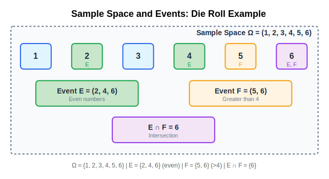 |

### Probability Axioms

Probability is defined by three axioms (fundamental rules) that all probability functions must satisfy:

**Axiom 1: Non-negativity**
For any event $E$, the probability $P(E) \geq 0$. Probabilities cannot be negative.

**Axiom 2: Normalization**
The probability of the entire sample space is 1: $P(\Omega) = 1$. Something must happen.

**Axiom 3: Additivity**
For mutually exclusive events (events that cannot happen simultaneously), the probability of their union equals the sum of their individual probabilities:
$$P(E \cup F) = P(E) + P(F) \text{ when } E \cap F = \emptyset$$

**Example: Fair Coin**

**Given:**
- Sample space: $\Omega = \{\text{Heads}, \text{Tails}\}$
- Event $E = \{\text{Heads}\}$: probability $P(E) = 0.5$
- Event $F = \{\text{Tails}\}$: probability $P(F) = 0.5$

**Verification of Axioms:**

1. **Non-negativity**: $P(E) = 0.5 \geq 0$ ✓, $P(F) = 0.5 \geq 0$ ✓

2. **Normalization**: $P(\Omega) = P(\{\text{Heads}, \text{Tails}\}) = P(E) + P(F) = 0.5 + 0.5 = 1.0$ ✓

3. **Additivity**: $E$ and $F$ are mutually exclusive (cannot both happen), so:
   $$P(E \cup F) = P(\{\text{Heads}, \text{Tails}\}) = 1.0$$
   $$P(E) + P(F) = 0.5 + 0.5 = 1.0$$
   Therefore $P(E \cup F) = P(E) + P(F)$ ✓

**Example: Fair Die**

**Given:**
- Sample space: $\Omega = \{1, 2, 3, 4, 5, 6\}$
- For a fair die, each outcome has equal probability: $P(1) = P(2) = P(3) = P(4) = P(5) = P(6) = \frac{1}{6}$

**Computation:**
- Probability of rolling 1: $P(1) = \frac{1}{6} \approx 0.167$
- Probability of rolling an even number: $P(\{2, 4, 6\}) = P(2) + P(4) + P(6) = \frac{1}{6} + \frac{1}{6} + \frac{1}{6} = \frac{3}{6} = 0.5$
- Probability of rolling greater than 4: $P(\{5, 6\}) = P(5) + P(6) = \frac{1}{6} + \frac{1}{6} = \frac{2}{6} \approx 0.333$

**Verification:**
- Normalization: $P(\Omega) = P(1) + P(2) + P(3) + P(4) + P(5) + P(6) = 6 \times \frac{1}{6} = 1.0$ ✓

### Conditional Probability

**Conditional probability** $P(A|B)$ is the probability of event $A$ occurring given that event $B$ has already occurred. The formula is:

$$P(A|B) = \frac{P(A \cap B)}{P(B)}$$

where $A \cap B$ (read "A intersect B") is the event that both $A$ and $B$ occur.

**Why this formula?** When we condition on $B$, we restrict our attention to outcomes where $B$ occurred. We then ask: of those outcomes, what fraction also satisfy $A$? This is exactly $\frac{P(A \cap B)}{P(B)}$.

**Example: Dice Roll**

**Given:**
- Sample space: $\Omega = \{1, 2, 3, 4, 5, 6\}$ (fair die)
- Event $A$: "Roll is even" = $\{2, 4, 6\}$
- Event $B$: "Roll is greater than 3" = $\{4, 5, 6\}$
- Event $A \cap B$: "Roll is even AND greater than 3" = $\{4, 6\}$

**Computation:**

1. **Compute individual probabilities:**
   - $P(A) = P(\{2, 4, 6\}) = \frac{3}{6} = 0.5$
   - $P(B) = P(\{4, 5, 6\}) = \frac{3}{6} = 0.5$
   - $P(A \cap B) = P(\{4, 6\}) = \frac{2}{6} \approx 0.333$

2. **Compute conditional probability:**
   $$P(A|B) = \frac{P(A \cap B)}{P(B)} = \frac{\frac{2}{6}}{\frac{3}{6}} = \frac{2}{3} \approx 0.667$$

**Interpretation:** Given that we rolled a number greater than 3, the probability that it's even is $\frac{2}{3}$. This makes sense: of the three outcomes $\{4, 5, 6\}$ that satisfy $B$, two of them ($\{4, 6\}$) also satisfy $A$.

| |
|:---:|
| 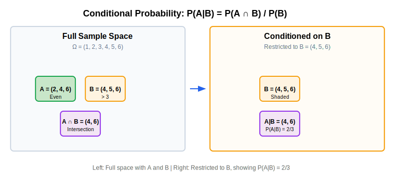 |

### Independence

Two events $A$ and $B$ are **independent** if knowing that $B$ occurred doesn't change the probability of $A$:

$$P(A|B) = P(A)$$

Equivalently, independence means:
$$P(A \cap B) = P(A) \cdot P(B)$$

**Intuition:** Independent events don't influence each other. The outcome of one doesn't affect the probability of the other.

**Example: Independent Coin Flips**

**Given:**
- Experiment: Flip two fair coins
- Sample space: $\Omega = \{(\text{H},\text{H}), (\text{H},\text{T}), (\text{T},\text{H}), (\text{T},\text{T})\}$ (all 4 possible outcomes)
- Event $A$: "First coin is Heads" = $\{(\text{H},\text{H}), (\text{H},\text{T})\}$
- Event $B$: "Second coin is Heads" = $\{(\text{H},\text{H}), (\text{T},\text{H})\}$

**Computation:**

1. **Individual probabilities:**
   - $P(A) = P(\{(\text{H},\text{H}), (\text{H},\text{T})\}) = \frac{2}{4} = 0.5$
   - $P(B) = P(\{(\text{H},\text{H}), (\text{T},\text{H})\}) = \frac{2}{4} = 0.5$

2. **Joint probability:**
   - $A \cap B = \{(\text{H},\text{H})\}$ (both coins are Heads)
   - $P(A \cap B) = P(\{(\text{H},\text{H})\}) = \frac{1}{4} = 0.25$

3. **Check independence:**
   - $P(A) \cdot P(B) = 0.5 \times 0.5 = 0.25$
   - $P(A \cap B) = 0.25$
   - Since $P(A \cap B) = P(A) \cdot P(B)$, events $A$ and $B$ are independent ✓

**Interpretation:** The outcome of the first coin flip doesn't affect the probability of the second coin flip being Heads. This matches our intuition that coin flips are independent.

---

## Probability Distributions

A **probability distribution** assigns probabilities to all possible outcomes. It's a function that maps each outcome to its probability.

### Discrete Distributions

A **discrete distribution** assigns probabilities to a countable set of outcomes (like coin flips, dice rolls, or classification classes).

**Probability Mass Function (PMF)**

For a discrete random variable $X$ that can take values $x_1, x_2, \ldots, x_n$, the **probability mass function** $P(X = x_i)$ gives the probability that $X$ equals $x_i$.

**Properties:**
1. **Non-negativity**: $P(X = x_i) \geq 0$ for all $i$
2. **Normalization**: $\sum_{i=1}^{n} P(X = x_i) = 1$ (all probabilities sum to 1)

**Example: Fair Coin PMF**

**Given:**
- Random variable $X$: outcome of coin flip
- Possible values: $X \in \{\text{Heads}, \text{Tails}\}$

**Probability Mass Function:**
- $P(X = \text{Heads}) = 0.5$
- $P(X = \text{Tails}) = 0.5$

**Verification:**
- Non-negativity: $0.5 \geq 0$ ✓, $0.5 \geq 0$ ✓
- Normalization: $0.5 + 0.5 = 1.0$ ✓

**Example: Biased Coin PMF**

**Given:**
- Random variable $X$: outcome of biased coin flip
- Possible values: $X \in \{\text{Heads}, \text{Tails}\}$
- Bias: coin lands Heads 70% of the time

**Probability Mass Function:**
- $P(X = \text{Heads}) = 0.7$
- $P(X = \text{Tails}) = 0.3$

**Verification:**
- Non-negativity: $0.7 \geq 0$ ✓, $0.3 \geq 0$ ✓
- Normalization: $0.7 + 0.3 = 1.0$ ✓

| |
|:---:|
| 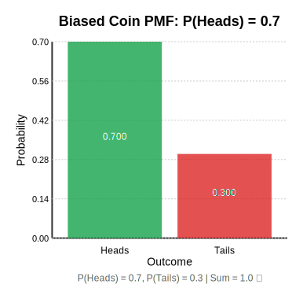 |

**Example: Fair Die PMF**

**Given:**
- Random variable $X$: outcome of die roll
- Possible values: $X \in \{1, 2, 3, 4, 5, 6\}$

**Probability Mass Function:**
- $P(X = 1) = \frac{1}{6} \approx 0.167$
- $P(X = 2) = \frac{1}{6} \approx 0.167$
- $P(X = 3) = \frac{1}{6} \approx 0.167$
- $P(X = 4) = \frac{1}{6} \approx 0.167$
- $P(X = 5) = \frac{1}{6} \approx 0.167$
- $P(X = 6) = \frac{1}{6} \approx 0.167$

**Verification:**
- Normalization: $6 \times \frac{1}{6} = 1.0$ ✓

| |
|:---:|
| 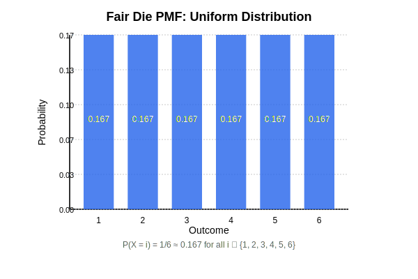 |

### Continuous Distributions

A **continuous distribution** assigns probabilities to intervals of real numbers (like heights, weights, or neural network weights). For continuous distributions, we use **probability density functions (PDF)** instead of probability mass functions.

**Probability Density Function (PDF)**

For a continuous random variable $X$, the **probability density function** $f(x)$ gives the relative likelihood of $X$ taking a value near $x$. The probability that $X$ falls in an interval $[a, b]$ is:

$$P(a \leq X \leq b) = \int_{a}^{b} f(x) \, dx$$

**Properties:**
1. **Non-negativity**: $f(x) \geq 0$ for all $x$
2. **Normalization**: $\int_{-\infty}^{\infty} f(x) \, dx = 1$ (total area under the curve is 1)

**Key difference from discrete:** For continuous distributions, $P(X = x) = 0$ for any specific value $x$. We can only compute probabilities for intervals.

**Cumulative Distribution Function (CDF)**

The **cumulative distribution function** $F(x) = P(X \leq x)$ gives the probability that the random variable is less than or equal to $x$.

For discrete distributions:
$$F(x) = \sum_{x_i \leq x} P(X = x_i)$$

For continuous distributions:
$$F(x) = \int_{-\infty}^{x} f(t) \, dt$$

**Example: Fair Die CDF**

**Given:**
- Random variable $X$: outcome of fair die roll
- CDF: $F(x) = P(X \leq x)$

**Computation:**
- $F(0) = P(X \leq 0) = 0$ (no outcomes $\leq 0$)
- $F(1) = P(X \leq 1) = P(X = 1) = \frac{1}{6} \approx 0.167$
- $F(2) = P(X \leq 2) = P(X = 1) + P(X = 2) = \frac{1}{6} + \frac{1}{6} = \frac{2}{6} \approx 0.333$
- $F(3) = P(X \leq 3) = \frac{3}{6} = 0.5$
- $F(4) = P(X \leq 4) = \frac{4}{6} \approx 0.667$
- $F(5) = P(X \leq 5) = \frac{5}{6} \approx 0.833$
- $F(6) = P(X \leq 6) = \frac{6}{6} = 1.0$
- $F(7) = P(X \leq 7) = 1.0$ (all outcomes are $\leq 7$)

| |
|:---:|
| 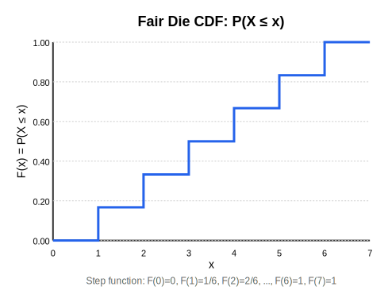 |

---

## Expected Value and Moments

### Expected Value (Mean)

The **expected value** $E[X]$ (also called the **mean** $\mu$) is the weighted average of all possible values, where each value is weighted by its probability.

**For discrete distributions:**
$$E[X] = \sum_{i=1}^{n} x_i \cdot P(X = x_i)$$

**For continuous distributions:**
$$E[X] = \int_{-\infty}^{\infty} x \cdot f(x) \, dx$$

**Why is this an average?** The expected value is a **weighted average** where:
- Each possible value $x_i$ is weighted by its probability $P(X = x_i)$
- We sum all weighted values: $\sum_{i} x_i \cdot P(X = x_i)$

This is exactly like computing a weighted grade: if you have grades $[90, 80, 70]$ with weights $[0.3, 0.4, 0.3]$, the weighted average is $90 \times 0.3 + 80 \times 0.4 + 70 \times 0.3 = 27 + 32 + 21 = 80$.

**Example: Fair Die Expected Value**

**Given:**
- Random variable $X$: outcome of fair die roll
- Possible values: $x_i \in \{1, 2, 3, 4, 5, 6\}$
- Probabilities: $P(X = x_i) = \frac{1}{6}$ for all $i$

**Equation to solve:**
$$E[X] = \sum_{i=1}^{6} x_i \cdot P(X = x_i) = \sum_{i=1}^{6} x_i \cdot \frac{1}{6}$$

**Computation:**

1. **Expand the sum:**
   $$E[X] = 1 \cdot \frac{1}{6} + 2 \cdot \frac{1}{6} + 3 \cdot \frac{1}{6} + 4 \cdot \frac{1}{6} + 5 \cdot \frac{1}{6} + 6 \cdot \frac{1}{6}$$

2. **Compute each term:**
   - $1 \times \frac{1}{6} = \frac{1}{6} \approx 0.167$
   - $2 \times \frac{1}{6} = \frac{2}{6} \approx 0.333$
   - $3 \times \frac{1}{6} = \frac{3}{6} = 0.5$
   - $4 \times \frac{1}{6} = \frac{4}{6} \approx 0.667$
   - $5 \times \frac{1}{6} = \frac{5}{6} \approx 0.833$
   - $6 \times \frac{1}{6} = \frac{6}{6} = 1.0$

3. **Sum all terms:**
   $$E[X] = \frac{1}{6} + \frac{2}{6} + \frac{3}{6} + \frac{4}{6} + \frac{5}{6} + \frac{6}{6} = \frac{21}{6} = 3.5$$

**Result:** $E[X] = 3.5$

**Interpretation:** The expected value of a fair die roll is 3.5. This is the long-run average if we roll the die many times.

| |
|:---:|
| 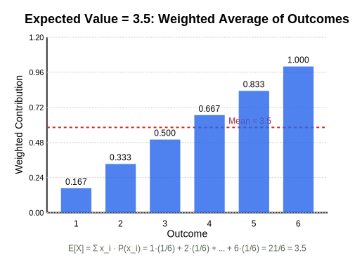 |

**Example: Biased Coin Expected Value**

**Given:**
- Random variable $X$: outcome of biased coin flip
- Encoding: Heads = 1, Tails = 0
- Probabilities: $P(X = 1) = 0.7$, $P(X = 0) = 0.3$

**Equation to solve:**
$$E[X] = \sum_{i} x_i \cdot P(X = x_i) = 1 \cdot P(X = 1) + 0 \cdot P(X = 0)$$

**Computation:**
$$E[X] = 1 \times 0.7 + 0 \times 0.3 = 0.7 + 0 = 0.7$$

**Result:** $E[X] = 0.7$

**Interpretation:** The expected value is 0.7, which equals the probability of Heads. This makes sense: if we encode Heads as 1 and Tails as 0, the expected value is exactly the probability of getting 1.

### Variance

The **variance** $\text{Var}(X)$ (also written as $\sigma^2$) measures how spread out the values are around the mean. It's the expected value of the squared deviation from the mean:

$$\text{Var}(X) = E[(X - \mu)^2]$$

where $\mu = E[X]$ is the mean.

**For discrete distributions:**
$$\text{Var}(X) = \sum_{i=1}^{n} (x_i - \mu)^2 \cdot P(X = x_i)$$

**Why squared?** We square the deviations to make all values positive (so positive and negative deviations don't cancel out) and to penalize larger deviations more heavily.

**Example: Fair Die Variance**

**Given:**
- Random variable $X$: outcome of fair die roll
- Mean: $\mu = E[X] = 3.5$ (from previous example)
- Possible values: $x_i \in \{1, 2, 3, 4, 5, 6\}$
- Probabilities: $P(X = x_i) = \frac{1}{6}$ for all $i$

**Equation to solve:**
$$\text{Var}(X) = \sum_{i=1}^{6} (x_i - 3.5)^2 \cdot \frac{1}{6}$$

**Computation:**

1. **Compute squared deviations:**
   - $(1 - 3.5)^2 = (-2.5)^2 = 6.25$
   - $(2 - 3.5)^2 = (-1.5)^2 = 2.25$
   - $(3 - 3.5)^2 = (-0.5)^2 = 0.25$
   - $(4 - 3.5)^2 = (0.5)^2 = 0.25$
   - $(5 - 3.5)^2 = (1.5)^2 = 2.25$
   - $(6 - 3.5)^2 = (2.5)^2 = 6.25$

2. **Multiply by probabilities:**
   - $6.25 \times \frac{1}{6} \approx 1.042$
   - $2.25 \times \frac{1}{6} = 0.375$
   - $0.25 \times \frac{1}{6} \approx 0.042$
   - $0.25 \times \frac{1}{6} \approx 0.042$
   - $2.25 \times \frac{1}{6} = 0.375$
   - $6.25 \times \frac{1}{6} \approx 1.042$

3. **Sum all terms:**
   $$\text{Var}(X) = 1.042 + 0.375 + 0.042 + 0.042 + 0.375 + 1.042 = 2.918$$

**Result:** $\text{Var}(X) \approx 2.92$

**Alternative formula:** Variance can also be computed as:
$$\text{Var}(X) = E[X^2] - (E[X])^2$$

**Verification using alternative formula:**

1. **Compute $E[X^2]$:**
   $$E[X^2] = \sum_{i=1}^{6} x_i^2 \cdot \frac{1}{6} = \frac{1^2 + 2^2 + 3^2 + 4^2 + 5^2 + 6^2}{6} = \frac{1 + 4 + 9 + 16 + 25 + 36}{6} = \frac{91}{6} \approx 15.167$$

2. **Compute variance:**
   $$\text{Var}(X) = E[X^2] - (E[X])^2 = 15.167 - (3.5)^2 = 15.167 - 12.25 = 2.917 \approx 2.92$$

Both methods give the same result ✓

| |
|:---:|
| 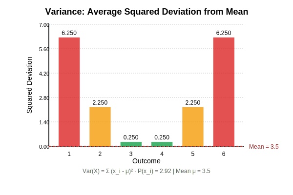 |

### Standard Deviation

The **standard deviation** $\sigma$ is the square root of the variance:

$$\sigma = \sqrt{\text{Var}(X)}$$

**Why square root?** Variance is in squared units (e.g., if $X$ is in meters, variance is in square meters). Taking the square root returns to the original units, making it easier to interpret.

**Example: Fair Die Standard Deviation**

**Given:**
- Variance: $\text{Var}(X) = 2.92$ (from previous example)

**Computation:**
$$\sigma = \sqrt{2.92} \approx 1.71$$

**Result:** $\sigma \approx 1.71$

**Interpretation:** The standard deviation of 1.71 means that, on average, die roll outcomes deviate from the mean (3.5) by about 1.71 units.

---

## Common Distributions for Neural Networks

### Uniform Distribution

A **uniform distribution** assigns equal probability to all outcomes.

**Discrete Uniform Distribution**

For $n$ outcomes, each outcome has probability $\frac{1}{n}$:

$$P(X = x_i) = \frac{1}{n} \text{ for all } i \in \{1, 2, \ldots, n\}$$

**Example: Fair Die (Uniform)**

**Given:**
- $n = 6$ outcomes
- Each outcome has probability $\frac{1}{6}$

This is a uniform distribution because all outcomes are equally likely.

**Example: Classification with 4 Classes (Uniform)**

**Given:**
- Random variable $X$: predicted class
- Possible classes: $\{A, B, C, D\}$ (4 classes)
- Uniform distribution: $P(X = A) = P(X = B) = P(X = C) = P(X = D) = \frac{1}{4} = 0.25$

**Connection to Neural Networks:** When a neural network hasn't learned yet (random initialization), its predictions are often close to uniform—each class gets roughly equal probability.

### Bernoulli Distribution

A **Bernoulli distribution** models a single binary outcome (success or failure, Heads or Tails, 1 or 0).

**Parameters:**
- $p$: probability of success (outcome = 1)
- $1-p$: probability of failure (outcome = 0)

**Probability Mass Function:**
- $P(X = 1) = p$
- $P(X = 0) = 1 - p$

**Expected Value:**
$$E[X] = 1 \cdot p + 0 \cdot (1-p) = p$$

**Variance:**
$$\text{Var}(X) = p(1-p)$$

**Example: Biased Coin (Bernoulli)**

**Given:**
- $p = 0.7$ (probability of Heads)
- $X = 1$ if Heads, $X = 0$ if Tails

**Probability Mass Function:**
- $P(X = 1) = 0.7$
- $P(X = 0) = 0.3$

**Expected Value:**
$$E[X] = 0.7$$

**Variance:**
$$\text{Var}(X) = 0.7 \times 0.3 = 0.21$$

### Categorical Distribution

A **categorical distribution** (also called **multinoulli**) generalizes Bernoulli to multiple classes. It's the distribution used in classification problems.

**Parameters:**
- $n$ classes: $\{1, 2, \ldots, n\}$
- Probabilities: $p_1, p_2, \ldots, p_n$ where $\sum_{i=1}^{n} p_i = 1$

**Probability Mass Function:**
$$P(X = i) = p_i \text{ for } i \in \{1, 2, \ldots, n\}$$

**Example: 4-Class Classification (Categorical)**

**Given:**
- Classes: $\{A, B, C, D\}$ (encoded as $\{1, 2, 3, 4\}$)
- Probabilities: $p_1 = 0.1$, $p_2 = 0.2$, $p_3 = 0.6$, $p_4 = 0.1$

**Probability Mass Function:**
- $P(X = 1) = 0.1$ (class A)
- $P(X = 2) = 0.2$ (class B)
- $P(X = 3) = 0.6$ (class C)
- $P(X = 4) = 0.1$ (class D)

**Verification:**
- Normalization: $0.1 + 0.2 + 0.6 + 0.1 = 1.0$ ✓

**Connection to Neural Networks:** When a neural network applies softmax to logits, it produces a categorical distribution. The softmax output $[0.1, 0.2, 0.6, 0.1]$ is exactly a categorical distribution over 4 classes.

**One-Hot Encoding as Degenerate Categorical**

**One-hot encoding** is a special case of categorical distribution where one class has probability 1 and all others have probability 0.

**Example: One-Hot for Class C**

**Given:**
- Classes: $\{A, B, C, D\}$
- True label: Class C

**One-Hot Distribution:**
- $P(X = A) = 0$
- $P(X = B) = 0$
- $P(X = C) = 1$
- $P(X = D) = 0$

**Vector representation:** $\mathbf{p} = \begin{bmatrix} 0 \\ 0 \\ 1 \\ 0 \end{bmatrix}$

**Connection to Neural Networks:** In classification, the true label is represented as a one-hot vector. The model predicts a categorical distribution (from softmax). Cross-entropy loss compares these two distributions.

### Normal (Gaussian) Distribution

The **normal distribution** (also called **Gaussian**) is a continuous distribution defined by two parameters: mean $\mu$ and variance $\sigma^2$ (or standard deviation $\sigma$).

**Probability Density Function:**
$$f(x) = \frac{1}{\sigma\sqrt{2\pi}} e^{-\frac{1}{2}\left(\frac{x-\mu}{\sigma}\right)^2}$$

**Notation:** $X \sim \mathcal{N}(\mu, \sigma^2)$ means "$X$ follows a normal distribution with mean $\mu$ and variance $\sigma^2$."

**Properties:**
- **Symmetric:** The distribution is symmetric around the mean $\mu$
- **Bell-shaped:** The PDF has a characteristic bell curve shape
- **68-95-99.7 Rule:** Approximately 68% of values fall within 1 standard deviation of the mean, 95% within 2 standard deviations, and 99.7% within 3 standard deviations

**Example: Standard Normal Distribution**

**Given:**
- Mean: $\mu = 0$
- Standard deviation: $\sigma = 1$
- Variance: $\sigma^2 = 1$

**Notation:** $X \sim \mathcal{N}(0, 1)$

**PDF at $x = 0$:**
$$f(0) = \frac{1}{1 \cdot \sqrt{2\pi}} e^{-\frac{1}{2}\left(\frac{0-0}{1}\right)^2} = \frac{1}{\sqrt{2\pi}} e^0 = \frac{1}{\sqrt{2\pi}} \approx 0.399$$

**PDF at $x = 1$:**
$$f(1) = \frac{1}{\sqrt{2\pi}} e^{-\frac{1}{2}\left(\frac{1-0}{1}\right)^2} = \frac{1}{\sqrt{2\pi}} e^{-0.5} \approx 0.242$$

| |
|:---:|
| 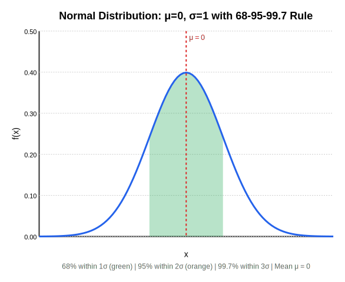 |

**Why Used for Weight Initialization**

Neural network weights are typically initialized by sampling from a normal distribution with mean 0 and small standard deviation (e.g., $\sigma = 0.01$).

**Reasons:**
1. **Symmetry:** Mean of 0 ensures no initial bias
2. **Small variance:** Small standard deviation prevents initial weights from being too large (which can cause training instability)
3. **Mathematical properties:** Normal distributions have nice mathematical properties that make gradient computation easier

**Example: Weight Initialization**

**Given:**
- Weight initialization: $W \sim \mathcal{N}(0, 0.01^2)$
- Mean: $\mu = 0$
- Standard deviation: $\sigma = 0.01$

**Interpretation:** Each weight is sampled independently from a normal distribution centered at 0 with standard deviation 0.01. Most weights will be close to 0 (within $[-0.03, 0.03]$ with 99.7% probability), but some will be slightly larger or smaller.

---

## Information Theory Foundations

### Entropy: Measuring Uncertainty

**Entropy** measures the uncertainty or randomness in a probability distribution. It quantifies how "surprised" we would be, on average, by an outcome.

**Definition:**
$$H(P) = -\sum_{i=1}^{n} P(i) \log P(i)$$

where $P(i)$ is the probability of outcome $i$, and $\log$ is the natural logarithm (base $e$).

**Why is this an average?** Entropy is the **expected value** (weighted average) of the "surprise" function $-\log P(i)$:

1. **Surprise function:** For outcome $i$ with probability $P(i)$, the surprise is $-\log P(i)$
   - Rare events (low $P(i)$) have high surprise (large $-\log P(i)$)
   - Common events (high $P(i)$) have low surprise (small $-\log P(i)$)

2. **Weighted average:** We compute the expected value of surprise:
   $$E[\text{surprise}] = \sum_{i} P(i) \cdot (-\log P(i)) = -\sum_{i} P(i) \log P(i) = H(P)$$

**Example: Fair Coin Entropy**

**Given:**
- Distribution: $P(\text{Heads}) = 0.5$, $P(\text{Tails}) = 0.5$

**Equation to solve:**
$$H(P) = -[P(\text{Heads}) \log P(\text{Heads}) + P(\text{Tails}) \log P(\text{Tails})]$$

**Computation:**

1. **Compute log probabilities:**
   - $\log(0.5) \approx -0.693$
   - $\log(0.5) \approx -0.693$

2. **Multiply by probabilities:**
   - $0.5 \times (-0.693) = -0.347$
   - $0.5 \times (-0.693) = -0.347$

3. **Sum and negate:**
   $$H(P) = -[-0.347 + (-0.347)] = -[-0.694] = 0.694$$

**Result:** $H(P) \approx 0.693$

**Interpretation:** High entropy (0.693) indicates high uncertainty—the coin flip is very unpredictable.

**Example: Biased Coin Entropy**

**Given:**
- Distribution: $P(\text{Heads}) = 0.99$, $P(\text{Tails}) = 0.01$

**Equation to solve:**
$$H(P) = -[0.99 \log(0.99) + 0.01 \log(0.01)]$$

**Computation:**

1. **Compute log probabilities:**
   - $\log(0.99) \approx -0.010$
   - $\log(0.01) \approx -4.605$

2. **Multiply by probabilities:**
   - $0.99 \times (-0.010) = -0.010$
   - $0.01 \times (-4.605) = -0.046$

3. **Sum and negate:**
   $$H(P) = -[-0.010 + (-0.046)] = -[-0.056] = 0.056$$

**Result:** $H(P) \approx 0.056$

**Interpretation:** Low entropy (0.056) indicates low uncertainty—the outcome is very predictable (almost always Heads).

| |
|:---:|
| 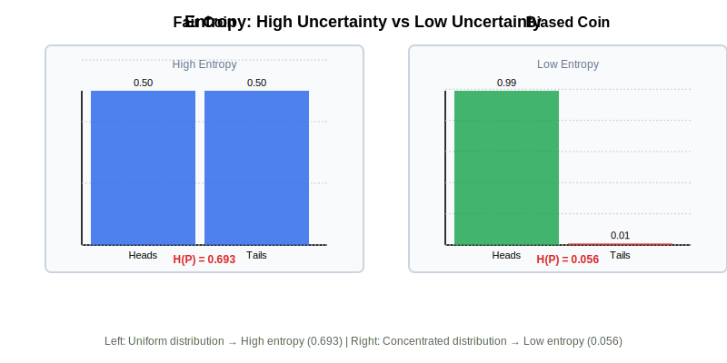 |

**Maximum Entropy Principle**

For a distribution with $n$ outcomes, entropy is maximized when all outcomes are equally likely (uniform distribution):

$$H_{\text{max}} = \log n$$

**Example: Maximum Entropy for 4 Classes**

**Given:**
- $n = 4$ classes
- Uniform distribution: $P(i) = \frac{1}{4} = 0.25$ for all $i$

**Computation:**
$$H_{\text{max}} = -\sum_{i=1}^{4} \frac{1}{4} \log \frac{1}{4} = -4 \times \frac{1}{4} \times \log(0.25) = -\log(0.25) = \log(4) \approx 1.386$$

**Verification:**
- Using the formula: $H_{\text{max}} = \log(4) \approx 1.386$ ✓

**Interpretation:** When all classes are equally likely, we have maximum uncertainty (maximum entropy). As the distribution becomes more concentrated (one class gets higher probability), entropy decreases.

### Cross-Entropy: Comparing Distributions

**Cross-entropy** measures how different two probability distributions are. It's used to compare:
- The **true distribution** $P$ (what actually happened)
- The **predicted distribution** $Q$ (what the model thinks)

**Definition:**
$$H(P, Q) = -\sum_{i=1}^{n} P(i) \log Q(i)$$

**Why "cross"?** We take probabilities from distribution $P$ and apply the log of probabilities from distribution $Q$—we're "crossing" the two distributions.

**Example: Cross-Entropy for Classification**

**Given:**
- True distribution (one-hot): $P = \begin{bmatrix} 0 \\ 0 \\ 1 \\ 0 \end{bmatrix}$ (class C is correct)
- Predicted distribution: $Q = \begin{bmatrix} 0.1 \\ 0.2 \\ 0.6 \\ 0.1 \end{bmatrix}$ (model's prediction)

**Equation to solve:**
$$H(P, Q) = -\sum_{i=1}^{4} P(i) \log Q(i)$$

**Computation:**

1. **Compute each term:**
   - $P(1) \log Q(1) = 0 \times \log(0.1) = 0$ (zero times anything is zero)
   - $P(2) \log Q(2) = 0 \times \log(0.2) = 0$
   - $P(3) \log Q(3) = 1 \times \log(0.6) = \log(0.6) \approx -0.511$
   - $P(4) \log Q(4) = 0 \times \log(0.1) = 0$

2. **Sum and negate:**
   $$H(P, Q) = -[0 + 0 + (-0.511) + 0] = -[-0.511] = 0.511$$

**Result:** $H(P, Q) \approx 0.511$

**Key insight:** When $P$ is one-hot (only one class has probability 1), most terms in the sum are zero. We're left with:
$$H(P, Q) = -\log Q(\text{target})$$

This is exactly the cross-entropy loss formula used in neural networks!

| |
|:---:|
| 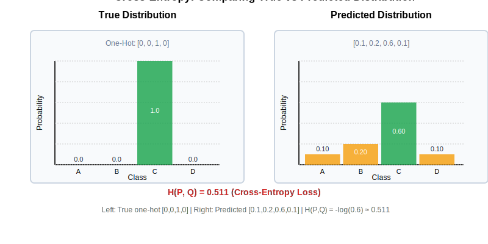 |

**Connection to Neural Networks:** Cross-entropy loss compares the true one-hot distribution with the model's predicted categorical distribution (from softmax). Lower cross-entropy means the distributions are more similar, which means better predictions.

### KL Divergence

**Kullback-Leibler (KL) divergence** measures how different two probability distributions are. It's always non-negative and equals zero only when the distributions are identical.

**Definition:**
$$D_{KL}(P || Q) = \sum_{i=1}^{n} P(i) \log \frac{P(i)}{Q(i)}$$

**Relationship to Cross-Entropy:**
$$D_{KL}(P || Q) = H(P, Q) - H(P)$$

where $H(P)$ is the entropy of $P$ and $H(P, Q)$ is the cross-entropy.

**Interpretation:** KL divergence measures the "extra information" needed to encode samples from $P$ using a code optimized for $Q$ instead of $P$.

---

## Statistics for Neural Networks

### Computing Mean and Variance from Data

In practice, we often compute mean and variance from a dataset (sample) rather than from a known probability distribution.

**Sample Mean**

Given $n$ data points $x_1, x_2, \ldots, x_n$, the **sample mean** is:

$$\bar{x} = \frac{1}{n}\sum_{i=1}^{n} x_i$$

**Example: Computing Sample Mean**

**Given:**
- Dataset: $x = [2.0, 3.5, 4.0, 2.5, 3.0]$ ($n = 5$ data points)

**Equation to solve:**
$$\bar{x} = \frac{1}{5}\sum_{i=1}^{5} x_i$$

**Computation:**

1. **Sum all values:**
   $$\sum_{i=1}^{5} x_i = 2.0 + 3.5 + 4.0 + 2.5 + 3.0 = 15.0$$

2. **Divide by count:**
   $$\bar{x} = \frac{15.0}{5} = 3.0$$

**Result:** $\bar{x} = 3.0$

**Sample Variance**

Given $n$ data points with sample mean $\bar{x}$, the **sample variance** is:

$$s^2 = \frac{1}{n}\sum_{i=1}^{n}(x_i - \bar{x})^2$$

**Example: Computing Sample Variance**

**Given:**
- Dataset: $x = [2.0, 3.5, 4.0, 2.5, 3.0]$
- Sample mean: $\bar{x} = 3.0$ (from previous example)

**Equation to solve:**
$$s^2 = \frac{1}{5}\sum_{i=1}^{5}(x_i - 3.0)^2$$

**Computation:**

1. **Compute squared deviations:**
   - $(2.0 - 3.0)^2 = (-1.0)^2 = 1.0$
   - $(3.5 - 3.0)^2 = (0.5)^2 = 0.25$
   - $(4.0 - 3.0)^2 = (1.0)^2 = 1.0$
   - $(2.5 - 3.0)^2 = (-0.5)^2 = 0.25$
   - $(3.0 - 3.0)^2 = (0.0)^2 = 0.0$

2. **Sum squared deviations:**
   $$\sum_{i=1}^{5}(x_i - 3.0)^2 = 1.0 + 0.25 + 1.0 + 0.25 + 0.0 = 2.5$$

3. **Divide by count:**
   $$s^2 = \frac{2.5}{5} = 0.5$$

**Result:** $s^2 = 0.5$

**Sample Standard Deviation**

The **sample standard deviation** is the square root of the sample variance:

$$s = \sqrt{s^2}$$

**Example: Computing Sample Standard Deviation**

**Given:**
- Sample variance: $s^2 = 0.5$

**Computation:**
$$s = \sqrt{0.5} \approx 0.707$$

**Result:** $s \approx 0.707$

### Z-Scores and Normalization

A **z-score** (also called **standard score**) measures how many standard deviations a value is from the mean:

$$z = \frac{x - \mu}{\sigma}$$

where $\mu$ is the mean and $\sigma$ is the standard deviation.

**Example: Computing Z-Scores**

**Given:**
- Dataset: $x = [2.0, 3.5, 4.0, 2.5, 3.0]$
- Mean: $\mu = 3.0$
- Standard deviation: $\sigma = 0.707$

**Equation to solve:**
$$z_i = \frac{x_i - 3.0}{0.707}$$

**Computation:**

1. **Compute z-score for $x_1 = 2.0$:**
   $$z_1 = \frac{2.0 - 3.0}{0.707} = \frac{-1.0}{0.707} \approx -1.414$$

2. **Compute z-score for $x_2 = 3.5$:**
   $$z_2 = \frac{3.5 - 3.0}{0.707} = \frac{0.5}{0.707} \approx 0.707$$

3. **Compute z-score for $x_3 = 4.0$:**
   $$z_3 = \frac{4.0 - 3.0}{0.707} = \frac{1.0}{0.707} \approx 1.414$$

**Result:** Z-scores: $z = [-1.414, 0.707, 1.414, -0.707, 0.0]$

**Properties of Z-Scores:**
- Mean of z-scores is always 0
- Standard deviation of z-scores is always 1
- Z-scores are unitless (they're in units of standard deviations)

**Why Normalization Helps Training**

Normalization (computing z-scores) helps neural network training because:

1. **Consistent scale:** All features are on the same scale (mean 0, std 1), preventing some features from dominating others
2. **Stable gradients:** Normalized inputs lead to more stable gradients during backpropagation
3. **Faster convergence:** Training converges faster when inputs are normalized

**Connection to Layer Normalization:** Layer normalization in transformers applies this exact transformation: subtract the mean, divide by the standard deviation. This stabilizes training in deep networks.

| |
|:---:|
| 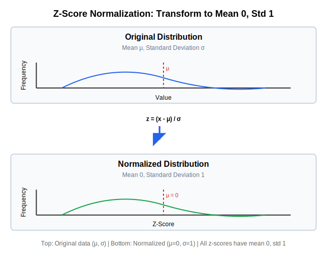 |

### Sample vs Population Statistics

**Population statistics** describe the entire population (all possible values). **Sample statistics** describe a sample (a subset of the population).

**Notation:**
- Population mean: $\mu$ (Greek letter mu)
- Population variance: $\sigma^2$ (Greek letter sigma squared)
- Sample mean: $\bar{x}$ (x-bar)
- Sample variance: $s^2$

**Key difference:** In practice, we usually have a sample, not the entire population. We compute sample statistics to estimate population statistics.

---

## Applications to Neural Networks

### How Softmax Creates Probability Distributions

**Softmax** converts a vector of logits (raw scores) into a probability distribution (categorical distribution).

**Softmax Formula:**
$$\text{softmax}(x_i) = \frac{e^{x_i}}{\sum_{j=1}^{n} e^{x_j}}$$

**Properties:**
1. **Non-negativity:** All outputs are $\geq 0$
2. **Normalization:** All outputs sum to 1
3. **Probability distribution:** The output is a valid categorical distribution

**Example: Softmax on Logits**

**Given:**
- Logits: $\mathbf{x} = [1.0, 2.0, 3.0, 1.0]$ (4 classes)

**Equation to solve:**
$$\text{softmax}(x_i) = \frac{e^{x_i}}{\sum_{j=1}^{4} e^{x_j}}$$

**Computation:**

1. **Compute exponentials:**
   - $e^{1.0} \approx 2.718$
   - $e^{2.0} \approx 7.389$
   - $e^{3.0} \approx 20.086$
   - $e^{1.0} \approx 2.718$

2. **Compute sum:**
   $$\sum_{j=1}^{4} e^{x_j} = 2.718 + 7.389 + 20.086 + 2.718 = 32.911$$

3. **Normalize (divide each by sum):**
   - $\text{softmax}(x_1) = \frac{2.718}{32.911} \approx 0.083$
   - $\text{softmax}(x_2) = \frac{7.389}{32.911} \approx 0.225$
   - $\text{softmax}(x_3) = \frac{20.086}{32.911} \approx 0.610$
   - $\text{softmax}(x_4) = \frac{2.718}{32.911} \approx 0.083$

**Result:** Probabilities: $[0.083, 0.225, 0.610, 0.083]$

**Verification:**
- Sum: $0.083 + 0.225 + 0.610 + 0.083 = 1.001 \approx 1.0$ ✓ (small rounding error)

**Interpretation:** The logit vector $[1.0, 2.0, 3.0, 1.0]$ is converted to a categorical distribution where class 3 has the highest probability (0.610), reflecting that it had the highest logit (3.0).

### Why Cross-Entropy Loss Works

Cross-entropy loss works well for classification because:

1. **Penalizes confident wrong predictions:** If the model assigns high probability to the wrong class, cross-entropy loss is large
2. **Rewards confident correct predictions:** If the model assigns high probability to the correct class, cross-entropy loss is small
3. **Mathematical properties:** Cross-entropy has nice gradient properties that make optimization efficient

**Example: Good vs Bad Prediction**

**Given:**
- True label: Class C (one-hot: $[0, 0, 1, 0]$)

**Case 1: Good Prediction**
- Predicted probabilities: $[0.1, 0.2, 0.6, 0.1]$
- Cross-entropy loss: $-\log(0.6) \approx 0.511$ (low loss ✓)

**Case 2: Bad Prediction**
- Predicted probabilities: $[0.8, 0.1, 0.05, 0.05]$
- Cross-entropy loss: $-\log(0.05) \approx 3.0$ (high loss ✗)

**Interpretation:** The model is penalized much more heavily for being confidently wrong (case 2) than for being reasonably correct (case 1). This encourages the model to learn to make confident, correct predictions.

### How Normalization Stabilizes Training

**Layer normalization** applies z-score normalization to layer inputs:

$$\text{normalize}(x_i) = \frac{x_i - \mu}{\sigma}$$

where $\mu$ and $\sigma$ are computed from the current layer's inputs.

**Why this helps:**
1. **Prevents exploding values:** Normalization keeps values in a reasonable range
2. **Stabilizes gradients:** Normalized inputs lead to more stable gradients
3. **Faster training:** Networks train faster with normalized inputs

**Connection to Statistics:** Layer normalization is exactly computing z-scores: subtract the mean, divide by the standard deviation. This transforms the input distribution to have mean 0 and standard deviation 1, which is optimal for neural network training.

### Weight Initialization from Distributions

Neural network weights are initialized by sampling from probability distributions, typically:

**Normal Distribution Initialization:**
- Sample weights from $\mathcal{N}(0, \sigma^2)$ where $\sigma$ is small (e.g., 0.01)
- Ensures weights start small and random

**Why Normal Distribution?**
1. **Symmetry:** Mean of 0 ensures no initial bias
2. **Controlled variance:** Small $\sigma$ prevents initial weights from being too large
3. **Mathematical convenience:** Normal distributions have nice properties for gradient computation

**Example: Weight Matrix Initialization**

**Given:**
- Weight matrix shape: $2 \times 3$ (2 rows, 3 columns)
- Initialization: $W_{ij} \sim \mathcal{N}(0, 0.01^2)$ for each element

**Interpretation:** Each of the 6 weights is sampled independently from a normal distribution with mean 0 and standard deviation 0.01. Most weights will be close to 0, but some will be slightly positive or negative.

---

## Summary

This chapter established the probability and statistics foundations needed for understanding neural networks:

1. **Basic Probability:** Sample spaces, events, probability axioms, conditional probability, independence
2. **Distributions:** Discrete (PMF) and continuous (PDF) distributions, CDFs
3. **Expected Value:** Weighted averages, variance, standard deviation
4. **Common Distributions:** Uniform, Bernoulli, Categorical (for classification), Normal (for weight initialization)
5. **Information Theory:** Entropy (uncertainty), cross-entropy (comparing distributions), KL divergence
6. **Statistics:** Sample mean/variance, z-scores, normalization
7. **Applications:** How softmax creates distributions, why cross-entropy loss works, how normalization stabilizes training

Every concept was explained operationally—as explicit transformations that can be computed step-by-step. This foundation is essential for understanding loss functions, softmax, normalization, and the probabilistic nature of neural network predictions.

**Next Steps:** In [Chapter 4: Learning Algorithms](04-learning-algorithms.md), we'll see how these probability concepts are used in loss functions and training algorithms.

---

**Navigation:**
- [← Previous: Neural Networks and the Perceptron](01-neural-networks-perceptron.md) | [Table of Contents](00b-toc.md) | [Next: Multilayer Networks and Architecture →](03-multilayer-networks-architecture.md)
