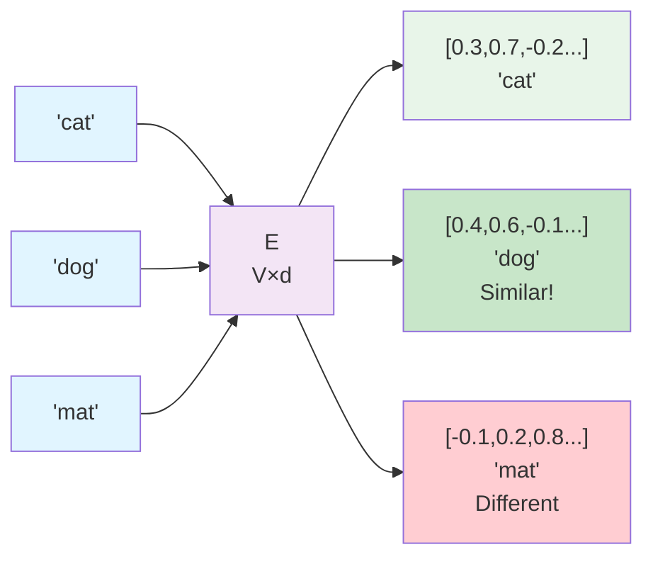
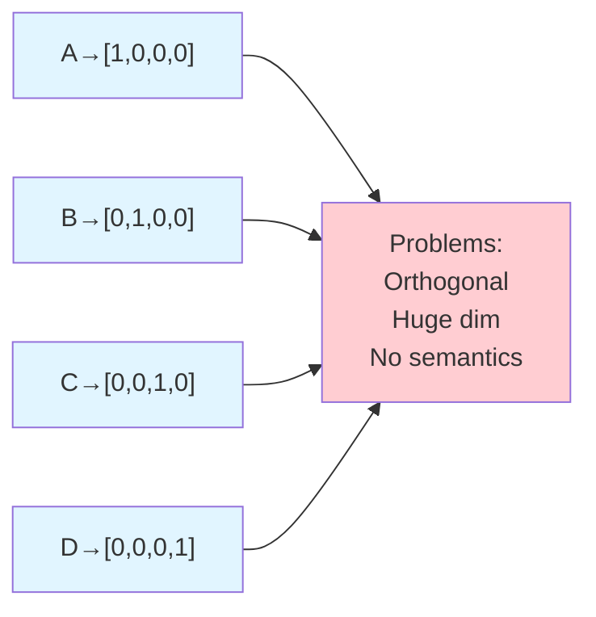
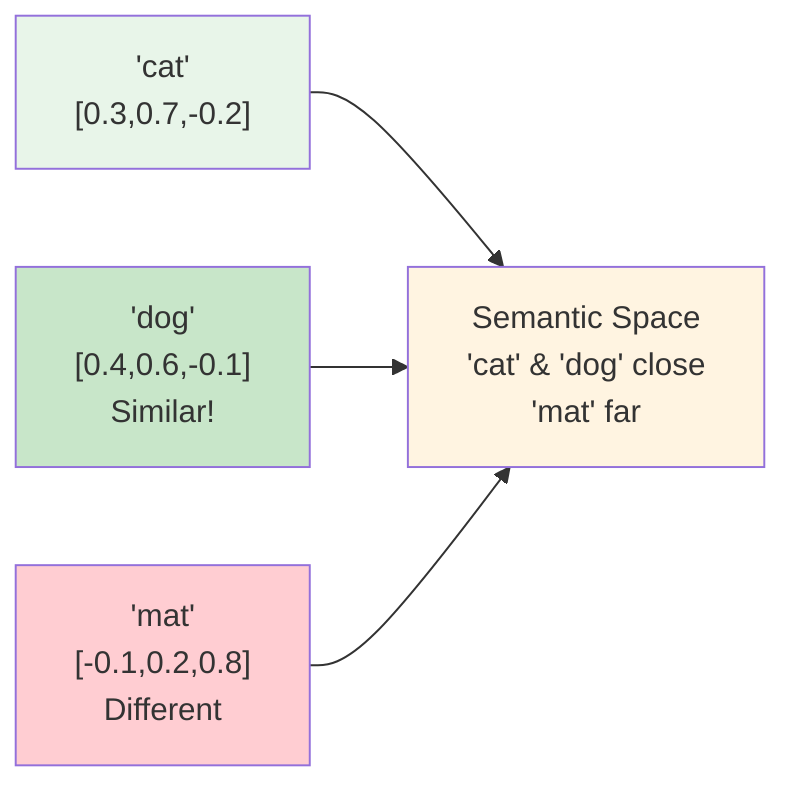
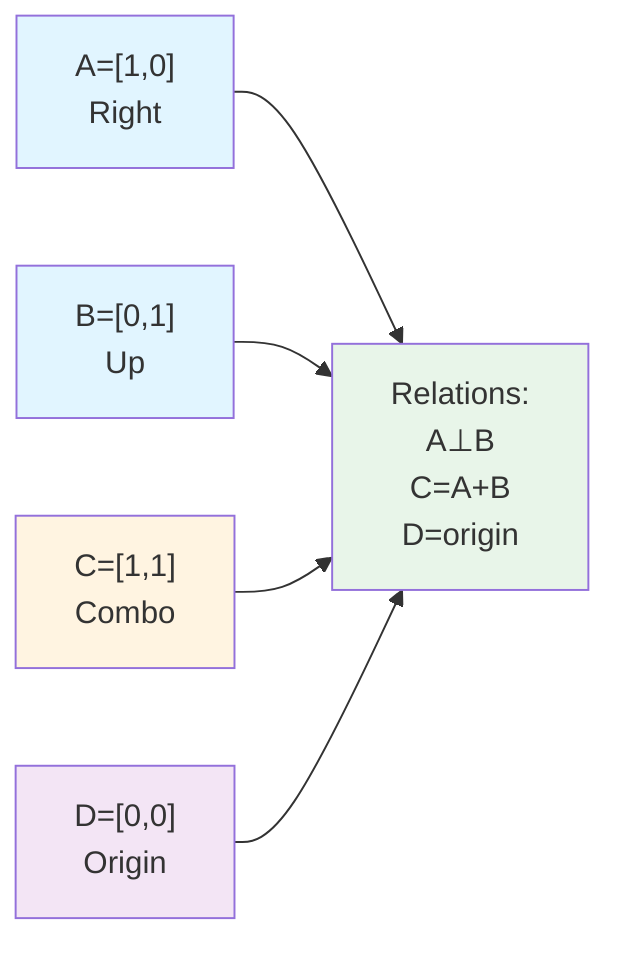

## Chapter 3: Embeddings: Tokens to Vectors

### The Problem: Discrete vs. Continuous

**Tokens** (words, characters, subwords) are **discrete**:
- "cat" is just a symbol
- No mathematical relationship between "cat" and "dog"
- Can't do arithmetic: "cat" + "dog" = ???

**Neural networks** need **continuous** values:
- Matrix operations require numbers
- Gradients need smooth functions
- Learning needs measurable similarity

**Solution:** Convert discrete tokens to continuous vectors = **embeddings**

### What are Embeddings?

**Embeddings** map each token to a vector (point in space):

**Key insight:** Similar tokens should have similar vectors!

### One-Hot Encoding: The Starting Point

**One-hot encoding** is the simplest embedding:
- Vocabulary size = $V$
- Each token gets a vector of length $V$
- Only one element is 1, rest are 0

**Example (vocab: A, B, C, D):**

**Problems with one-hot:**
- Vectors are orthogonal (no similarity)
- Dimension = vocabulary size (huge for large vocabs!)
- No semantic relationships

### Learned Embeddings: The Solution

**Learned embeddings** are vectors that get updated during training:
- Start random
- Learn to capture semantic relationships
- Similar meanings → similar vectors

**Example (learned):**

**How it works:**
- Embedding matrix: $E \in \mathbb{R}^{V \times d}$
- $V$ = vocabulary size
- $d$ = embedding dimension (e.g., 2 for our examples, 768 for BERT)
- Lookup: token $i$ → row $i$ of $E$

### Embedding Dimensions

**Dimension choice:**
- **Too small**: Can't capture enough information
- **Too large**: Overfitting, slow computation
- **Sweet spot**: Balance capacity and efficiency

**Our examples:** $d = 2$ (hand-calculable!)
**Real models:** $d = 768$ (BERT), $d = 12,288$ (GPT-3)

### Semantic Spaces

**Embeddings create a "semantic space":**
- Tokens with similar meanings are close together
- Tokens with different meanings are far apart
- Relationships emerge: "king" - "man" + "woman" ≈ "queen"

**Example in 2D:**

**2D Embedding Space Visualization:**

<svg width="600" height="600" xmlns="http://www.w3.org/2000/svg">
  <g transform="translate(100, 50)">
    <text x="200" y="-20" font-family="Arial" font-size="16" font-weight="bold">Semantic Space: Tokens as Points in 2D</text>
    <!-- Axes -->
    <line x1="0" y1="400" x2="400" y2="400" stroke="#333" stroke-width="2"/>
    <line x1="200" y1="0" x2="200" y2="500" stroke="#333" stroke-width="2"/>
    <!-- Axis labels -->
    <text x="400" y="420" font-family="Arial" font-size="14">Dimension 1</text>
    <text x="190" y="-10" font-family="Arial" font-size="14">Dimension 2</text>
    <!-- Origin -->
    <circle cx="200" cy="400" r="3" fill="#333"/>
    <text x="205" y="405" font-family="Arial" font-size="11">(0,0)</text>
    <!-- Grid lines -->
    <line x1="100" y1="0" x2="100" y2="500" stroke="#ccc" stroke-width="1" stroke-dasharray="2,2"/>
    <line x1="300" y1="0" x2="300" y2="500" stroke="#ccc" stroke-width="1" stroke-dasharray="2,2"/>
    <line x1="0" y1="300" x2="400" y2="300" stroke="#ccc" stroke-width="1" stroke-dasharray="2,2"/>
    <line x1="0" y1="500" x2="400" y2="500" stroke="#ccc" stroke-width="1" stroke-dasharray="2,2"/>
    <!-- 'cat' at (0.3, 0.7) - scaled to (120, 160) -->
    <circle cx="120" cy="160" r="8" fill="#16a34a"/>
    <text x="130" y="165" font-family="Arial" font-size="12" font-weight="bold">'cat'</text>
    <text x="120" y="180" font-family="Arial" font-size="10" text-anchor="middle">(0.3, 0.7)</text>
    <!-- 'dog' at (0.4, 0.6) - close to cat -->
    <circle cx="160" cy="200" r="8" fill="#16a34a"/>
    <text x="170" y="205" font-family="Arial" font-size="12" font-weight="bold">'dog'</text>
    <text x="160" y="220" font-family="Arial" font-size="10" text-anchor="middle">(0.4, 0.6)</text>
    <!-- 'mat' at (-0.1, 0.2) - far from cat/dog -->
    <circle cx="160" cy="360" r="8" fill="#dc2626"/>
    <text x="170" y="365" font-family="Arial" font-size="12" font-weight="bold">'mat'</text>
    <text x="160" y="380" font-family="Arial" font-size="10" text-anchor="middle">(-0.1, 0.2)</text>
    <!-- Distance line between cat and dog (similar) -->
    <line x1="120" y1="160" x2="160" y2="200" stroke="#16a34a" stroke-width="2" stroke-dasharray="3,3" opacity="0.5"/>
    <text x="140" y="175" font-family="Arial" font-size="10" fill="#16a34a">Close (similar)</text>
    <!-- Distance line between cat and mat (different) -->
    <line x1="120" y1="160" x2="160" y2="360" stroke="#dc2626" stroke-width="2" stroke-dasharray="3,3" opacity="0.5"/>
    <text x="140" y="260" font-family="Arial" font-size="10" fill="#dc2626">Far (different)</text>
    <!-- Scale note -->
    <text x="0" y="480" font-family="Arial" font-size="11" fill="#666">Note: Coordinates scaled for visualization. Similar tokens cluster together.</text>
  </g>
</svg>

### Fixed vs. Learned Embeddings

**Fixed embeddings** (our examples):
- Pre-defined, don't change
- Simple for learning
- Example: A=[1,0], B=[0,1]

**Learned embeddings** (real models):
- Updated during training
- Capture task-specific semantics
- Much more powerful

**In our examples:** We use fixed embeddings to focus on attention and training mechanics.

### Embedding Lookup

**Process:**
1. Token index: "cat" → index 42
2. Lookup: $E[42]$ → vector $[0.3, 0.7, -0.2, ...]$
3. Use vector in computations

**Mathematically:**
$$\text{embedding}(i) = E[i]$$

Where $E$ is the embedding matrix and $i$ is the token index.

### Why Embeddings Matter

**1. Enable computation:**
- Can't do math on "cat"
- Can do math on $[0.3, 0.7, -0.2]$

**2. Capture relationships:**
- Similar tokens → similar vectors
- Enables attention to find relevant tokens

**3. Learnable:**
- Embeddings adapt to task
- Better embeddings = better model

### Learning Objectives Recap

- ✓ Understand why embeddings are needed
- ✓ See how discrete tokens become vectors
- ✓ Understand embedding spaces and dimensions
- ✓ Know difference between fixed and learned embeddings

### Key Concepts Recap

- **Token vocabulary**: Set of all possible tokens
- **Embedding matrices**: Map tokens to vectors
- **Vector representations**: Continuous, learnable
- **Semantic spaces**: Where meaning lives

### Mathematical Foundations Recap

- **One-hot encoding**: Simple but limited
- **Embedding lookup**: $E[i]$ for token $i$
- **Embedding dimensions**: Balance capacity and efficiency

---
---
**Navigation:**
- [← Index](00-index.md) | [← Previous: The Matrix Core](02-matrix-core.md) | [Next: Attention Intuition →](04-attention-intuition.md)
---
