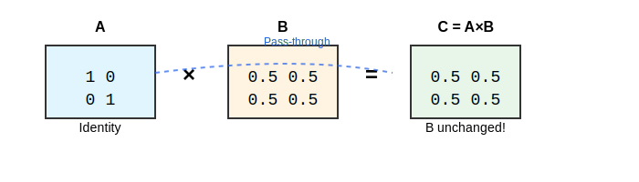
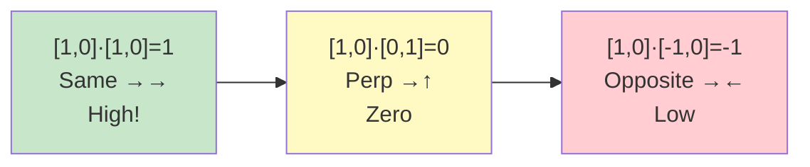
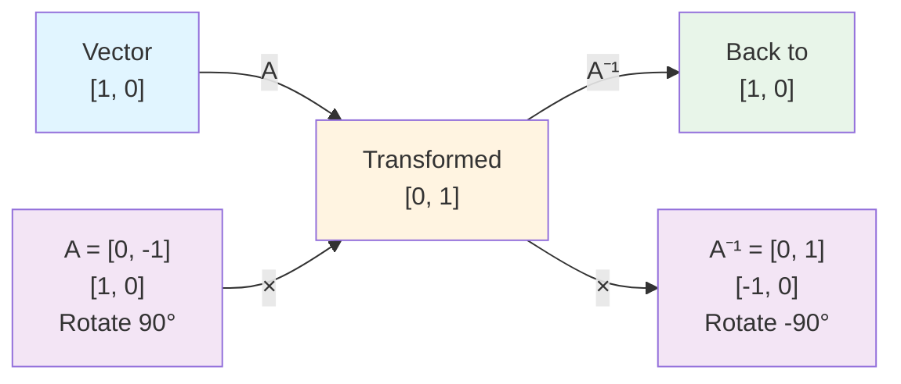

## Chapter 5: The Matrix Core

### Why Matrices?

Neural networks are fundamentally built on **matrix operations**. Every layer, every transformation, every computation involves matrices. But why?

**The answer:** Matrices are the mathematical tool that lets us:
1. Transform data efficiently
2. Learn patterns from examples
3. Compute gradients for training
4. Parallelize on GPUs/TPUs

### What is a Matrix?

A **matrix** is a rectangular array of numbers. For our 2×2 case:

$$A = \begin{bmatrix} a & b \\ c & d \end{bmatrix}$$

**Why 2×2?** Small enough to compute by hand, but captures all the essential operations.

### Matrix Multiplication: The Core Operation

**Matrix multiplication** is how neural networks transform data.

For matrices $A$ (2×2) and $B$ (2×2):

$$C = AB = \begin{bmatrix} a & b \\ c & d \end{bmatrix} \begin{bmatrix} e & f \\ g & h \end{bmatrix} = \begin{bmatrix} ae+bg & af+bh \\ ce+dg & cf+dh \end{bmatrix}$$

**What this means:**
- Each element of $C$ is a **weighted combination** of elements from $A$ and $B$
- The weights come from the matrix structure itself
- This is how networks "mix" information

**Example:**

| |
|:---:|
|  |

The identity matrix $A$ doesn't change $B$ - this is like a "pass-through" layer.

### Linear Transformations

**Matrix multiplication = linear transformation**

When we multiply a vector by a matrix, we:
- **Rotate** the vector in space
- **Scale** its components
- **Project** it to a new space

**Example:**

| |
|:---:|
| ![Vector Rotation: [1,0] rotated 90° to [0,1]](images/other/vector-rotation-90deg.svg) |

**Why this matters for learning:**
- Different matrices = different transformations
- Learning = finding the right transformation
- Weights in matrices are what get updated during training

### Vector Spaces

**Vectors** are points in space. For 2D:
- $[1, 0]$ = point at (1, 0)
- $[0, 1]$ = point at (0, 1)
- $[0.5, 0.5]$ = point at (0.5, 0.5)

**Vector space** = all possible points/vectors

**Why this matters:**
- Embeddings live in vector spaces
- Attention computes similarity in vector space
- Learning = moving points in space to create patterns

### Dot Products: Measuring Similarity

**Dot product** of two vectors measures how "aligned" they are:

$$\mathbf{a} \cdot \mathbf{b} = a_1 b_1 + a_2 b_2$$

**Properties:**
- **High dot product** = vectors point in similar direction = similar
- **Low dot product** = vectors point in different directions = different
- **Zero dot product** = vectors are perpendicular = unrelated

**Example:**

**In attention:** Dot product between Query and Key measures how relevant they are!

### Transpose: Changing Perspective

**Transpose** swaps rows and columns:

$$A^T = \begin{bmatrix} a & c \\ b & d \end{bmatrix}$$

**Why transpose?**
- Matrix multiplication requires compatible dimensions
- $A \times B$ works if $A$ has $n$ columns and $B$ has $n$ rows
- Transpose lets us align dimensions: $A \times B^T$

**In attention:** We compute $Q \times K^T$ to get all pairwise dot products at once!

### Matrix Inverse: The "Undo" Operation

**Matrix inverse** is like division for matrices. If $A \times B = I$ (identity), then $B$ is the inverse of $A$, written as $A^{-1}$.

**For a 2×2 matrix:**

$$A = \begin{bmatrix} a & b \\ c & d \end{bmatrix}$$

The inverse is:

$$A^{-1} = \frac{1}{ad - bc} \begin{bmatrix} d & -b \\ -c & a \end{bmatrix}$$

**Key concept:** The term $ad - bc$ is called the **determinant** of $A$, written as $\det(A)$.

**Important:** The inverse only exists if $\det(A) \neq 0$. If $\det(A) = 0$, the matrix is **singular** (not invertible).

**Physical Analogy:** Think of matrix inverse like **undoing a transformation**:
- If you rotate a vector 90° clockwise, the inverse rotates it 90° counter-clockwise
- If you scale by 2, the inverse scales by 0.5
- The inverse "undoes" what the original matrix did

**Example:**

**Hand Calculation Example:**

Let's compute the inverse of:

$$A = \begin{bmatrix} 2 & 1 \\ 1 & 1 \end{bmatrix}$$

**Step 1:** Compute determinant:
$$\det(A) = ad - bc = (2)(1) - (1)(1) = 2 - 1 = 1$$

**Step 2:** Apply formula:
$$A^{-1} = \frac{1}{1} \begin{bmatrix} 1 & -1 \\ -1 & 2 \end{bmatrix} = \begin{bmatrix} 1 & -1 \\ -1 & 2 \end{bmatrix}$$

**Step 3:** Verify:
$$A \times A^{-1} = \begin{bmatrix} 2 & 1 \\ 1 & 1 \end{bmatrix} \begin{bmatrix} 1 & -1 \\ -1 & 2 \end{bmatrix} = \begin{bmatrix} 2-1 & -2+2 \\ 1-1 & -1+2 \end{bmatrix} = \begin{bmatrix} 1 & 0 \\ 0 & 1 \end{bmatrix} = I$$

✓ It works! $A \times A^{-1} = I$ (identity matrix).

**Why Matrix Inverse Matters (Even Though Transformers Don't Use It):**

1. **Understanding Linear Systems:**
   - Solving $Ax = b$ gives $x = A^{-1}b$
   - Helps understand when systems have unique solutions

2. **Understanding Matrix Properties:**
   - Invertible matrices are "full rank" (all information preserved)
   - Singular matrices lose information (can't be inverted)

3. **Mathematical Foundation:**
   - Inverse is fundamental to linear algebra
   - Understanding inverses helps understand other concepts

**Why Transformers Don't Use Matrix Inverse:**

Transformers use:
- **Matrix multiplication** (forward transformations)
- **Transpose** (for dimension alignment)
- **Element-wise operations** (additions, multiplications)

But **NOT** matrix inverse because:
- Inversion is computationally expensive ($O(n^3)$ for $n \times n$ matrices)
- Transformers learn weights through gradient descent, not by inverting matrices
- Weights are updated iteratively, not computed directly
- The forward pass only needs multiplication, not inversion

**Key Takeaway:** Matrix inverse is a fundamental concept to understand, but transformers solve problems through learning (gradient descent) rather than analytical solutions (matrix inversion).

### Why Matrices Enable Learning

**1. Expressiveness:**
- Linear transformations can represent any linear relationship
- With non-linearities (ReLU), can approximate any function
- Multiple layers = composition of transformations = complex patterns

**2. Gradient Flow:**
- Matrix operations have clean derivatives
- Chain rule works beautifully: $\frac{d}{dW}(f(g(x))) = \frac{df}{dg} \frac{dg}{dW}$
- Enables backpropagation

**3. Parallelization:**
- GPUs have "tensor cores" optimized for matrix multiply
- Can process thousands of operations simultaneously
- Makes training feasible

**4. Composition:**
- Stack matrices: $f(g(x))$ where $f$ and $g$ are matrix operations
- Each layer adds complexity
- Deep networks = many composed transformations

### Matrix Calculus Basics

**For $C = AB$:**
- $\frac{\partial L}{\partial A} = \frac{\partial L}{\partial C} B^T$
- $\frac{\partial L}{\partial B} = A^T \frac{\partial L}{\partial C}$

**Why this matters:**
- Backpropagation needs these rules
- Gradients flow backward through matrix operations
- Enables training

### Learning Objectives Recap

- ✓ Understand why matrices are fundamental
- ✓ Master matrix multiplication
- ✓ See how linear transformations work
- ✓ Understand gradient flow through matrices
- ✓ Understand matrix inverse (even though transformers don't use it)

### Key Concepts Recap

- **Matrix multiplication**: Core operation for transformations
- **Linear transformations**: How matrices change vectors
- **Vector spaces**: Where embeddings and computations live
- **Transpose**: Tool for dimension alignment
- **Matrix inverse**: The "undo" operation (fundamental concept, not used in transformers)
- **Matrices enable learning**: Expressiveness + gradients + parallelization

---
---
**Navigation:**
- [← Index](00b-toc.md) | [← Previous: Training Neural Networks](04-training-neural-networks.md) | [Next: Embeddings →](06-embeddings.md)
---
