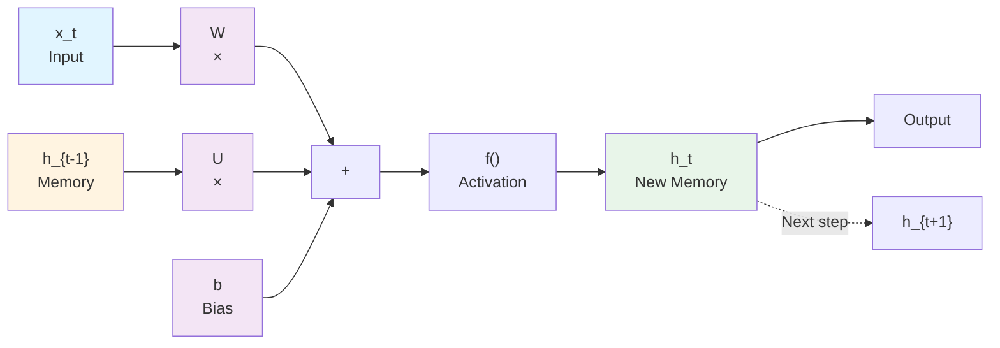
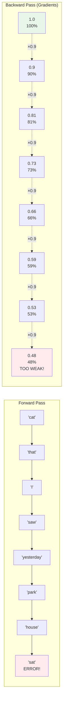
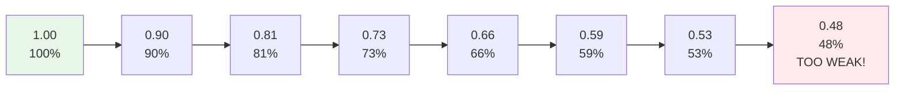
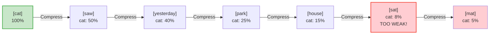
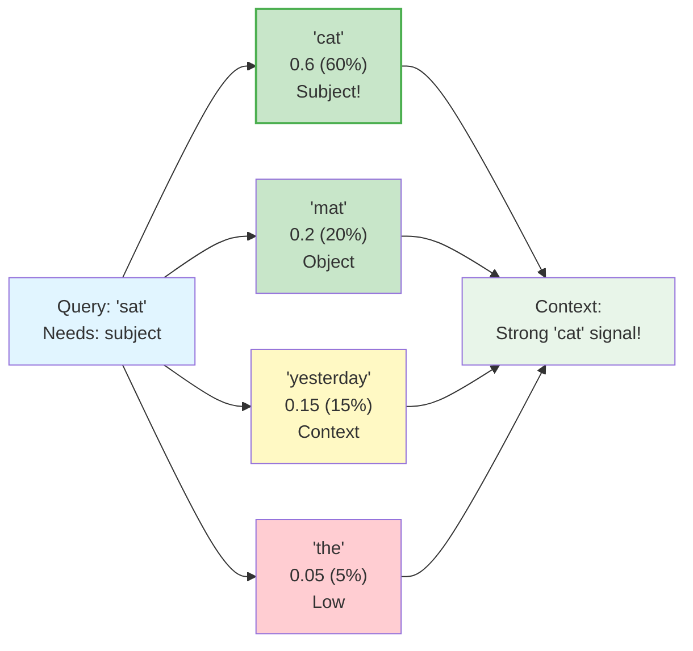

## Chapter 5: Why Transformers?

**Prerequisites:** You should have read:
- Chapter 1: Neural Network Fundamentals (all concepts explained with physical analogies)
- Chapter 2: The Matrix Core (matrix operations)
- Chapter 3: Embeddings (tokens to vectors)
- Chapter 4: Attention Intuition (Q/K/V, attention mechanism)

Now we understand the building blocks, let's see why transformers are needed.

### The Problem: Sequence Modeling

Imagine you're reading a sentence: "The cat sat on the mat." To understand this, you need to:
- Remember that "cat" is the subject
- Connect "sat" to "cat" (the cat did the sitting)
- Understand "on the mat" describes where the cat sat

This is **sequence modeling**: understanding how elements in a sequence relate to each other.

**Real-world applications:**
- **Language translation**: "Hello" → "Hola" (but context matters!)
- **Text generation**: Given "The weather is", predict "nice" or "terrible"
- **Question answering**: "Who wrote Hamlet?" requires understanding context
- **Code completion**: IDE suggests next token based on previous code

### The Challenge: Long-Range Dependencies

In the sentence "The cat that I saw yesterday sat on the mat", the word "sat" must connect to "cat" even though many words separate them. This is a **long-range dependency**.

**Why this is hard:**
- Information must flow across many positions
- Context from early in the sequence affects later predictions
- Traditional models struggle with this

### Previous Solutions: RNNs and Their Limitations

**Recurrent Neural Networks (RNNs)** were the previous solution:
- Process sequence one **token** (see Chapter 1) at a time
- Maintain **hidden state** (a vector - see Chapter 1) that carries information forward
- Can theoretically handle long sequences

**But RNNs have problems:**
1. **Sequential bottleneck**: Must process tokens one-by-one (can't parallelize)
2. **Vanishing gradients**: Information gets lost over long sequences
3. **Forgetting**: Early context fades as sequence gets longer

#### How RNNs Work: The Hidden State Mechanism

Imagine an RNN as a person reading a sentence, but with a **very limited memory**. At each word, they:
1. Read the current word
2. Combine it with what they remember from previous words
3. Update their memory (hidden state)
4. Use this updated memory to understand the next word

**The Mathematical Story:**

At each time step $t$, an RNN:
- Takes input $x_t$ (current word, e.g., "cat")
- Combines it with hidden state $h_{t-1}$ (memory from previous words)
- Computes new hidden state: $h_t = f(W \cdot x_t + U \cdot h_{t-1} + b)$
- Uses $h_t$ to predict the next word or make decisions

**RNN Architecture Flow:**



**Understanding the Variables with Physical Examples:**

Let's break down each component of $h_t = f(W \cdot x_t + U \cdot h_{t-1} + b)$:

**$x_t$ - Current Input (The New Information)**
- **What it is**: The current word/token being processed (e.g., "cat", "sat", "mat")
- **Physical analogy**: Like a new piece of mail arriving at your desk
- **Example**: When processing "cat", $x_t$ is the **embedding** (see Chapter 1 and 3) vector for "cat": `[0.3, 0.7, -0.2, ...]`
- **Size**: Typically a vector of dimension $d$ (e.g., 128, 512, or 2 for our simple examples)

**$h_{t-1}$ - Previous Hidden State (The Memory)**
- **What it is**: The accumulated memory from all previous words in the sequence
- **Physical analogy**: Like a notebook where you've written down everything you've read so far, but it has a fixed number of pages
- **Example**: After processing "The cat that I saw", $h_{t-1}$ contains compressed information about all those words: `[0.2, 0.5, -0.1, 0.8, ...]`
- **Size**: Same dimension as $h_t$ (e.g., 128, 512, or 2)
- **Key limitation**: Fixed size means old information gets compressed as new information arrives

**$W$ - Input Weight Matrix (How to Process New Information)**
- **What it is**: A learned matrix that transforms the current input into a format that can be combined with memory
- **Physical analogy**: Like a filter that processes new mail before filing it
- **Example**: If $x_t$ is size 128 and $h_t$ is size 128, then $W$ is 128×128
- **What it learns**: Which aspects of the current word are important to remember
- **Operation**: $W \cdot x_t$ transforms the input word into a "memory-ready" format

**$U$ - Hidden State Weight Matrix (How to Preserve Old Information)**
- **What it is**: A learned matrix that determines how much of the previous memory to keep
- **Physical analogy**: Like a decision-maker that decides which old notes to keep when adding new ones
- **Example**: If $h_{t-1}$ is size 128, then $U$ is 128×128
- **What it learns**: How to compress and preserve important information from the past
- **Operation**: $U \cdot h_{t-1}$ transforms the old memory into a format compatible with new information
- **Critical role**: This is where forgetting happens! If $U$ has small values, old information fades quickly

**$b$ - Bias Vector (The Baseline)**
- **What it is**: A learned vector that provides a baseline or offset for the computation
- **Physical analogy**: Like a default setting or starting point for your memory system
- **Example**: A vector of the same size as $h_t$ (e.g., 128 numbers)
- **What it learns**: Default patterns that are always present, regardless of input
- **Operation**: Added to the sum to shift the activation

**$f()$ - Activation Function (The Non-Linearity)**
- **What it is**: A function that introduces non-linearity (e.g., tanh, ReLU, sigmoid)
- **Physical analogy**: Like a filter that ensures the memory stays within reasonable bounds
- **Example**: $\tanh(x)$ keeps values between -1 and 1, preventing memory from growing unbounded
- **Why needed**: Without it, the RNN would just be linear transformations stacked, which can't learn complex patterns

**The Complete Picture:**

When processing "cat" at time $t=2$ (after "The"):
1. **$x_t$** = embedding of "cat": `[0.3, 0.7, -0.2]`
2. **$h_{t-1}$** = memory from "The": `[0.1, 0.2, 0.05]`
3. **$W \cdot x_t$** = transforms "cat" into memory format: `[0.15, 0.35, -0.1]`
4. **$U \cdot h_{t-1}$** = transforms old memory: `[0.08, 0.16, 0.04]`
5. **$W \cdot x_t + U \cdot h_{t-1} + b$** = combines everything: `[0.23, 0.51, -0.06]`
6. **$f(...)$** = applies activation (e.g., tanh): `[0.23, 0.48, -0.06]`
7. **$h_t$** = new memory containing both "The" and "cat" information

**The Hidden State is a Fixed-Size Vector:**
- Think of it as a **fixed-size memory box** (e.g., 128 or 512 numbers)
- Every new word must **squeeze into this same box**
- Old information gets **compressed** or **overwritten** to make room

#### Why RNNs Forget: The Information Compression Problem

Let's trace what happens with our sentence: **"The cat that I saw yesterday in the park near my house sat on the mat"**

**Information Flow Through Time:**

```mermaid
graph LR
    T1["'The'<br/>100%"] -->|Compress| T2["'cat'<br/>cat: 80%"]
    T2 -->|Compress| T3["'that'<br/>cat: 70%"]
    T3 -->|Compress| T4["'I'<br/>cat: 60%"]
    T4 -->|Compress| T5["'saw'<br/>cat: 50%"]
    T5 -->|Compress| T6["'yesterday'<br/>cat: 40%"]
    T6 -->|Compress| T7["'park'<br/>cat: 25%"]
    T7 -->|Compress| T8["'house'<br/>cat: 15%"]
    T8 -->|Compress| T9["'sat'<br/>cat: 8%<br/>TOO WEAK!"]
    
    style T2 fill:#e8f5e9
    style T9 fill:#ffebee
    style T2 stroke:#4caf50,stroke-width:2px
    style T9 stroke:#f44336,stroke-width:2px
```



**Step-by-Step Breakdown:**

**Step 1: Processing "cat"**
```
Hidden state: [cat information: "noun, subject, animal"]
Size: 100% dedicated to "cat"
Signal strength: ████████████ 100%
```

**Step 2: Processing "that"**
```
Hidden state: [cat info (90%) + "that" info (10%)]
The "cat" information is still strong, but slightly diluted
Signal strength: ███████████░ 90%
```

**Step 3: Processing "I"**
```
Hidden state: [cat info (75%) + "that" info (10%) + "I" info (15%)]
"Cat" is getting weaker...
Signal strength: █████████░░░ 75%
```

**Step 4: Processing "saw"**
```
Hidden state: [cat info (60%) + "that" info (8%) + "I" info (12%) + "saw" info (20%)]
"Cat" is fading...
Signal strength: ████████░░░░ 60%
```

**Step 5: Processing "yesterday"**
```
Hidden state: [cat info (40%) + "that" info (5%) + "I" info (8%) + "saw" info (15%) + "yesterday" info (32%)]
"Cat" is becoming a whisper...
Signal strength: ██████░░░░░░ 40%
```

**Step 6: Processing "park"**
```
Hidden state: [cat info (25%) + ... + "park" info (30%)]
"Cat" is barely there...
Signal strength: ███░░░░░░░░░ 25%
```

**Step 7: Processing "house"**
```
Hidden state: [cat info (15%) + ... + "house" info (25%)]
"Cat" is almost gone...
Signal strength: ██░░░░░░░░░░ 15%
```

**Step 8: Processing "sat"**
```
Hidden state: [cat info (8%) + ... + "sat" info (35%)]
By now, "cat" information is so weak it's nearly useless!
Signal strength: █░░░░░░░░░░░ 8%
```

**The Core Problem: Information Compression**

The hidden state is like a **fixed-size container** that must hold:
- All previous words
- The current word
- All relationships between words

As the sequence grows, each new word **dilutes** the information from earlier words. It's like trying to remember a long story with a fixed-size notebook—you can only write so much, so older details get overwritten or compressed beyond recognition.

#### The Vanishing Gradient Problem

**During training**, RNNs learn by computing gradients (how much each weight should change). But here's the problem:

When processing "sat", the RNN needs to learn: *"When I see 'sat', I should remember 'cat' from earlier."*

To do this, the gradient must flow **backward through time**:

**Gradient Flow (Backpropagation Through Time):**



**The gradient gets multiplied at each step:**
- If each step multiplies by 0.9 (a typical value)
- After 7 steps: $0.9^7 \approx 0.48$ (gradient is half its original size)
- After 20 steps: $0.9^{20} \approx 0.12$ (gradient is tiny!)
- After 50 steps: $0.9^{50} \approx 0.005$ (gradient is essentially zero!)

**Visual Representation of Gradient Decay:**



**Gradient Decay Curve (Vanishing Gradient Problem):**

<svg width="600" height="400" xmlns="http://www.w3.org/2000/svg">
  <g transform="translate(80, 50)">
    <text x="200" y="-20" font-family="Arial" font-size="16" font-weight="bold">Gradient Vanishes Over Time Steps</text>
    <!-- Axes -->
    <line x1="0" y1="300" x2="400" y2="300" stroke="#333" stroke-width="2"/>
    <line x1="0" y1="300" x2="0" y2="0" stroke="#333" stroke-width="2"/>
    <!-- Axis labels -->
    <text x="400" y="320" font-family="Arial" font-size="14">Time Step (Backward)</text>
    <text x="-50" y="150" font-family="Arial" font-size="14" transform="rotate(-90, -50, 150)">Gradient Strength</text>
    <!-- Exponential decay curve: gradient = 0.9^t -->
    <path d="M 0,0 Q 100,50 200,100 Q 300,180 400,280" stroke="#dc2626" stroke-width="3" fill="none"/>
    <!-- Key points -->
    <circle cx="0" cy="0" r="5" fill="#16a34a"/>
    <text x="5" y="-5" font-family="Arial" font-size="10">t=0: 1.00</text>
    <circle cx="100" cy="50" r="4" fill="#16a34a"/>
    <text x="105" y="45" font-family="Arial" font-size="10">t=1: 0.90</text>
    <circle cx="200" cy="100" r="4" fill="#fff9c4"/>
    <text x="205" y="95" font-family="Arial" font-size="10">t=2: 0.81</text>
    <circle cx="300" cy="180" r="4" fill="#ffcdd2"/>
    <text x="305" y="175" font-family="Arial" font-size="10">t=5: 0.59</text>
    <circle cx="400" cy="280" r="5" fill="#dc2626"/>
    <text x="405" y="275" font-family="Arial" font-size="10">t=10: 0.35</text>
    <!-- Grid lines -->
    <line x1="100" y1="0" x2="100" y2="300" stroke="#ccc" stroke-width="1" stroke-dasharray="2,2"/>
    <line x1="200" y1="0" x2="200" y2="300" stroke="#ccc" stroke-width="1" stroke-dasharray="2,2"/>
    <line x1="300" y1="0" x2="300" y2="300" stroke="#ccc" stroke-width="1" stroke-dasharray="2,2"/>
    <line x1="0" y1="100" x2="400" y2="100" stroke="#ccc" stroke-width="1" stroke-dasharray="2,2"/>
    <line x1="0" y1="200" x2="400" y2="200" stroke="#ccc" stroke-width="1" stroke-dasharray="2,2"/>
    <!-- Labels -->
    <text x="0" y="310" font-family="Arial" font-size="11">0</text>
    <text x="390" y="310" font-family="Arial" font-size="11">10</text>
    <text x="-10" y="305" font-family="Arial" font-size="11">1.0</text>
    <text x="-20" y="25" font-family="Arial" font-size="11">0.0</text>
    <!-- Warning zone -->
    <rect x="300" y="150" width="100" height="150" fill="#ffebee" opacity="0.3"/>
    <text x="300" y="320" font-family="Arial" font-size="11" fill="#dc2626">Gradient too weak to learn!</text>
  </g>
</svg>

**When gradients vanish:**
- The RNN **cannot learn** to connect "sat" to "cat"
- Early weights don't get updated
- Long-range dependencies are **impossible to learn**

#### The Story of "Cat" and "Sat"

Let's follow the journey of information about "cat" through our sentence:

**The Journey of "Cat" Information:**

```mermaid
graph LR
    S2["'cat'<br/>100%"] --> H2["h₂: 100%"]
    H2 -->|Compress| H3["h₃: 90%"]
    H3 -->|Compress| H4["h₄: 75%"]
    H4 -->|Compress| H5["h₅: 60%"]
    H5 -->|Compress| H6["h₆: 40%"]
    H6 -->|Compress| H7["h₇: 25%"]
    H7 -->|Compress| H8["h₈: 15%"]
    H8 -->|Compress| H9["h₉: 8%<br/>TOO WEAK!"]
    H9 --> S9["'sat'<br/>Needs 'cat'"]
    
    style S2 fill:#e8f5e9
    style S9 fill:#ffebee
    style H2 fill:#e8f5e9
    style H9 fill:#ffebee
```



**What happens:**

1. **"cat" enters** → Hidden state: `[strong cat signal]` ████████████ 100%
2. **"that" arrives** → Hidden state: `[cat signal (90%), that signal (10%)]` ███████████░ 90%
3. **"I" arrives** → Hidden state: `[cat signal (75%), that (8%), I (17%)]` █████████░░░ 75%
4. **"saw" arrives** → Hidden state: `[cat signal (60%), that (6%), I (13%), saw (21%)]` ████████░░░░ 60%
5. **"yesterday" arrives** → Hidden state: `[cat signal (45%), ...]` ██████░░░░░░ 45%
6. **"park" arrives** → Hidden state: `[cat signal (30%), ...]` ████░░░░░░░░ 30%
7. **"house" arrives** → Hidden state: `[cat signal (18%), ...]` ██░░░░░░░░░░ 18%
8. **"sat" arrives** → Hidden state: `[cat signal (10%), sat (35%), ...]` █░░░░░░░░░░░ 10%

**By the time "sat" needs to know about "cat":**
- The "cat" signal is **only 10% of its original strength**
- It's mixed with 7 other words
- The RNN **cannot reliably** connect "sat" to "cat"
- The relationship is **lost in the noise**

**This is why RNNs forget!**

The hidden state is a **fixed-size memory** that must hold everything. Each new word **compresses** or **overwrites** previous information. Without special mechanisms (like LSTM gates), early information **inevitably fades away**.

**Example of RNN limitation:**



By the time we reach "sat", the RNN has forgotten much about "cat" because:
1. **Information compression**: The fixed-size hidden state must hold 7+ words
2. **Dilution**: Each new word reduces the "cat" signal's strength
3. **Vanishing gradients**: The network cannot learn to preserve "cat" information
4. **No direct connection**: "sat" cannot directly access "cat" - it must go through the chain

### The Transformer Solution: Attention

**Transformers solve this with attention:**
- Every position can directly attend to every other position
- No sequential bottleneck - all positions processed in parallel
- Information flows directly where needed

**Key insight:** Instead of forcing information through a sequential chain, let each position "look" at all other positions and decide what's relevant.

**Example with attention:**



### Why Attention is Powerful

1. **Direct connections**: No information loss through sequential processing
2. **Parallel computation**: All positions computed simultaneously (fast on GPUs)
3. **Interpretable**: Can see what the model is "paying attention to"
4. **Scalable**: Works well with very long sequences

### Real-World Impact

Transformers power:
- **GPT models**: ChatGPT, GPT-4 (text generation)
- **BERT**: Google search, language understanding
- **Code models**: GitHub Copilot, Codex
- **Translation**: Google Translate
- **Image models**: Vision transformers (ViT)

### The Core Innovation

The transformer's innovation isn't a single breakthrough, but a combination:
1. **Self-attention**: Each position attends to all positions
2. **Parallel processing**: No sequential dependency
3. **Scaled dot-product**: Efficient attention computation
4. **Stacked layers**: Multiple attention layers for complex patterns

### Learning Objectives Recap

- ✓ Understand sequence modeling challenges
- ✓ See why RNNs struggle with long-range dependencies
- ✓ Understand how attention solves these problems
- ✓ Connect to real-world transformer applications

### Key Concepts Recap

- **Sequence-to-sequence tasks**: Input sequence → output sequence
- **Long-range dependencies**: Connections across many positions
- **Parallel computation**: All positions processed simultaneously
- **Attention mechanism**: Direct connections between positions

---
---
**Navigation:**
- [← Index](00-index.md) | [← Previous: Attention Intuition](04-attention-intuition.md) | [Next: Example 1: Forward Pass →](06-example1-forward-pass.md)
---
