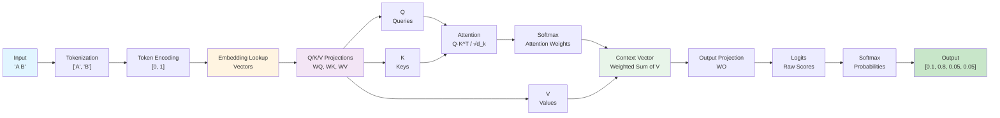
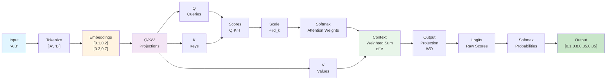

## Example 1: Minimal Forward Pass

**Goal**: Understand how a transformer makes predictions (no training yet)

**What You'll Learn**:
- Forward pass computation
- Attention mechanism step-by-step
- How context is created
- How predictions are made

### The Task

Given input sequence "A B", predict the next token. We'll compute probabilities for each possible token (A, B, C, D) without any training - just to see how the forward pass works.

### Model Architecture

This example demonstrates a minimal transformer architecture focusing on the forward pass only. For the complete transformer architecture with all components, see [Chapter 1: Neural Network Fundamentals](01-neural-network-fundamentals.md) - "Complete Transformer Architecture".

**Components in this example:**
- Fixed token embeddings
- Fixed Q, K, V projection matrices
- Scaled dot-product attention
- Output projection to vocabulary
- Softmax to get probabilities

**Model Architecture Diagram:**

**Note:** This is a simplified forward-only architecture. The complete transformer (shown in Chapter 1) includes multiple transformer blocks, feed-forward networks, layer normalization, and residual connections.

### Step-by-Step Computation

1. **Token Embeddings**: Convert "A" and "B" to 2D vectors
2. **Q/K/V Projections**: Create Query, Key, Value vectors
3. **Attention Scores**: Compute similarity between queries and keys
4. **Attention Weights**: Apply softmax to get probability distribution
5. **Context Vector**: Weighted sum of values
6. **Output Logits**: Project context to vocabulary space
7. **Probabilities**: Apply softmax to get final predictions

### Forward Pass Flow

### Hand Calculation Guide

See [worksheet](../worksheets/example1_worksheet.md) for step-by-step template.

### Theory

#### Attention Formula

The scaled dot-product attention is:

$$\text{Attention}(Q, K, V) = \text{softmax}\left(\frac{QK^T}{\sqrt{d_k}}\right)V$$

Where:
- $Q$: Query matrix (what we're looking for)
- $K$: Key matrix (what information is available)
- $V$: Value matrix (the actual content)
- $d_k$: Dimension of keys (scaling factor)

#### Why Scaling?

Without the $\sqrt{d_k}$ scaling, dot products grow with dimension, causing:
- Softmax saturation (probabilities near 0 or 1)
- Vanishing gradients
- Numerical instability

Scaling keeps variance approximately constant.

#### Softmax Properties

For input vector $\mathbf{x} = [x_1, x_2, \ldots, x_n]$:

$$\text{softmax}(x_i) = \frac{e^{x_i}}{\sum_{j=1}^{n} e^{x_j}}$$

Properties:
- All outputs are positive
- Outputs sum to 1 (probability distribution)
- Differentiable everywhere
- Preserves relative ordering

### Code Implementation

See [code](../examples/example1_forward_only/main.cpp)

### Exercises

1. Compute attention scores by hand for given Q, K matrices
2. Verify softmax computation
3. Trace through complete forward pass
4. Compare hand calculation to code output

---
---
**Navigation:**
- [← Index](00-index.md) | [← Previous: Why Transformers?](05-why-transformers.md) | [Next: Example 2: Single Step →](07-example2-single-step.md)
---
