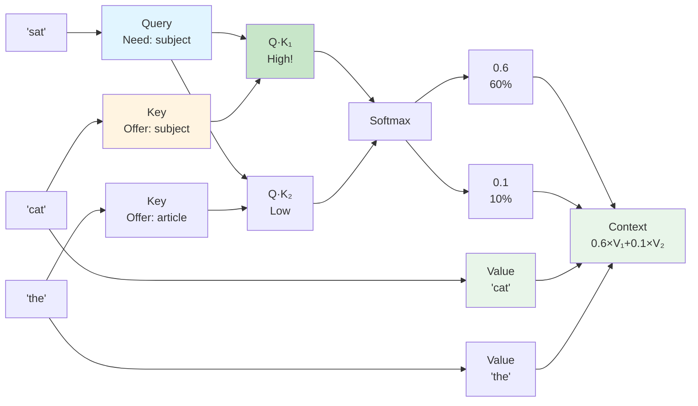
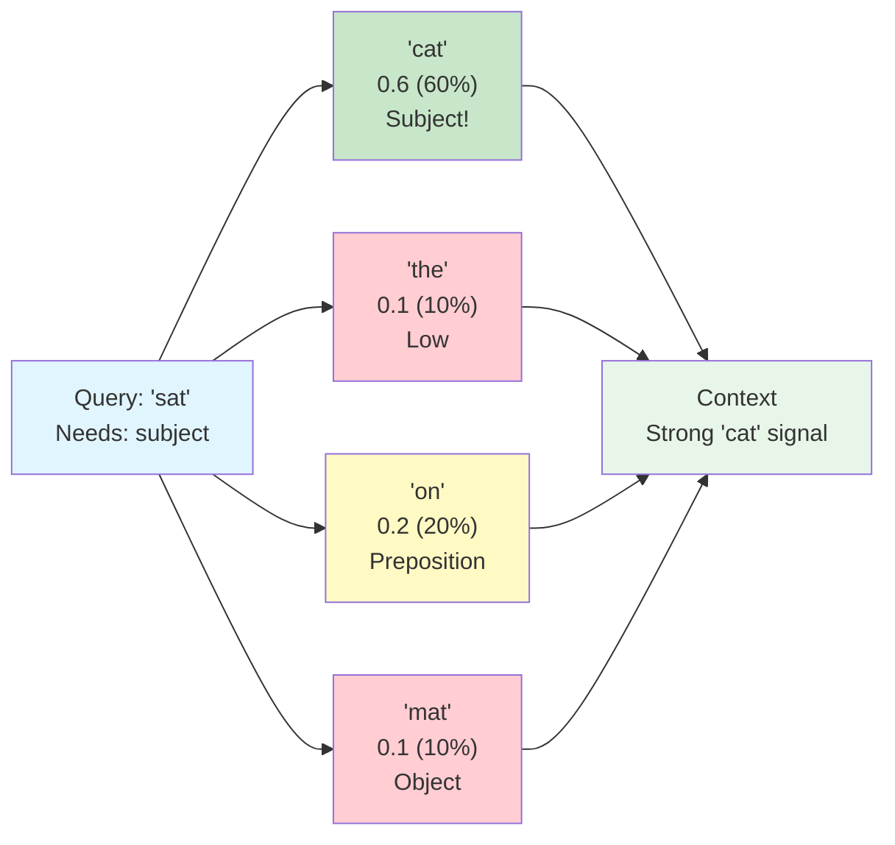
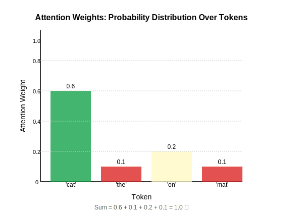

## Chapter 7: Attention Intuition

### The Core Question

When processing a sequence, each position needs to ask:
> **"Which other positions contain information relevant to me?"**

**Example:** In "The cat sat on the mat"
- Position "sat" needs to know about "cat" (subject)
- Position "mat" needs to know about "sat" (verb)
- Position "the" (first) is less relevant to "mat"

**Attention** is the mechanism that answers this question.

### The Query/Key/Value Metaphor

Think of attention like a **library search system**:

#### Query (Q): "What am I looking for?"

**Query** represents what information a position needs:
- "sat" needs: "What is the subject?"
- "mat" needs: "What verb describes location?"

**In vectors:** Query is a learned representation of "what I'm searching for"

#### Key (K): "What do I have to offer?"

**Key** represents what information each position contains:
- "cat" offers: "I am a noun, I am the subject"
- "sat" offers: "I am a verb, I describe action"
- "the" offers: "I am an article, I'm not very informative"

**In vectors:** Key is a learned representation of "what I advertise"

#### Value (V): "What is my actual content?"

**Value** is the actual information to retrieve:
- Once we decide "cat" is relevant, we retrieve its value
- Value contains the semantic content we actually use

**In vectors:** Value is what gets weighted and combined

### The Search Process

**Attention Flow Diagram:**



**Step 1: Match Query to Keys**
```
Query "sat": "I need the subject"
Key "cat": "I am a noun, I am the subject"  ← Match!
Key "the": "I am an article"                ← No match
```

**Step 2: Compute Relevance Scores**
- High score = Query matches Key = relevant
- Low score = Query doesn't match Key = not relevant

**Step 3: Convert to Probabilities (Softmax)**
- Scores → probabilities (attention weights)
- Sum to 1.0 (probability distribution)

**Step 4: Retrieve Values**
- Weighted sum of values
- High attention weight → more contribution from that value

### Search Engine Analogy

**Google Search:**
1. **Query**: Your search terms ("transformer attention")
2. **Keys**: Keywords on web pages
3. **Relevance**: How well keywords match query
4. **Values**: Actual webpage content
5. **Result**: Weighted combination of relevant pages

**Transformer Attention:**
1. **Query**: What position needs
2. **Keys**: What each position offers
3. **Relevance**: Dot product (similarity)
4. **Values**: Actual content to retrieve
5. **Output**: Weighted combination of values

**Same idea, different domain!**

### Database Query Analogy

**SQL Query:**
```sql
SELECT content FROM pages 
WHERE keywords MATCH "transformer attention"
ORDER BY relevance DESC
```

**Attention:**
```
SELECT values FROM positions
WHERE keys MATCH query
WEIGHT BY attention_scores
```

**Attention is like a learned, differentiable database query!**

### Why Three Components (Q, K, V)?

**Why not just one?** Because they serve different purposes:

1. **Q and K determine relevance** (what to attend to)
2. **V provides content** (what to retrieve)

**Separation allows:**
- Learning what to search for (Q)
- Learning what to advertise (K)
- Learning what content to provide (V)

**Example:** A position might:
- Search for "subject" (Q)
- Advertise "I'm a noun" (K)
- Provide "cat" meaning (V)

All three are learned separately!

### Attention Weights as Probabilities

**Attention weights** are probabilities:
- Each position gets a weight
- Weights sum to 1.0
- Higher weight = more attention

**Attention Weights Visualization:**



**Attention Weights Probability Distribution:**



**Example:**
```
Position "sat" attending to:
- "cat": 0.6  (60% attention - subject!)
- "the": 0.1  (10% attention - not very relevant)
- "on": 0.2   (20% attention - preposition)
- "mat": 0.1  (10% attention - object)
Sum: 1.0 ✓
```

**Interpretation:** "sat" pays 60% attention to "cat" because it's the subject.

### How Relevance is Computed

**Dot product** measures alignment:

$$\text{score} = Q \cdot K = \sum_i Q_i K_i$$

**Why dot product?**
- High when Q and K point in similar direction
- Low when they point in different directions
- Zero when perpendicular (unrelated)

**After dot product:**
1. Scale by $\sqrt{d_k}$ (prevents large values)
2. Apply softmax (convert to probabilities)
3. Use as weights for values

### Information Retrieval Perspective

**Classic IR:** Given query, find relevant documents

**Attention:** Given query vector, find relevant position vectors

**Both:**
- Compute similarity (dot product)
- Rank by relevance
- Retrieve and combine content

**Difference:** Attention is **learned** - the model discovers what "relevant" means!

### The Magic: Learned Relevance

**Fixed relevance** (like keyword matching):
- "cat" always matches "cat"
- Can't learn new relationships

**Learned relevance** (attention):
- Model learns what makes positions relevant
- "cat" might become relevant to "feline" even if they don't share words
- Adapts to task

**This is why transformers are powerful!**

### Learning Objectives Recap

- ✓ Understand Q/K/V metaphor
- ✓ See attention as search mechanism
- ✓ Understand relevance computation
- ✓ Connect to information retrieval

### Key Concepts Recap

- **Query**: "What am I looking for?"
- **Key**: "What do I have to offer?"
- **Value**: "What is my actual content?"
- **Attention weights**: Probabilities of relevance

### Intuitive Explanations Recap

- **Search engine**: Query matches keywords, retrieves pages
- **Database query**: SELECT WHERE MATCH, ORDER BY relevance
- **Information retrieval**: Find relevant content, combine it

---
---
**Navigation:**
- [← Index](00-index.md) | [← Previous: Embeddings](06-embeddings.md) | [Next: Why Transformers? →](08-why-transformers.md)
---
