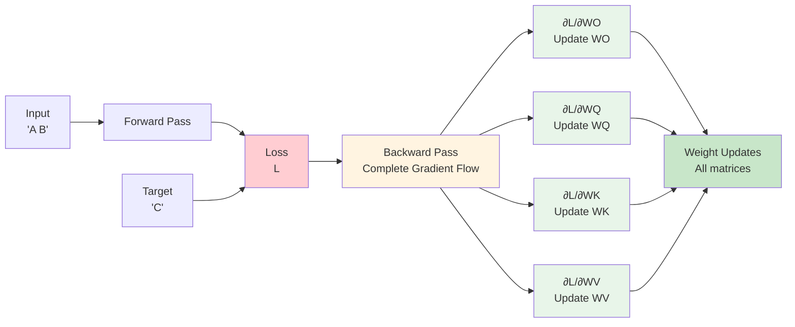
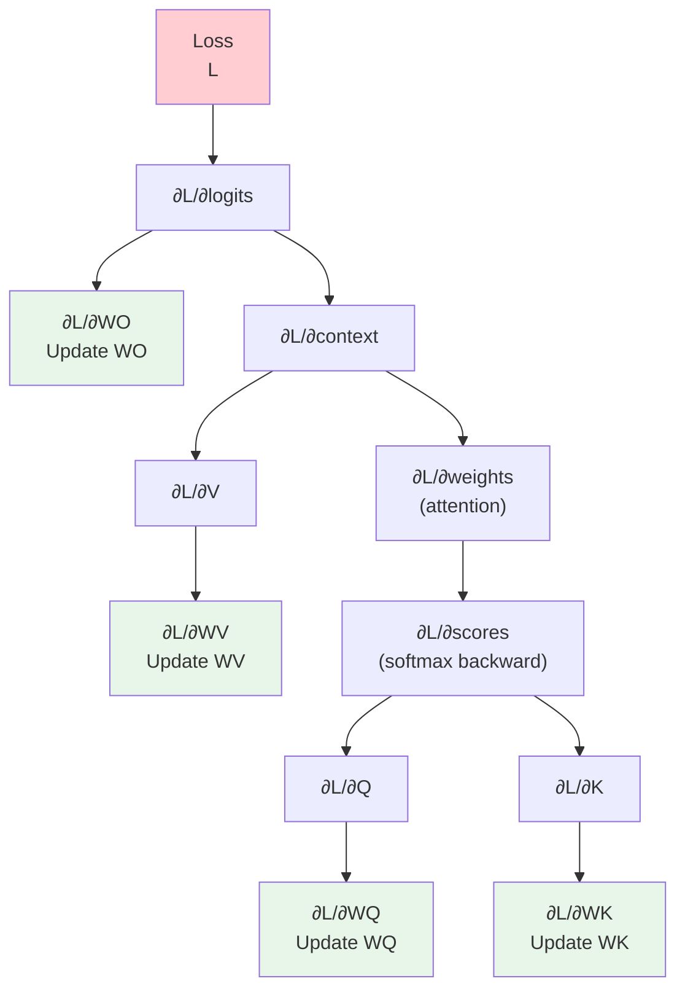
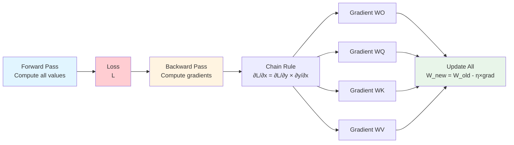

## Example 3: Full Backpropagation

**Goal**: Understand complete gradient flow through all components

**What You'll Learn**:
- Backpropagation through attention
- Matrix calculus
- Gradient flow through Q, K, V
- Complete training loop

### The Task

Train on "A B" → "C" with all weights trainable: $W_Q$, $W_K$, $W_V$, $W_O$

### Model Architecture

This example demonstrates complete backpropagation through all components. For the complete transformer architecture, see [Chapter 1: Neural Network Fundamentals](01-neural-network-fundamentals.md) - "Complete Transformer Architecture".

**Components:**
- **All projection matrices are trainable**: $W_Q$, $W_K$, $W_V$, $W_O$
- Complete gradient flow through attention mechanism
- Full backward pass from loss to all weights

**Model Architecture Diagram:**

**Key Difference from Example 2:**
- Example 2: Only $W_O$ trainable (simple gradient flow)
- Example 3: All weights trainable (complete gradient flow through attention)

### Backpropagation Steps

1. **Loss → Logits**: $\frac{\partial L}{\partial \text{logits}}$ (from Example 2)
2. **Logits → $W_O$**: $\frac{\partial L}{\partial W_O}$ (from Example 2)
3. **Logits → Context**: $\frac{\partial L}{\partial \text{context}}$
4. **Context → Attention Weights**: $\frac{\partial L}{\partial \text{weights}}$
5. **Attention Weights → Scores**: $\frac{\partial L}{\partial \text{scores}}$ (softmax backward)
6. **Scores → Q, K**: $\frac{\partial L}{\partial Q}$, $\frac{\partial L}{\partial K}$
7. **Q, K → $W_Q$, $W_K$**: $\frac{\partial L}{\partial W_Q}$, $\frac{\partial L}{\partial W_K}$
8. **Context → V**: $\frac{\partial L}{\partial V}$
9. **V → $W_V$**: $\frac{\partial L}{\partial W_V}$

### Backpropagation Flow

### Gradient Computation Flow

### Matrix Calculus

#### Matrix Multiplication Gradient

For $C = AB$:
- $\frac{\partial L}{\partial A} = \frac{\partial L}{\partial C} B^T$
- $\frac{\partial L}{\partial B} = A^T \frac{\partial L}{\partial C}$

#### Attention Gradients

For $\text{Output} = \text{Weights} \times V$:
- $\frac{\partial L}{\partial \text{Weights}} = \frac{\partial L}{\partial \text{Output}} V^T$
- $\frac{\partial L}{\partial V} = \text{Weights}^T \frac{\partial L}{\partial \text{Output}}$

For $\text{Scores} = QK^T$:
- $\frac{\partial L}{\partial Q} = \frac{\partial L}{\partial \text{Scores}} K$
- $\frac{\partial L}{\partial K} = \frac{\partial L}{\partial \text{Scores}}^T Q$

### Softmax Jacobian

The softmax Jacobian is:

$$\frac{\partial \text{softmax}_i}{\partial x_j} = \text{softmax}_i \cdot (\delta_{ij} - \text{softmax}_j)$$

Where $\delta_{ij}$ is the Kronecker delta.

This means each output depends on all inputs (through the normalization).

### Hand Calculation Guide

See [worksheet](../worksheets/example3_worksheet.md)

### Theory

#### Why Backpropagation Works

Backpropagation is just the chain rule applied systematically:
1. Forward pass: compute all intermediate values
2. Backward pass: compute gradients starting from loss
3. Each operation has a known local gradient
4. Chain rule multiplies local gradients together

#### Computational Graph

The computation forms a directed acyclic graph (DAG):
- Nodes: operations (matmul, softmax, etc.)
- Edges: data flow
- Backprop: reverse the edges, multiply gradients

### Code Implementation

See [code](../examples/example3_full_backprop/main.cpp)

### Exercises

1. Trace complete gradient flow by hand
2. Compute all weight gradients
3. Verify gradient magnitudes make sense
4. Perform full training step
5. Compare to Example 2 (only $W_O$ trained)

---
---
**Navigation:**
- [← Index](00-index.md) | [← Previous: Example 2: Single Step](07-example2-single-step.md) | [Next: Example 4: Multiple Patterns →](09-example4-multiple-patterns.md)
---
