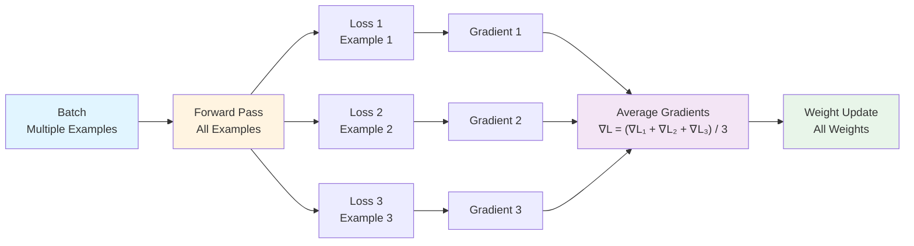
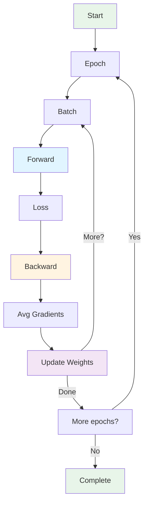

## Example 4: Multiple Patterns

**Goal**: Learn multiple patterns from multiple examples

**What You'll Learn**:
- Batch training
- Gradient accumulation
- Pattern learning
- Convergence

### The Task

Train on multiple examples:
- "A B" → "C"
- "A A" → "D"
- "B A" → "C"

Learn all patterns simultaneously.

### Model Architecture

This example demonstrates batch training with multiple patterns. For the complete transformer architecture, see [Chapter 1: Neural Network Fundamentals](01-neural-network-fundamentals.md) - "Complete Transformer Architecture".

**Components:**
- Same architecture as Example 3
- **Batch processing**: Multiple examples processed together
- **Gradient averaging**: Gradients averaged across batch

**Model Architecture Diagram:**

**Key Difference from Example 3:**
- Example 3: Single example per training step
- Example 4: Multiple examples per batch (batch training)

### Batch Training

Instead of one example at a time:
1. Process all examples in batch
2. Compute loss for each
3. Average gradients
4. Update weights once per batch

### Gradient Averaging

For batch of size $N$:

$$\frac{\partial L}{\partial W} = \frac{1}{N} \sum_{i=1}^{N} \frac{\partial L_i}{\partial W}$$

This averages gradients across examples.

### Training Loop

### Hand Calculation Guide

See [worksheet](../worksheets/example4_worksheet.md)

### Theory

#### Why Batch Training?

- **Stability**: Averaging reduces noise in gradients
- **Efficiency**: Process multiple examples in parallel
- **Generalization**: Model sees diverse patterns together

#### Convergence

With proper learning rate:
- Loss decreases over epochs
- Model learns all patterns
- Gradients become smaller (convergence)

### Code Implementation

See [code](../examples/example4_multiple_patterns/main.cpp)

### Exercises

1. Compute batch loss
2. Average gradients across examples
3. Train for multiple epochs
4. Verify all patterns are learned
5. Plot loss over time

---
---
**Navigation:**
- [← Index](00-index.md) | [← Previous: Example 3: Full Backprop](08-example3-full-backprop.md) | [Next: Example 5: Feed-Forward →](10-example5-feedforward.md)
---
