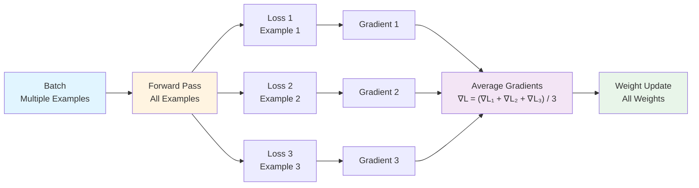
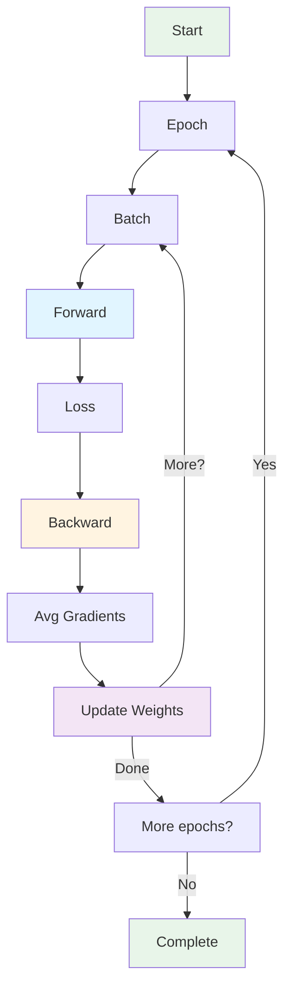

## Example 4: Multiple Patterns

**Goal**: Learn multiple patterns from multiple examples

**What You'll Learn**:
- Batch training
- Gradient accumulation
- Pattern learning
- Convergence

### The Task

Train on multiple examples:
- "A B" → "C"
- "A A" → "D"
- "B A" → "C"

Learn all patterns simultaneously.

### Model Architecture

This example demonstrates batch training with multiple patterns. For the complete transformer architecture, see [Chapter 1: Neural Network Fundamentals](01-neural-network-fundamentals.md) - "Complete Transformer Architecture".

**Components:**
- Same architecture as Example 3
- **Batch processing**: Multiple examples processed together
- **Gradient averaging**: Gradients averaged across batch

**Model Architecture Diagram:**

**Key Difference from Example 3:**
- Example 3: Single example per training step
- Example 4: Multiple examples per batch (batch training)

### Batch Training

Instead of one example at a time:
1. Process all examples in batch
2. Compute loss for each
3. Average gradients
4. Update weights once per batch

### Gradient Averaging

For batch of size $N$:

$$\frac{\partial L}{\partial W} = \frac{1}{N} \sum_{i=1}^{N} \frac{\partial L_i}{\partial W}$$

This averages gradients across examples.

### Training Loop

### Hand Calculation Guide

See [worksheet](../worksheets/example4_worksheet.md)

### Theory

#### Why Batch Training?

- **Stability**: Averaging reduces noise in gradients
- **Efficiency**: Process multiple examples in parallel
- **Generalization**: Model sees diverse patterns together

#### Convergence

With proper learning rate:
- Loss decreases over epochs
- Model learns all patterns
- Gradients become smaller (convergence)

### Code Implementation

See [code](../examples/example4_multiple_patterns/main.cpp)

### Exercises

1. Compute batch loss
2. Average gradients across examples
3. Train for multiple epochs
4. Verify all patterns are learned
5. Plot loss over time

**Training Loss Curve:**

<svg width="600" height="400" xmlns="http://www.w3.org/2000/svg">
  <g transform="translate(80, 50)">
    <text x="200" y="-20" font-family="Arial" font-size="16" font-weight="bold">Loss Decreases as Model Learns Multiple Patterns</text>
    <!-- Axes -->
    <line x1="0" y1="300" x2="400" y2="300" stroke="#333" stroke-width="2"/>
    <line x1="0" y1="300" x2="0" y2="0" stroke="#333" stroke-width="2"/>
    <!-- Axis labels -->
    <text x="400" y="320" font-family="Arial" font-size="14">Training Iteration</text>
    <text x="-50" y="150" font-family="Arial" font-size="14" transform="rotate(-90, -50, 150)">Loss</text>
    <!-- Loss curve with some noise (realistic training) -->
    <path d="M 0,50 L 20,55 L 40,60 L 60,65 L 80,70 L 100,75 L 120,80 L 140,85 L 160,90 L 180,95 L 200,100 L 220,105 L 240,110 L 260,115 L 280,120 L 300,125 L 320,130 L 340,135 L 360,140 L 380,145 L 400,150" stroke="#2563eb" stroke-width="2" fill="none"/>
    <!-- Smoothed trend line -->
    <path d="M 0,50 Q 200,100 400,150" stroke="#dc2626" stroke-width="3" fill="none" stroke-dasharray="5,5"/>
    <!-- Grid lines -->
    <line x1="100" y1="0" x2="100" y2="300" stroke="#ccc" stroke-width="1" stroke-dasharray="2,2"/>
    <line x1="200" y1="0" x2="200" y2="300" stroke="#ccc" stroke-width="1" stroke-dasharray="2,2"/>
    <line x1="300" y1="0" x2="300" y2="300" stroke="#ccc" stroke-width="1" stroke-dasharray="2,2"/>
    <line x1="0" y1="100" x2="400" y2="100" stroke="#ccc" stroke-width="1" stroke-dasharray="2,2"/>
    <line x1="0" y1="200" x2="400" y2="200" stroke="#ccc" stroke-width="1" stroke-dasharray="2,2"/>
    <!-- Labels -->
    <text x="0" y="310" font-family="Arial" font-size="11">0</text>
    <text x="390" y="310" font-family="Arial" font-size="11">N</text>
    <text x="-10" y="305" font-family="Arial" font-size="11">High</text>
    <text x="-15" y="25" font-family="Arial" font-size="11">Low</text>
    <!-- Legend -->
    <line x1="50" y1="250" x2="80" y2="250" stroke="#2563eb" stroke-width="2"/>
    <text x="85" y="255" font-family="Arial" font-size="11">Actual Loss</text>
    <line x1="200" y1="250" x2="230" y2="250" stroke="#dc2626" stroke-width="3" stroke-dasharray="5,5"/>
    <text x="235" y="255" font-family="Arial" font-size="11">Trend</text>
  </g>
</svg>

---
---
**Navigation:**
- [← Index](00-index.md) | [← Previous: Example 3: Full Backprop](08-example3-full-backprop.md) | [Next: Example 5: Feed-Forward →](10-example5-feedforward.md)
---
