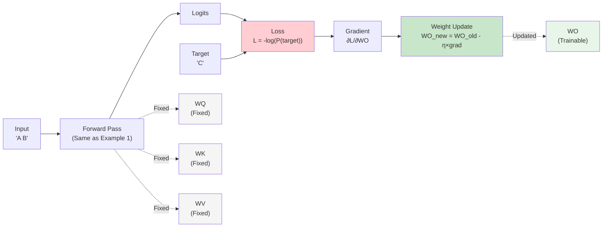
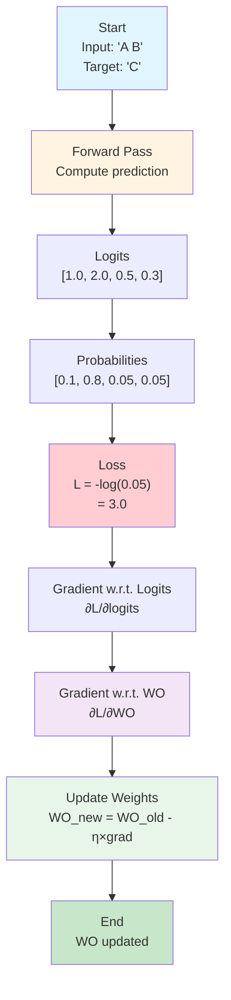

## Example 2: Single Training Step

**Goal**: Understand how one weight update works

**What You'll Learn**:
- Loss functions
- Gradient computation
- Gradient descent
- How models learn from examples

### The Task

Train the model on example: Input "A B" → Target "C"

We'll update only the output projection matrix $W_O$ in this example to keep it simple.

### Model Architecture

This example extends Example 1 by adding training. For the complete transformer architecture, see [Chapter 4: Training Neural Networks](04-training-neural-networks.md) - "The Transformer Architecture".

**Components:**
- Same forward pass as Example 1
- **$W_O$ is now trainable** (highlighted in diagram)
- $W_Q$, $W_K$, $W_V$ remain fixed (not updated)
- Loss computation and gradient flow

**Model Architecture Diagram:**

**Key Difference from Example 1:**
- Example 1: Forward pass only (no training)
- Example 2: Forward pass + Loss + Gradient + Weight update (only WO)

### Training Process

1. **Forward Pass**: Compute prediction (same as Example 1)
2. **Compute Loss**: Measure how wrong the prediction is
3. **Compute Gradients**: Calculate how to change weights
4. **Update Weights**: Actually change $W_O$ using gradient descent

### Training Step Flow

### Loss Function

Cross-entropy loss for next-token prediction:

$$L = -\log P(y_{\text{target}})$$

Where $P(y_{\text{target}})$ is the model's predicted probability for the correct token.

Properties:
- Lower when model is confident and correct
- Higher when model is wrong or uncertain
- Differentiable (enables gradient descent)

### Gradient Computation

For softmax + cross-entropy, the gradient w.r.t. logits is:

$$\frac{\partial L}{\partial \text{logit}_i} = P(i) - \mathbf{1}[i = \text{target}]$$

Where $\mathbf{1}[\cdot]$ is the indicator function.

This elegant formula means:
- If model predicts too high probability for wrong token → push logit down
- If model predicts too low probability for correct token → push logit up

### Gradient Descent Update

$$W_{\text{new}} = W_{\text{old}} - \eta \cdot \frac{\partial L}{\partial W}$$

Where $\eta$ is the learning rate.

### Hand Calculation Guide

See [worksheet](../worksheets/example2_worksheet.md)

### Theory

#### Chain Rule Basics

For composite function $f(g(x))$:

$$\frac{df}{dx} = \frac{df}{dg} \cdot \frac{dg}{dx}$$

In our case:
$$L \leftarrow \text{softmax}(\text{logits}) \leftarrow \text{logits} \leftarrow W_O \times \text{context}$$

We compute gradients backward through this chain.

#### Why Gradient Descent Works

Gradient points in direction of steepest increase. To minimize loss, we move opposite to gradient (hence the minus sign).

With small learning rate, we take small steps toward the minimum.

### Code Implementation

See [code](../examples/example2_single_step/main.cpp)

### Exercises

1. Compute loss by hand
2. Compute gradient w.r.t. logits
3. Compute gradient w.r.t. $W_O$
4. Perform one weight update
5. Verify prediction improves

---
---
**Navigation:**
- [← Index](00b-toc.md) | [← Previous: Example 1: Forward Pass](09-example1-forward-pass.md) | [Next: Example 3: Full Backprop →](11-example3-full-backprop.md)
---
