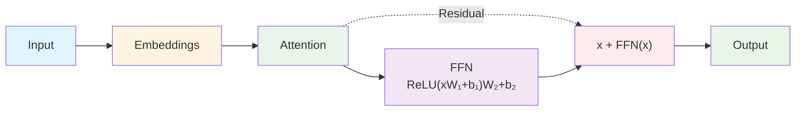

## Example 5: Feed-Forward Layers

**Goal**: Add non-linearity and depth

**What You'll Learn**:
- Feed-forward networks
- Non-linear activations (ReLU)
- Residual connections
- Layer composition

### The Task

Add a feed-forward network after attention:
- Attention output → Feed-Forward → Final output

### Model Architecture

This example adds feed-forward networks and residual connections. For the complete transformer architecture, see [Chapter 1: Neural Network Fundamentals](01-neural-network-fundamentals.md) - "Complete Transformer Architecture".

**New Components:**
- **Feed-Forward Network (FFN)**: Two linear transformations with ReLU activation
- **Residual Connection**: Adds input to FFN output (enables deep networks)

**Model Architecture Diagram:**

**Key Difference from Example 3:**
- Example 3: Attention → Output Projection
- Example 5: Attention → FFN → Residual → Output Projection

### Feed-Forward Network

Two linear transformations with ReLU:

$$\text{FFN}(x) = \text{ReLU}(x W_1 + b_1) W_2 + b_2$$

For our 2x2 case, we'll use:
- $W_1$: 2×2 matrix
- $W_2$: 2×2 matrix
- ReLU: element-wise max(0, x)

### ReLU Activation

$$\text{ReLU}(x) = \max(0, x)$$

Properties:
- Non-linear (enables learning complex functions)
- Simple derivative (0 or 1)
- Prevents negative activations

### Residual Connections

$$\text{Output} = x + \text{FFN}(x)$$

Why?
- Enables gradient flow through deep networks
- Allows identity mapping (if FFN learns nothing, output = input)
- Helps with training stability

### Hand Calculation Guide

See [worksheet](../worksheets/example5_worksheet.md)

### Theory

#### Universal Approximation

Feed-forward networks with non-linear activations can approximate any continuous function (universal approximation theorem).

This is why adding FFN increases model capacity.

#### Why Residuals?

Without residuals, gradients can vanish in deep networks. Residuals provide "highway" for gradients to flow directly.

### Code Implementation

See [code](../examples/example5_feedforward/main.cpp)

### Exercises

1. Compute FFN forward pass
2. Compute ReLU gradients
3. Trace gradient through FFN
4. Verify residual connection helps
5. Compare with/without residuals

---
---
**Navigation:**
- [← Index](00-index.md) | [← Previous: Example 4: Multiple Patterns](09-example4-multiple-patterns.md) | [Next: Example 6: Complete →](11-example6-complete.md)
---
