## Example 6: Complete Transformer

**Goal**: Full implementation with all components

**What You'll Learn**:
- Complete transformer architecture
- Layer normalization
- Multiple layers
- End-to-end training

### The Task

Build complete transformer with:
- Multiple transformer blocks
- Layer normalization
- Residual connections everywhere
- Complete training pipeline

### Model Architecture

This example implements the complete transformer architecture as shown in [Chapter 4: Training Neural Networks](04-training-neural-networks.md) - "The Transformer Architecture". All components are included.

**Complete Components:**
- **Multiple Transformer Blocks**: Each block has Attention + FFN
- **Layer Normalization**: Normalizes inputs to each layer
- **Residual Connections**: Enables training of deep networks
- **Complete Training Pipeline**: Forward + Backward + Updates

**Model Architecture Diagram:**

```mermaid
graph LR
    I["Input"] --> E["Embed"]
    E --> A1["Attn1"] --> LN1["LN1"] -->|+Res| R1["Res1"]
    R1 --> FF1["FFN1"] --> LN2["LN2"] -->|+Res| R2["Res2"]
    R2 --> A2["Attn2"] --> LN3["LN3"] -->|+Res| R3["Res3"]
    R3 --> FF2["FFN2"] --> LN4["LN4"] -->|+Res| R4["Res4"]
    R4 --> OP["Output"] --> SM["Softmax"] --> P["Probs"]
    
    style I fill:#e1f5ff
    style E fill:#fff4e1
    style A1 fill:#e8f5e9
    style A2 fill:#e8f5e9
    style FF1 fill:#f3e5f5
    style FF2 fill:#f3e5f5
    style R1 fill:#ffebee
    style R2 fill:#ffebee
    style R3 fill:#ffebee
    style R4 fill:#ffebee
    style P fill:#c8e6c9
```

**This is the complete transformer!** All previous examples built up to this. See [Chapter 4: Training Neural Networks](04-training-neural-networks.md) for the full architecture diagram with all components labeled.

### Layer Normalization

Normalize across features (not batch):

$$\text{LayerNorm}(x) = \gamma \frac{x - \mu}{\sigma} + \beta$$

Where:
- $\mu$: mean of features
- $\sigma$: standard deviation of features
- $\gamma, \beta$: learnable parameters

Why?
- Stabilizes training
- Reduces internal covariate shift
- Enables larger learning rates

### Multiple Layers

Stack transformer blocks:
- Each block processes the output of previous
- Deeper = more complex patterns
- Residuals enable deep networks

### Complete Training

Full pipeline:
1. Forward through all layers
2. Compute loss
3. Backprop through all layers
4. Update all weights
5. Repeat for many epochs

### Hand Calculation Guide

See [worksheet](../worksheets/example6_worksheet.md)

### Theory

#### Deep Networks

Each layer learns increasingly abstract features:
- Layer 1: Local patterns
- Layer 2: Combinations of Layer 1 patterns
- Layer 3: High-level concepts

#### Why This Architecture Works

- **Attention**: Captures long-range dependencies
- **FFN**: Adds non-linearity and capacity
- **Residuals**: Enables gradient flow
- **LayerNorm**: Stabilizes training
- **Multiple layers**: Learns hierarchical representations

### Code Implementation

See [code](../examples/example6_complete/main.cpp)

### Exercises

1. Trace through complete forward pass
2. Compute all intermediate values
3. Perform full backpropagation
4. Train complete model
5. Analyze learned representations

---
---
**Navigation:**
- [← Index](00-index.md) | [← Previous: Example 5: Feed-Forward](13-example5-feedforward.md) | [Next: Example 7: Character Recognition →](15-example7-character-recognition.md)
---
