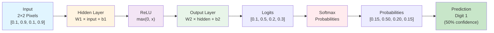
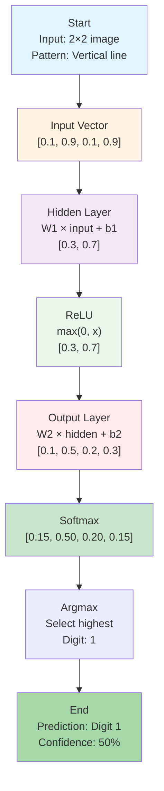

## Example 7: Character Recognition

**Goal**: Understand how neural networks perform classification tasks using continuous activations

**What You'll Learn**:
- Feed-forward neural networks for classification
- ReLU activation function in hidden layers
- How continuous outputs become discrete predictions via softmax
- The complete forward pass for image classification
- Connection to transformer concepts from Examples 1-6

### The Task

Classify a simple 2×2 pixel digit image into one of four classes (digits 0, 1, 2, or 3). We'll use a feed-forward network to demonstrate that the same fundamental principles—continuous activations, softmax, and classification—that we learned in transformer examples apply to other neural network tasks.

### Why This Example?

In Examples 1-6, we explored transformers for sequence processing. This example shows that the same core concepts apply to classification tasks:

- **Continuous activations** (ReLU) work the same way
- **Softmax** converts logits to probabilities identically
- **Classification** uses the same forward pass principles
- **No "firing"**—all neurons produce continuous outputs throughout

This demonstrates that neural network fundamentals are universal, not transformer-specific.

### Model Architecture

This example uses a simple feed-forward network (not transformer-based):

```
Input (4 pixels) → Hidden Layer (2 neurons, ReLU) → Output Layer (4 logits) → Softmax → Probabilities → Prediction
```

**Components:**
- **Input Layer**: 4 pixels from a 2×2 image
- **Hidden Layer**: 2 neurons with ReLU activation
- **Output Layer**: 4 logits (one per digit class: 0, 1, 2, 3)
- **Softmax**: Converts logits to probabilities
- **Decision**: Select class with highest probability (argmax)

**Model Architecture Diagram:**



**Key Difference from Transformer Examples:**
- Examples 1-6: Transformer architecture (attention, embeddings, sequences)
- Example 7: Feed-forward architecture (pixels → hidden → output)
- **Same fundamentals**: Continuous activations, softmax, classification

### Step-by-Step Computation

1. **Input**: Represent 2×2 image as 4D vector
2. **Hidden Layer**: Compute W1 × input + b1
3. **ReLU Activation**: Apply max(0, x) element-wise
4. **Output Layer**: Compute W2 × hidden + b2
5. **Softmax**: Convert logits to probabilities
6. **Prediction**: Select class with highest probability

### Forward Pass Flow



### Hand Calculation Guide

See [worksheet](../worksheets/example7_worksheet.md) for step-by-step template.

### Theory

#### Feed-Forward Networks

A feed-forward network processes information in one direction:

$$\mathbf{h} = \text{ReLU}(\mathbf{W}_1 \mathbf{x} + \mathbf{b}_1)$$
$$\mathbf{y} = \mathbf{W}_2 \mathbf{h} + \mathbf{b}_2$$
$$\mathbf{p} = \text{softmax}(\mathbf{y})$$

Where:
- $\mathbf{x}$: Input vector (4D for 2×2 image)
- $\mathbf{W}_1, \mathbf{b}_1$: Hidden layer weights and bias
- $\mathbf{h}$: Hidden layer output (after ReLU)
- $\mathbf{W}_2, \mathbf{b}_2$: Output layer weights and bias
- $\mathbf{y}$: Logits (raw scores)
- $\mathbf{p}$: Probabilities (after softmax)

#### ReLU Activation

ReLU (Rectified Linear Unit) applies element-wise:

$$\text{ReLU}(x) = \max(0, x)$$

Properties:
- Outputs continuous values (not binary)
- Preserves positive values
- Zeros out negative values
- Differentiable everywhere except at 0

**Key Insight**: ReLU produces continuous outputs, not binary "firing" decisions. This is the same activation used in transformer feed-forward networks (Example 5).

#### Softmax Classification

Softmax converts logits to probabilities:

$$\text{softmax}(y_i) = \frac{e^{y_i}}{\sum_{j=1}^{n} e^{y_j}}$$

Properties:
- All outputs are positive
- Outputs sum to 1 (probability distribution)
- Preserves relative ordering
- Largest logit gets highest probability

**Key Insight**: This is the same softmax used in transformers (Examples 1-6) for converting attention scores to probabilities and logits to token probabilities.

#### Continuous → Discrete

The network produces continuous probabilities, but we make a discrete decision:

1. **Continuous**: Probabilities [0.15, 0.50, 0.20, 0.15]
2. **Discrete**: Argmax selects class 1 (highest probability)

This is the same process as transformers:
- **Transformers**: Continuous probabilities → discrete token selection
- **Classification**: Continuous probabilities → discrete class selection

### Connection to Transformers

The same principles apply:

| Concept | Transformers (Examples 1-6) | Classification (Example 7) |
|---------|----------------------------|---------------------------|
| **Activation** | ReLU in FFN layers | ReLU in hidden layer |
| **Softmax** | Attention weights, output probabilities | Class probabilities |
| **Continuous** | All activations are continuous | All activations are continuous |
| **Discrete Decision** | Select token with highest probability | Select class with highest probability |
| **No "Firing"** | Neurons output continuous values | Neurons output continuous values |

### Code Implementation

See [code](../examples/example7_character_recognition/main.cpp)

### Exercises

1. Compute hidden layer output by hand
2. Apply ReLU activation step-by-step
3. Compute output logits
4. Verify softmax calculation
5. Compare hand calculations to code output
6. Modify input pattern and trace through forward pass
7. Explain why all values are continuous (no "firing")

### Key Takeaways

1. **Continuous Activations**: ReLU outputs continuous values, not binary decisions
2. **Softmax Classification**: Same function used in transformers and classification
3. **Universal Principles**: Neural network fundamentals apply across architectures
4. **No "Firing"**: Modern networks use continuous activations throughout
5. **Discrete Decisions**: Made via argmax on continuous probabilities

---

**Navigation:**
- [← Index](00-index.md) | [← Previous: Example 6: Complete Transformer](14-example6-complete.md) | [Next: Appendix A →](appendix-a-matrix-calculus.md)
---

